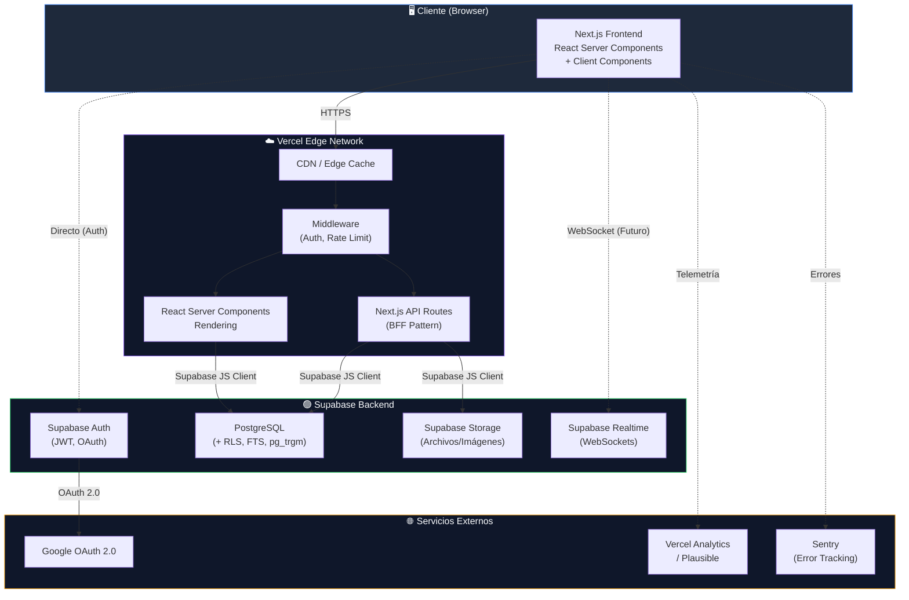
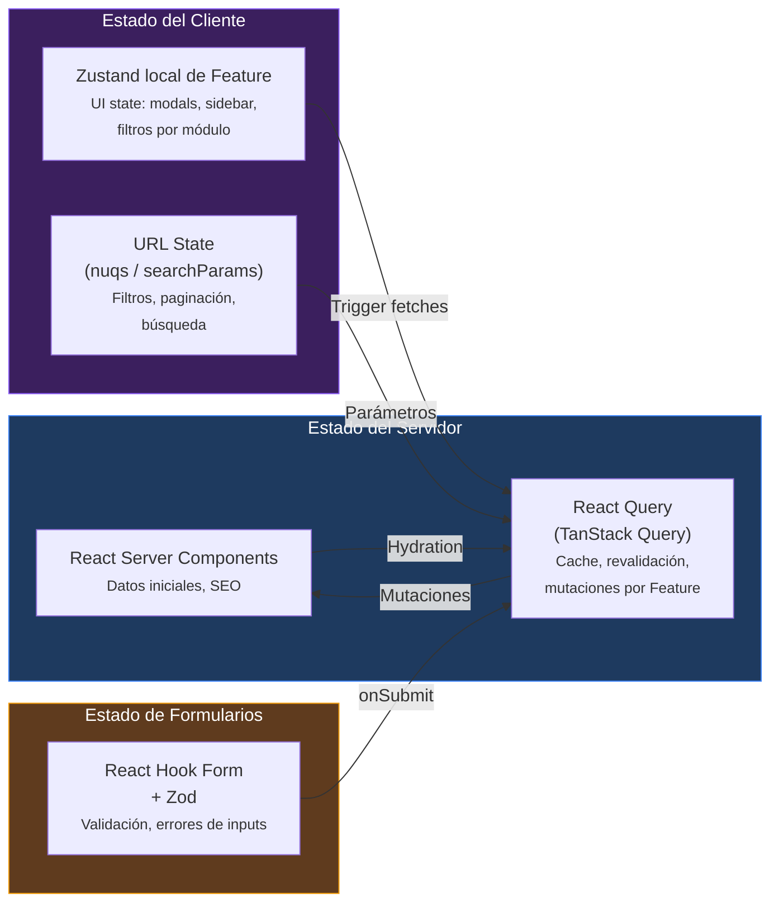
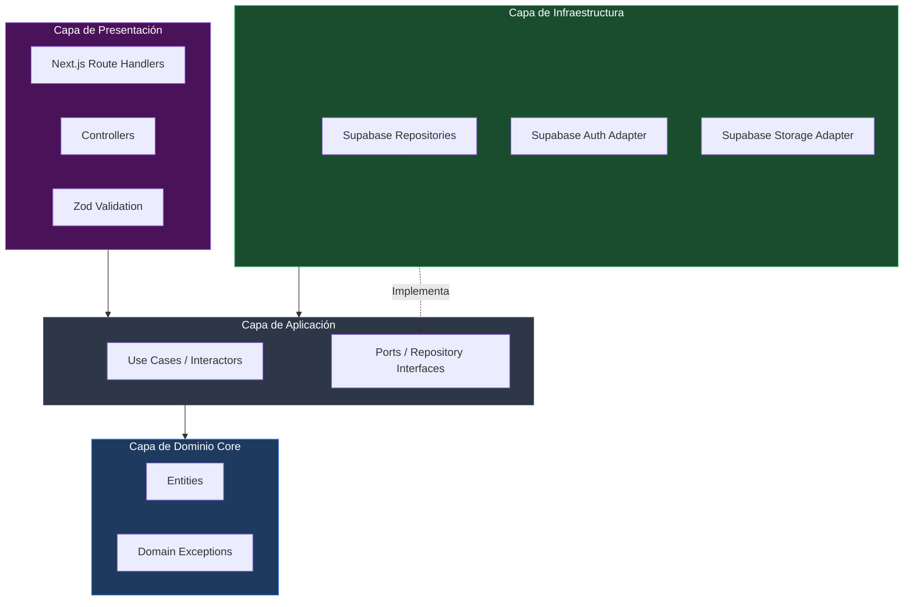
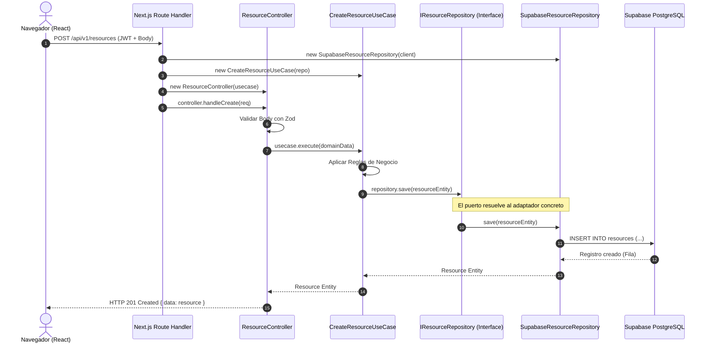
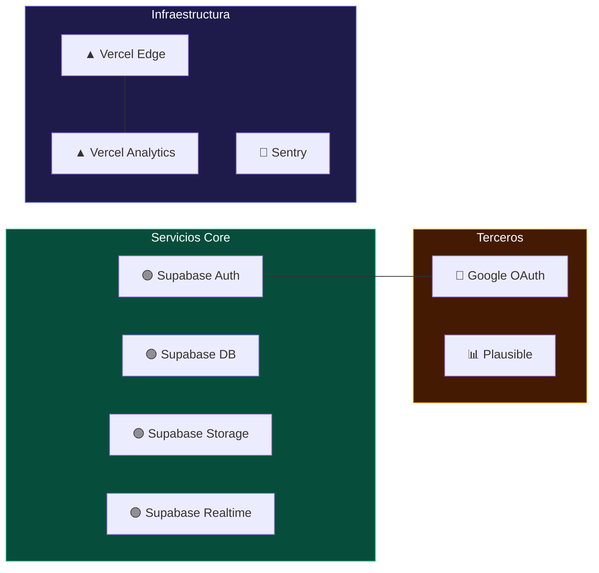
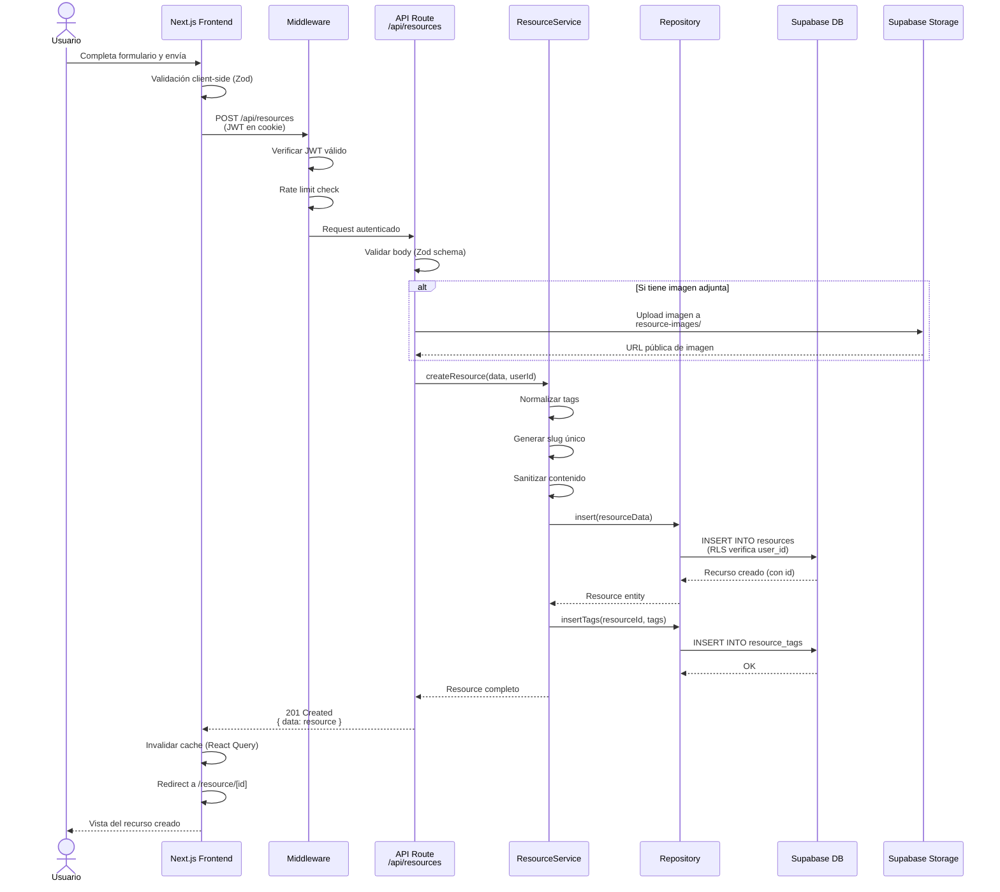
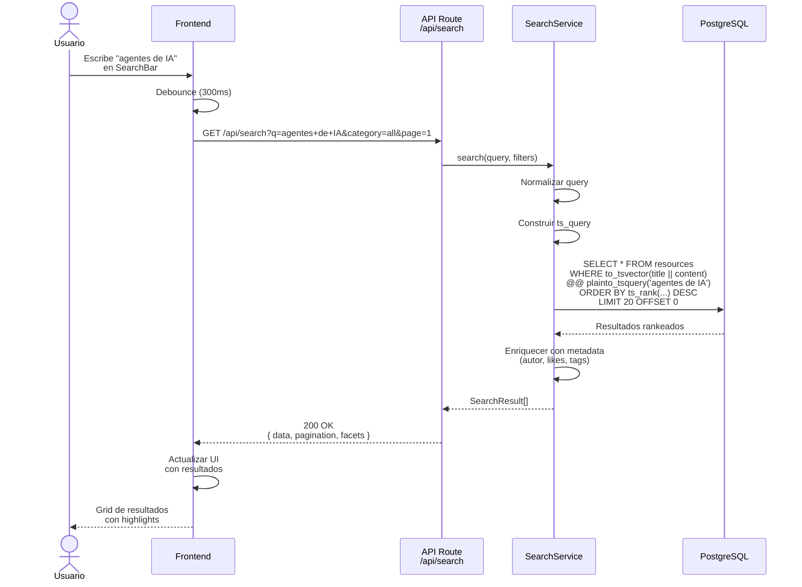
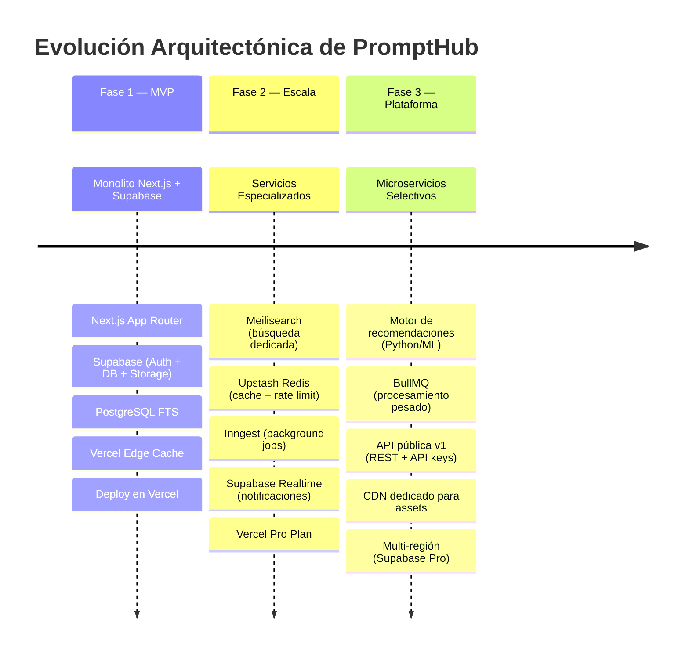
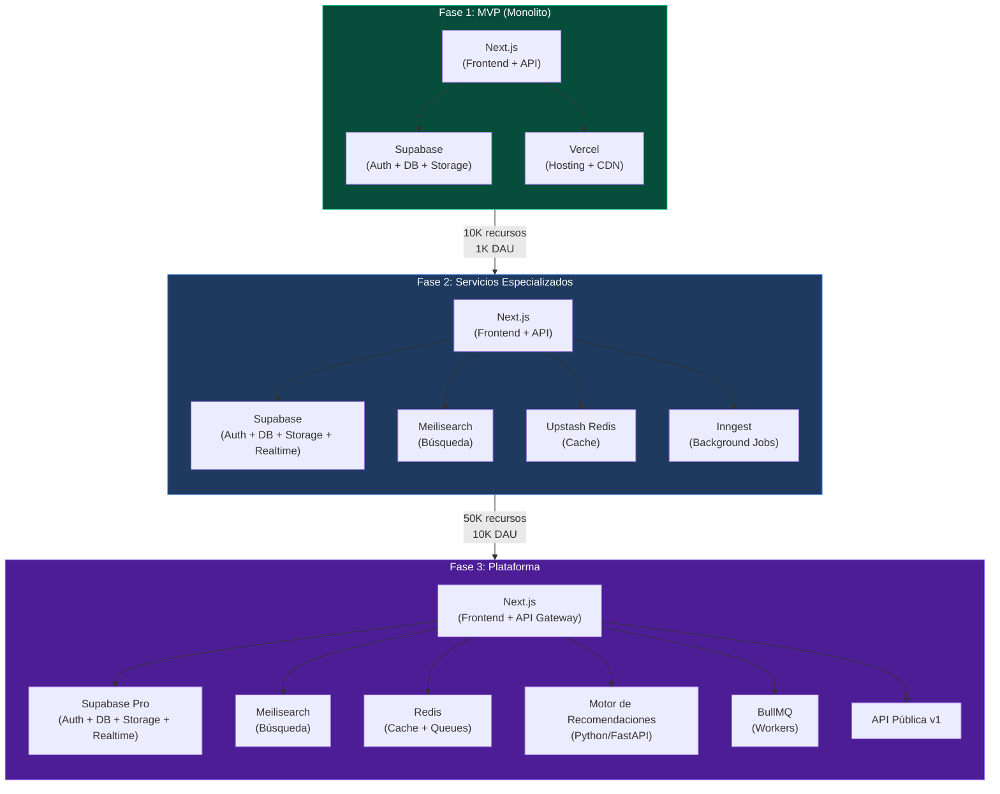

# 🏗️ Arquitectura del Sistema — PromptHub

> **Versión:** 1.0  
> **Última actualización:** Junio 2026  
> **Autor:** Equipo PromptHub  
> **Estado:** En definición (MVP)

---

## Tabla de Contenidos

1. [Visión General de la Arquitectura](#1-visión-general-de-la-arquitectura)
2. [Arquitectura del Frontend](#2-arquitectura-del-frontend)
3. [Capas del Backend](#3-capas-del-backend)
4. [Servicios Externos](#4-servicios-externos)
5. [Comunicación entre Módulos](#5-comunicación-entre-módulos)
6. [Registros de Decisiones Arquitectónicas (ADRs)](#6-registros-de-decisiones-arquitectónicas-adrs)
7. [Evolución Futura](#7-evolución-futura)

---

## 1. Visión General de la Arquitectura

PromptHub sigue una arquitectura **monolítica modular** basada en Next.js 14+ con App Router, utilizando Supabase como Backend-as-a-Service (BaaS). El patrón central es **BFF (Backend for Frontend)**, donde las API Routes de Next.js actúan como intermediario entre el cliente y Supabase.

### Principios Arquitectónicos

| Principio | Descripción |
|---|---|
| **Simplicidad primero** | Arquitectura mínima viable que un solo desarrollador puede mantener |
| **Monolito modular** | Un solo despliegue con separación lógica clara entre módulos |
| **Server-first** | Priorizar React Server Components para rendimiento y SEO |
| **Seguridad por capas** | Row Level Security en BD + validación en API Routes + auth en middleware |
| **Escalabilidad progresiva** | Diseñar para extraer servicios cuando sea necesario, no antes |

### Diagrama de Arquitectura de Alto Nivel



> [!NOTE]
> Las líneas punteadas (`-.->`) representan conexiones directas del cliente que **no** pasan por las API Routes. Esto se limit## 2. Arquitectura del Frontend (Feature-Based)

El frontend de PromptHub está diseñado utilizando un enfoque **Basado en Features (Feature-based)**. Esto significa que agrupamos el código por dominio de negocio (características) en lugar de agrupar por tipo técnico (componentes, hooks, tipos por separado).

El enrutamiento físico se gestiona a través del **Next.js App Router** en la carpeta `app/`, pero estas páginas actúan únicamente como contenedores ligeros ("cáscaras de enrutamiento") que importan y renderizan las vistas de negocio desde `src/features/`.

### 2.1 Estructura del App Router (Routing Layer)

La carpeta `app/` organiza las rutas utilizando Route Groups para agrupar páginas lógicamente sin afectar la URL:

```
app/
├── (marketing)/              # Páginas públicas (Landing, About)
│   ├── page.tsx              # Importa y renderiza src/features/marketing/components/LandingPage
│   └── layout.tsx            # Layout público (navbar + footer)
├── (auth)/                   # Páginas de inicio de sesión/registro
│   ├── login/page.tsx        # Importa src/features/auth/components/LoginForm
│   ├── register/page.tsx     # Importa src/features/auth/components/RegisterForm
│   ├── callback/page.tsx     # Callback de Supabase OAuth
│   └── layout.tsx            # Layout de autenticación (minimalista)
├── (app)/                    # Aplicación autenticada / Dashboard
│   ├── layout.tsx            # Layout con barra de navegación lateral y header
│   ├── explore/page.tsx      # Importa src/features/resources/components/ExplorePage
│   ├── search/page.tsx       # Importa src/features/search/components/SearchResultsPage
│   ├── resource/
│   │   ├── new/page.tsx      # Importa src/features/resources/components/CreateResourcePage
│   │   └── [slug]/page.tsx   # Importa src/features/resources/components/ResourceDetailPage
│   ├── profile/
│   │   ├── [username]/page.tsx # Importa src/features/profile/components/ProfilePage
│   │   └── settings/page.tsx # Importa src/features/profile/components/ProfileSettingsPage
│   ├── collections/
│   │   ├── page.tsx          # Importa src/features/collections/components/MyCollectionsPage
│   │   └── [id]/page.tsx     # Importa src/features/collections/components/CollectionDetailPage
│   └── dashboard/
│       └── page.tsx          # Importa src/features/dashboard/components/DashboardOverview
├── not-found.tsx             # Página 404
├── error.tsx                 # Error boundary global
├── loading.tsx               # Skeleton loader de transición global
└── layout.tsx                # Root layout (Html, body, providers de tema y caché)
```

### 2.2 Estructura Interna de un Feature (`src/features/*`)

Cada feature dentro de `src/features/` es un módulo autónomo y cohesivo. Un feature típico contiene los siguientes subdirectorios:

```
src/features/resources/       # Ejemplo: Feature de Recursos de IA
├── components/               # UI componentes propios del feature (Card, Form, Detail...)
│   ├── ResourceCard.tsx
│   ├── ResourceForm.tsx
│   ├── ResourceGrid.tsx
│   └── ResourceDetail.tsx
├── hooks/                    # Custom hooks del feature (queries, mutaciones, scroll)
│   ├── useResource.ts
│   ├── useCreateResource.ts
│   └── useInfiniteResources.ts
├── api/                      # Clientes de API y llamadas HTTP
│   └── resourcesApi.ts       # client.get('/api/v1/resources'), client.post...
├── types/                    # Tipos TypeScript específicos de este feature
│   └── resource.types.ts
├── store/                    # (Opcional) Estado Zustand local de este módulo
│   └── resourceStore.ts
└── utils/                    # (Opcional) Helpers de dominio local del feature
    └── formatPrompt.ts
```

### 2.3 Reglas de Cohesión y Dependencia en el Frontend

Para mantener el acoplamiento al mínimo y garantizar la mantenibilidad, establecemos las siguientes reglas:
1. **Autonomía**: Un feature no debe importar componentes o utilidades internas de *otro* feature de manera directa.
2. **Componentes Compartidos**: Si un componente se necesita en múltiples features (ej. botones, inputs, avatares), este se coloca en el directorio global `src/components/` o `src/components/ui/` (componentes base de shadcn/ui).
3. **Hooks Globales**: Funcionalidades genéricas compartidas (ej. `useDebounce`, `useLocalStorage`) residen en `src/hooks/`.
4. **API y Tipos compartidos**: El cliente base de red, tipos globales de base de datos (`database.types.ts`) y utilidades globales viven en `src/lib/` y `src/types/`.

### 2.4 Listado de Features del Frontend

| Feature | Carpeta | Responsabilidad |
|---|---|---|
| **Marketing** | `src/features/marketing` | Landing page, páginas de información, FAQ. |
| **Auth** | `src/features/auth` | Login, registro, recuperación de cuenta, menú de usuario. |
| **Resources** | `src/features/resources` | Creación, edición, listado, filtros, visor de detalles y ejemplos de prompts. |
| **Collections** | `src/features/collections` | Gestión de colecciones de recursos, grid de carpetas, modal de guardado. |
| **Profile** | `src/features/profile` | Perfil del creador, pestañas de contenido y configuración de cuenta. |
| **Social** | `src/features/social` | Gestión de comentarios (anidados), likes y sistema de follows. |
| **Search** | `src/features/search` | Input de búsqueda inteligente, sugerencias y ordenamiento. |
| **Dashboard** | `src/features/dashboard` | Dashboard del creador, analíticas con gráficos de visualización. |

### 2.5 Gestión de Estado

La gestión de estado se organiza según el origen y uso de la información:



* **Datos del servidor**: Gestionados por **TanStack Query (React Query)** local a nivel de cada feature, cacheando información de la API.
* **Estado de UI Global**: Guardado en Zustand en `src/features/[feature_name]/store/` o en `src/components/` si es puramente de presentación compartida.
* **Formularios**: Controlados localmente con `react-hook-form` + `zod`.
ion"| RQ
    RQ -->|"Mutaciones"| RSC
    Zustand -->|"Trigger fetches"| RQ
    URL -->|"Parámetros"| RQ
    RHF -->|"onSubmit"| RQ

    style Server fill:#1e3a5f,stroke:#3b82f6,color:#fff
    style Client fill:#3b1f5e,stroke:#8b5cf6,color:#fff
    style Form fill:#5f3b1e,stroke:#f59e0b,color:#fff
```

| Tipo de Estado | Herramienta | Ejemplos |
|---|---|---|
| **Datos del servidor** | React Query (TanStack Query) | Recursos, colecciones, perfil de usuario, comentarios |
| **Datos iniciales / SEO** | ## 3. Capas del Backend (Arquitectura Onion)

El backend de PromptHub (ejecutado en Serverless Functions a través de API Routes) adopta una **Arquitectura Onion (Arquitectura de Cebolla / Clean Architecture)**. Esto desacopla la lógica de negocio central de los detalles tecnológicos, como el motor de base de datos (Supabase) o el framework de presentación (Next.js).

### 3.1 Diagrama de Capas y Flujo de Dependencias

En la Arquitectura Onion, las dependencias fluyen estrictamente **hacia el centro**. Las capas más externas conocen a las más internas, pero el núcleo de dominio no conoce nada del exterior.



### 3.2 Detalle de Cada Capa

#### 1. Capa de Dominio (`src/backend/domain/`)
Es el núcleo de la aplicación. Contiene las reglas de negocio empresariales más abstractas. No tiene dependencias de librerías de persistencia, frameworks ni bases de datos.
* **Entities (`domain/entities/`)**: Clases de dominio que encapsulan el estado y comportamiento crítico (ej. `Resource`, `Profile`, `Comment`).
* **Domain Exceptions (`domain/exceptions/`)**: Clases de error específicas del negocio (ej. `ResourceNotFoundException`, `UnauthorizedActionException`).
* **Value Objects**: Estructuras de datos inmutables y con lógica propia (ej. `Slug`, `BioText`).

#### 2. Capa de Aplicación (`src/backend/application/`)
Orquesta el flujo de datos hacia y desde las entidades de dominio. Contiene las reglas de negocio específicas de la aplicación.
* **Use Cases (`application/use-cases/`)**: Clases de caso de uso (interactores) que realizan una sola acción del sistema (ej. `CreateResourceUseCase`, `LikeResourceUseCase`). Cada caso de uso representa un caso de uso funcional.
* **Ports / Interfaces (`application/ports/` o `application/repositories/`)**: Definición de contratos que la infraestructura externa debe cumplir (ej. `IResourceRepository`, `IAuthService`, `IStorageService`).

#### 3. Capa de Infraestructura (`src/backend/infrastructure/`)
Contiene los adaptadores concretos para interactuar con tecnologías externas. Implementa las interfaces (puertos) definidas en la capa de aplicación.
* **Supabase Adapters (`infrastructure/supabase/`)**: Implementaciones concretas de repositorios (ej. `SupabaseResourceRepository` que implementa `IResourceRepository`) utilizando el cliente de Supabase y comandos SQL o llamadas PostgREST.
* **Storage Adapters (`infrastructure/storage/`)**: Implementación del sistema de subida de archivos (ej. `SupabaseStorageService`).
* **External Services**: Conexión con APIs de IA, enviadores de correo o logs externos.

#### 4. Capa de Presentación (`src/backend/presentation/`)
Punto de entrada al backend que traduce los protocolos externos (HTTP/JSON) a llamadas de negocio.
* **Controllers (`presentation/controllers/`)**: Clases encargadas de recibir el request procesado por Next.js, validar los parámetros con Zod, invocar al Caso de Uso correspondiente, capturar las excepciones y estructurar la respuesta JSON de salida.
* **Middlewares (`presentation/middlewares/`)**: Validadores de autenticación JWT y rate limiting.
* **Route Handlers (`app/api/v1/.../route.ts`)**: Archivos de Next.js que simplemente inicializan las dependencias, llaman al controlador correspondiente y retornan el `NextResponse`.

---

### 3.3 Inyección de Dependencias Manual (Constructor Injection)

Para evitar la penalización de rendimiento en el arranque en frío (Cold Start) en un entorno Serverless de Next.js, **no utilizaremos frameworks pesados de inyección de dependencias** (como InversifyJS o NestJS). En su lugar, implementaremos inyección de dependencias manual por constructor:

```typescript
// Ejemplo: src/backend/presentation/controllers/ResourceController.ts
export class ResourceController {
  constructor(private createResourceUseCase: CreateResourceUseCase) {}

  async handleCreate(req: Request) {
    try {
      const body = await req.json();
      const validatedData = createResourceSchema.parse(body);

      const resource = await this.createResourceUseCase.execute(validatedData);

      return Response.json({ data: resource }, { status: 201 });
    } catch (error) {
      return this.handleError(error);
    }
  }
}
```

La inicialización y cableado de dependencias se realiza de manera centralizada en un contenedor de dependencias simple o en la propia API Route (BFF):

```typescript
// Ejemplo: app/api/v1/resources/route.ts (Route Handler)
import { createServerClient } from '@/src/lib/supabase/server';
import { SupabaseResourceRepository } from '@/src/backend/infrastructure/supabase/SupabaseResourceRepository';
import { CreateResourceUseCase } from '@/src/backend/application/use-cases/CreateResourceUseCase';
import { ResourceController } from '@/src/backend/presentation/controllers/ResourceController';

export async function POST(request: Request) {
  // 1. Instanciar cliente de base de datos
  const supabase = createServerClient();

  // 2. Resolver dependencias (Capa Infraestructura -> Aplicación -> Presentación)
  const resourceRepo = new SupabaseResourceRepository(supabase);
  const createResourceUseCase = new CreateResourceUseCase(resourceRepo);
  const controller = new ResourceController(createResourceUseCase);

  // 3. Delegar al controlador
  return controller.handleCreate(request);
}
```

---

### 3.4 Flujo de una Petición (Sequence Diagram)

El siguiente diagrama muestra el flujo de ejecución completo para la creación de un recurso de IA:



---
ies a tabla 'profiles'
│   └── interaction.repository.ts # Queries a tablas 'likes', 'saves'
│
└── supabase/
    ├── client.ts                 # createBrowserClient()
    ├── server.ts                 # createServerClient() (RSC/Route Handlers)
    └── admin.ts                  # createClient() con service_role key
```

> [!IMPORTANT]
> Se utilizan **tres tipos de cliente Supabase** según el contexto:
> - **Browser Client:** Para operaciones del lado del cliente (auth, realtime).
> - **Server Client:** Para RSC y Route Handlers, respeta RLS con el JWT del usuario.
> - **Admin Client:** Para operaciones administrativas que necesitan bypass de RLS (usar con extrema precaución).

---

## 4. Servicios Externos

### 4.1 Mapa de Servicios



### 4.2 Detalle de Servicios

| Servicio | Propósito | Tier (MVP) | Límites Relevantes |
|---|---|---|---|
| **Supabase Auth** | Autenticación, sesiones, OAuth | Free | 50,000 MAU |
| **Supabase Database** | PostgreSQL con RLS | Free | 500 MB, 2 proyectos |
| **Supabase Storage** | Almacenamiento de archivos | Free | 1 GB storage, 2 GB transfer |
| **Supabase Realtime** | WebSocket para notificaciones | Free | 200 conexiones concurrentes |
| **Google OAuth 2.0** | Proveedor de identidad | Free | Sin límite práctico |
| **Vercel** | Hosting, CDN, Edge Functions | Hobby/Free | 100 GB bandwidth, 10s exec |
| **Vercel Analytics** | Web Vitals, page views | Free | Básico incluido |
| **Sentry** | Error tracking, performance | Free | 5K errores/mes |
| **Plausible** | Analytics respetuoso con privacidad | €9/mes | Alternativa a GA, sin cookies |

### 4.3 Supabase Auth — Flujo de Autenticación

El flujo de autenticación con Google OAuth sigue el patrón **PKCE (Proof Key for Code Exchange)**:

1. El usuario hace clic en "Iniciar sesión con Google".
2. Supabase Auth redirige al consent screen de Google.
3. Google redirige de vuelta con un code al callback URL.
4. Supabase intercambia el code por tokens (access + refresh).
5. El cliente recibe la sesión y el JWT se almacena en cookies httpOnly.
6. Las solicitudes subsiguientes incluyen el JWT en el header `Authorization`.

### 4.4 Supabase Storage — Políticas de Acceso

```
Buckets:
├── avatars/              # Imágenes de perfil
│   ├── Lectura: Pública
│   └── Escritura: Solo el propietario
│
├── resource-images/      # Imágenes de recursos
│   ├── Lectura: Pública
│   └── Escritura: Solo el autor del recurso
│
└── resource-files/       # Archivos adjuntos
    ├── Lectura: Según visibilidad del recurso
    └── Escritura: Solo el autor del recurso
```

### 4.5 Supabase Realtime — Uso Futuro

> [!NOTE]
> Supabase Realtime se implementará en fases posteriores para:
> - **Notificaciones en tiempo real** (alguien le dio like a tu recurso)
> - **Contador de vistas en vivo** en recursos populares
> - **Actualizaciones de colecciones** compartidas

---

## 5. Comunicación entre Módulos

### 5.1 Patrones de Comunicación

| Canal | Protocolo | Uso | Autenticación |
|---|---|---|---|
| Cliente ↔ API Routes | REST sobre HTTPS | CRUD, búsqueda, uploads | JWT en cookie/header |
| API Routes ↔ Supabase DB | Supabase JS Client (HTTP) | Queries, mutaciones | JWT del usuario (RLS) |
| API Routes ↔ Supabase Storage | Supabase JS Client (HTTP) | Upload/download archivos | JWT del usuario |
| Cliente ↔ Supabase Auth | Supabase JS Client (HTTP) | Login, logout, refresh | API Key + OAuth tokens |
| Cliente ↔ Supabase Realtime | WebSocket | Notificaciones (futuro) | JWT del usuario |
| Vercel ↔ Supabase | HTTPS (internal) | Cron jobs, webhooks | Service Role Key |

### 5.2 Diagrama de Secuencia — Creación de un Recurso



### 5.3 Diagrama de Secuencia — Búsqueda de Recursos



### 5.4 Formato Estándar de Respuesta API

Todas las API Routes siguen un formato de respuesta consistente:

```typescript
// Respuesta exitosa
{
  "data": T | T[],
  "pagination?": {
    "page": number,
    "limit": number,
    "total": number,
    "hasMore": boolean
  },
  "meta?": {
    "facets": Record<string, number>,  // Para búsqueda
    "took": number                      // Tiempo en ms
  }
}

// Respuesta de error
{
  "error": {
    "code": string,         // "RESOURCE_NOT_FOUND"
    "message": string,      // Mensaje legible
    "details?": unknown     // Detalles adicionales (validación)
  }
}
```

---

## 6. Registros de Decisiones Arquitectónicas (ADRs)

### ADR-001: Next.js App Router sobre Pages Router o SPA

| Aspecto | Decisión |
|---|---|
| **Estado** | ✅ Aceptado |
| **Fecha** | Junio 2026 |
| **Contexto** | Necesitamos una plataforma web con buen SEO (recursos deben ser indexables), rendimiento óptimo y capacidad de desarrollo rápido por un solo desarrollador. |

**Alternativas consideradas:**

| Opción | Pros | Contras |
|---|---|---|
| **Next.js App Router** ✅ | RSC para rendimiento, streaming, layouts anidados, SEO nativo, API Routes integradas | Curva de aprendizaje RSC, ecosistema en maduración |
| **Next.js Pages Router** | Más maduro, más documentación legacy | Sin RSC, sin streaming, layouts limitados, patrón legacy |
| **SPA (React + Vite)** | Simplicidad, separación clara frontend/backend | Sin SSR/SSG, SEO muy pobre, necesita backend separado |
| **Remix** | Excelente model de datos, web standards | Comunidad más pequeña, menos ecosistema, reciente fusión con React Router |

**Decisión:** Next.js 14+ con App Router porque:
- Los recursos de PromptHub **deben ser indexables por buscadores** → SSR/SSG es crítico.
- Los React Server Components eliminan JavaScript innecesario del bundle del cliente.
- Los layouts anidados permiten mantener el estado del sidebar mientras se navega.
- Las API Routes eliminan la necesidad de un backend separado para el MVP.
- Vercel ofrece la mejor integración posible con Next.js.

---

### ADR-002: Supabase sobre Backend Personalizado (Express/Fastify)

| Aspecto | Decisión |
|---|---|
| **Estado** | ✅ Aceptado |
| **Fecha** | Junio 2026 |
| **Contexto** | Un solo desarrollador necesita autenticación, base de datos, storage y API sin dedicar semanas a infraestructura. |

**Alternativas consideradas:**

| Opción | Pros | Contras |
|---|---|---|
| **Supabase** ✅ | Auth + DB + Storage + Realtime integrados, RLS, free tier generoso, tipos auto-generados | Vendor lock-in parcial, menos control fino, límites del free tier |
| **Express/Fastify + PostgreSQL** | Control total, sin vendor lock-in | Semanas de setup (auth, sessions, migrations), hosting separado, más código |
| **Firebase** | Tiempo real excelente, ecosistema Google | NoSQL (Firestore) no ideal para datos relacionales, pricing impredecible |
| **PocketBase** | Ultra-simple, single binary | Comunidad pequeña, sin edge functions, limitaciones de escala |

**Decisión:** Supabase porque:
- **Reduce el time-to-market** drásticamente: auth, DB, storage y realtime listos en minutos.
- **Row Level Security** proporciona seguridad a nivel de base de datos, no solo a nivel de aplicación.
- **PostgreSQL completo** con extensiones (pg_trgm, FTS) — no una versión limitada.
- **Tipos auto-generados** con `supabase gen types` para type safety end-to-end.
- Si necesitamos migrar, PostgreSQL es estándar — el lock-in es mínimo.

---

### ADR-003: Patrón BFF con API Routes

| Aspecto | Decisión |
|---|---|
| **Estado** | ✅ Aceptado |
| **Fecha** | Junio 2026 |
| **Contexto** | Decidir si el frontend se comunica directamente con Supabase o a través de API Routes intermedias. |

**Decisión:** API Routes como BFF (Backend for Frontend), excepto para auth y realtime.

**Razones:**
1. **Seguridad:** El `service_role` key nunca se expone al cliente. Las API Routes pueden ejecutar lógica que requiere permisos elevados.
2. **Validación centralizada:** Un solo punto para validar y sanitizar inputs antes de llegar a la BD.
3. **Transformación de datos:** Adaptar la respuesta de Supabase al formato óptimo para cada componente del frontend.
4. **Rate limiting:** Controlar el tráfico antes de que llegue a Supabase.
5. **Lógica de negocio:** Operaciones que involucran múltiples tablas o side-effects (enviar email, actualizar contadores).
6. **Abstracción:** Si migramos de Supabase, solo cambiamos la capa DAL, no el frontend.

**Excepciones:**
- **Auth:** El cliente se comunica directamente con Supabase Auth para login/logout/refresh (necesario para el flujo OAuth).
- **Realtime:** Las suscripciones WebSocket van directo de cliente a Supabase Realtime.

---

### ADR-004: PostgreSQL Full-Text Search sobre Elasticsearch

| Aspecto | Decisión |
|---|---|
| **Estado** | ✅ Aceptado |
| **Fecha** | Junio 2026 |
| **Contexto** | La búsqueda es una funcionalidad core. Necesitamos decidir entre una solución integrada o un servicio externo. |

**Alternativas consideradas:**

| Opción | Costo MVP | Latencia | Fuzzy Search | Facets | Complejidad |
|---|---|---|---|---|---|
| **PostgreSQL FTS** ✅ | $0 | ~50-100ms | pg_trgm | Manual | Baja |
| **Meilisearch** (Cloud) | ~$30/mes | ~20-50ms | Nativo | Nativo | Media |
| **Algolia** | ~$50+/mes | ~10-30ms | Excelente | Excelente | Baja (SDK) |
| **Elasticsearch** | ~$50+/mes | ~20-50ms | Excelente | Excelente | Alta |

**Decisión:** PostgreSQL FTS para el MVP, con plan de migración a Meilisearch cuando el volumen lo justifique.

**Razones:**
- **Cero costo adicional:** Ya tenemos PostgreSQL vía Supabase.
- **Sin servicio extra:** No hay que mantener otro servicio, ni sincronizar datos.
- **Suficiente para MVP:** Con `to_tsvector`, `ts_rank` y `pg_trgm` cubrimos búsqueda por relevancia y fuzzy matching.
- **Migración clara:** Cuando tengamos >10K recursos o necesitemos búsqueda instantánea (as-you-type), migrar a Meilisearch con indexación desde PostgreSQL.

---

### ADR-005: Vercel sobre AWS/GCP Directamente

| Aspecto | Decisión |
|---|---|
| **Estado** | ✅ Aceptado |
| **Fecha** | Junio 2026 |
| **Contexto** | Elegir plataforma de hosting que maximice la productividad de un desarrollador solo. |

**Alternativas consideradas:**

| Opción | Deploy Time | Config | SSL/Domain | Preview URLs | Costo MVP | Learning Curve |
|---|---|---|---|---|---|---|
| **Vercel** ✅ | ~30s | Zero-config | Automático | ✅ por PR | Free tier | Mínima |
| **Netlify** | ~45s | Bajo | Automático | ✅ por PR | Free tier | Baja |
| **AWS Amplify** | ~2-5min | Medio | Semi-auto | ✅ | Free tier | Media |
| **AWS EC2/ECS** | Variable | Alto | Manual | ❌ | ~$20+/mes | Alta |
| **Railway** | ~1min | Bajo | Automático | ❌ | $5+/mes | Baja |

**Decisión:** Vercel porque:
- **Next.js-native:** Creadores de Next.js, soporte de primera clase para todas las features (RSC, ISR, Edge).
- **Zero-config deploy:** Push a `main` = deploy a producción.
- **Preview deployments:** Cada PR genera una URL de preview para testing.
- **Edge Network global:** CDN automático para assets estáticos y edge functions.
- **Observabilidad integrada:** Analytics, Speed Insights, logs incluidos.
- **Free tier generoso:** Suficiente para un MVP con tráfico moderado.

---

## 7. Evolución Futura

### 7.1 Fases de Evolución



### 7.2 Detalle por Fase

#### Fase 1: Monolito Next.js + Supabase (MVP — Actual)

| Componente | Tecnología | Notas |
|---|---|---|
| Frontend + Backend | Next.js 14+ (App Router) | Monolito |
| Base de datos | Supabase PostgreSQL | Free tier |
| Autenticación | Supabase Auth + Google | Free tier |
| Storage | Supabase Storage | Free tier |
| Búsqueda | PostgreSQL FTS + pg_trgm | Integrada |
| Cache | Vercel Edge + ISR + RSC | Zero-config |
| Background Jobs | Vercel Cron | Tareas programadas simples |
| Hosting | Vercel (Hobby) | Free tier |

**Indicadores para pasar a Fase 2:**
- Más de 10,000 recursos en la base de datos.
- Latencia de búsqueda > 200ms consistentemente.
- Más de 1,000 usuarios activos diarios.
- Necesidad de notificaciones en tiempo real.

#### Fase 2: Servicios Especializados

| Componente | Migración | Razón |
|---|---|---|
| Búsqueda | PostgreSQL FTS → **Meilisearch** | Búsqueda instantánea, typo-tolerant, facets automáticos |
| Cache | Vercel Edge → + **Upstash Redis** | Cache de queries frecuentes, rate limiting distribuido, sesiones |
| Background Jobs | Vercel Cron → **Inngest/Trigger.dev** | Workflows complejos, reintentos, event-driven |
| Realtime | — → **Supabase Realtime** activo | Notificaciones push, contadores en vivo |

#### Fase 3: Plataforma

| Componente | Adición | Razón |
|---|---|---|
| Recomendaciones | **Servicio Python (FastAPI)** | Motor ML para "recursos similares", feed personalizado |
| Procesamiento | **BullMQ + Redis** | Procesamiento de imágenes, generación de previews, importación masiva |
| API Pública | **REST API v1 con API Keys** | Permitir integraciones de terceros |
| Infraestructura | **Supabase Pro + Vercel Pro** | Más storage, bandwidth, sin límites del free tier |

### 7.3 Diagrama de Evolución Arquitectónica



---

## Apéndice: Convenciones del Proyecto

### Estructura de Carpetas Completa

```
prompthub/
├── app/                    # Next.js App Router (Solo enrutamiento y paginado)
│   ├── (marketing)/
│   ├── (auth)/
│   ├── (app)/
│   └── api/                # API Routes (BFF) que instancian controladores backend
├── src/
│   ├── backend/            # ONION ARCHITECTURE (Backend Core)
│   │   ├── domain/         # Entidades puras y puertos (interfaces de repositorios)
│   │   ├── application/    # Casos de uso (Use Cases / Interactores)
│   │   ├── infrastructure/ # Adaptadores de infraestructura (Supabase, S3)
│   │   └── presentation/   # Controladores de la API y middlewares
│   │
│   ├── features/           # FEATURE-BASED FRONTEND
│   │   ├── auth/           # Módulo autónomo de Auth (components, hooks, api, types)
│   │   ├── resources/      # Módulo autónomo de Recursos
│   │   ├── collections/    # Módulo autónomo de Colecciones
│   │   ├── profile/        # Módulo autónomo de Perfiles
│   │   ├── social/         # Módulo autónomo Social (comentarios, likes)
│   │   ├── search/         # Módulo autónomo de Búsqueda
│   │   └── dashboard/      # Módulo de Estadísticas y Dashboard del creador
│   │
│   ├── components/         # UI Components globales y compartidos (shadcn/ui)
│   ├── hooks/              # Custom Hooks globales compartidos
│   ├── lib/                # Inicializadores y configuraciones (supabase client, sentry)
│   └── types/              # Tipos TypeScript globales compartidos
├── public/                 # Recursos estáticos
├── docs/                   # Documentación técnica del proyecto
├── tests/                  # Tests unitarios, integración y E2E
├── supabase/
│   ├── migrations/         # Migraciones SQL historiales
│   └── seed.sql            # Datos semilla
├── next.config.ts
├── tsconfig.json
└── package.json
```

### Convenciones de Nombres

| Elemento | Convención | Ejemplo |
|---|---|---|
| Componentes Frontend | PascalCase | `ResourceCard.tsx` |
| Hooks Frontend | camelCase con prefijo `use` | `useResource.ts` |
| Entidades Dominio | PascalCase | `Resource.ts` |
| Casos de Uso (Use Cases) | PascalCase con sufijo `UseCase` | `CreateResourceUseCase.ts` |
| Interfaces / Puertos | PascalCase con prefijo `I` | `IResourceRepository.ts` |
| Adaptadores Infraestructura| PascalCase con sufijo del servicio | `SupabaseResourceRepository.ts` |
| Controladores Backend | PascalCase con sufijo `Controller` | `ResourceController.ts` |
| Rutas API | kebab-case | `/api/v1/resources/[id]/route.ts` |
| Variables de entorno | SCREAMING_SNAKE_CASE | `NEXT_PUBLIC_SUPABASE_URL` |
| Archivos de test | `.test.ts` o `.spec.ts` | `CreateResourceUseCase.test.ts` |

---

> **Siguiente documento:** [Tech Stack →](./tech-stack.md)
