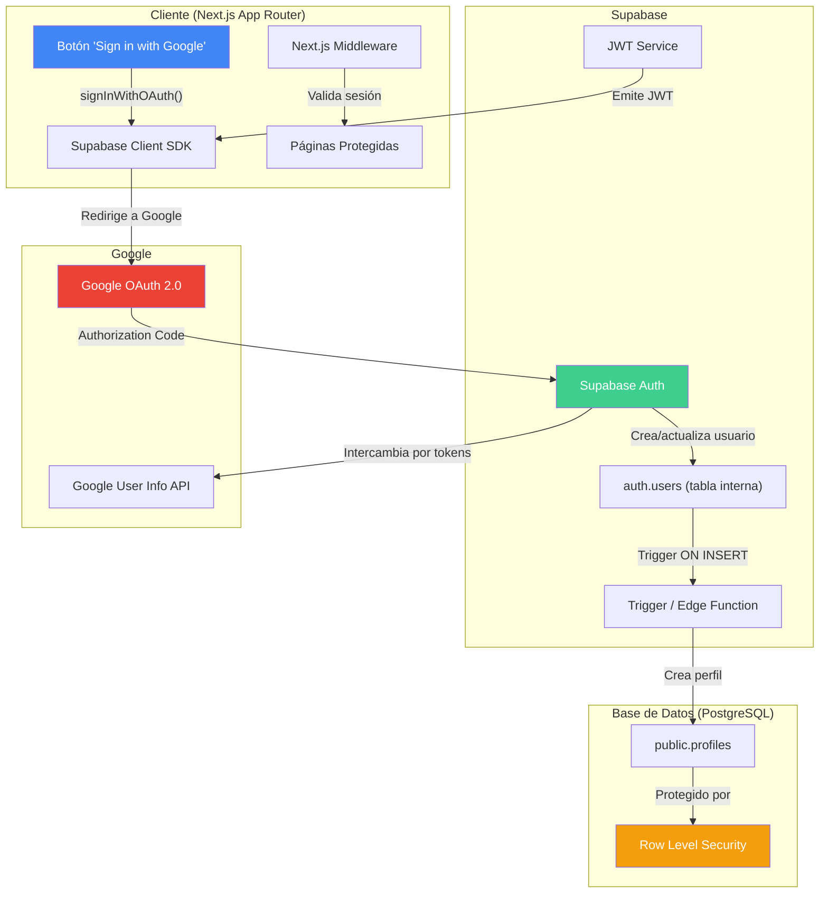
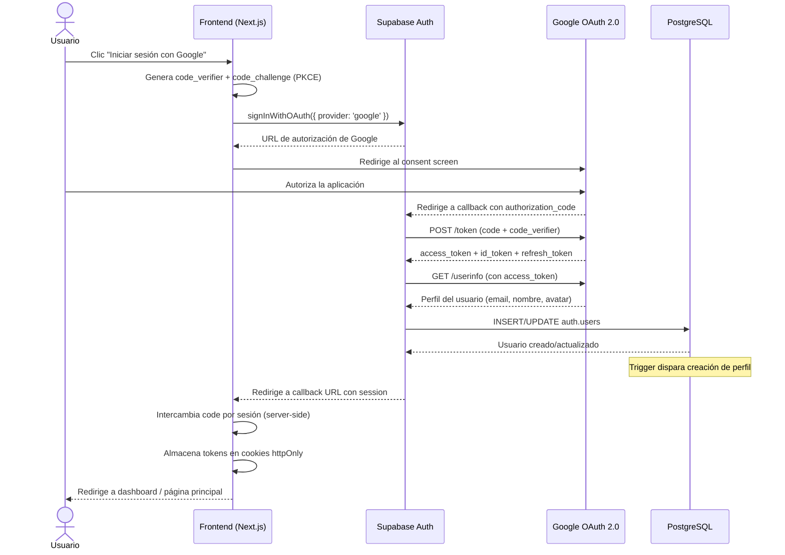
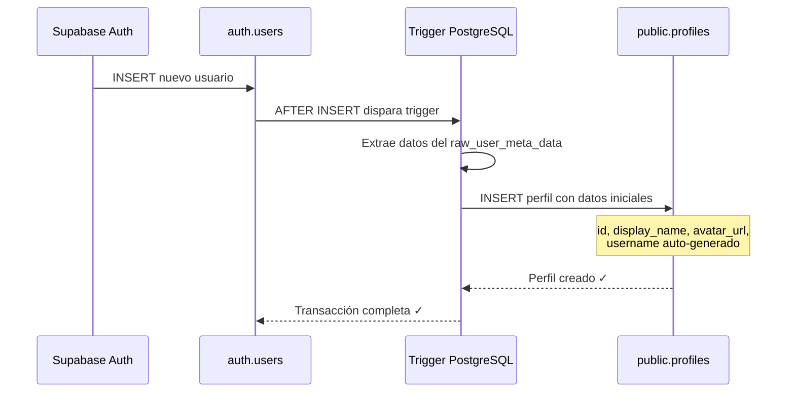
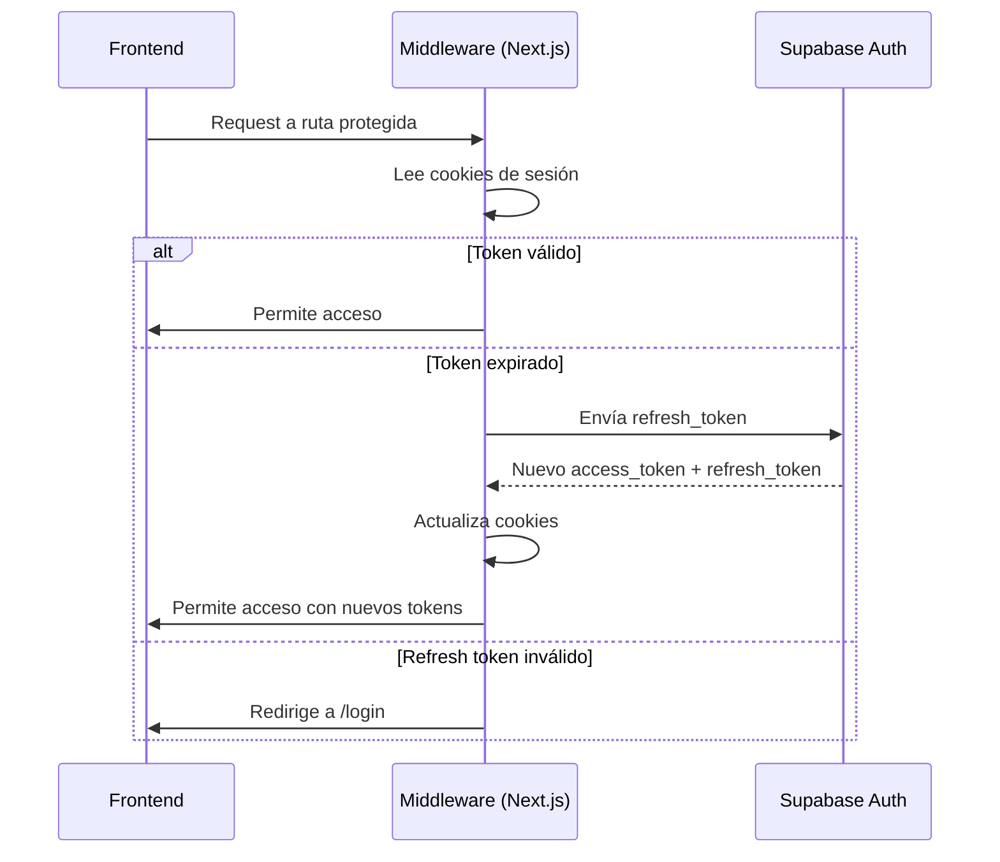
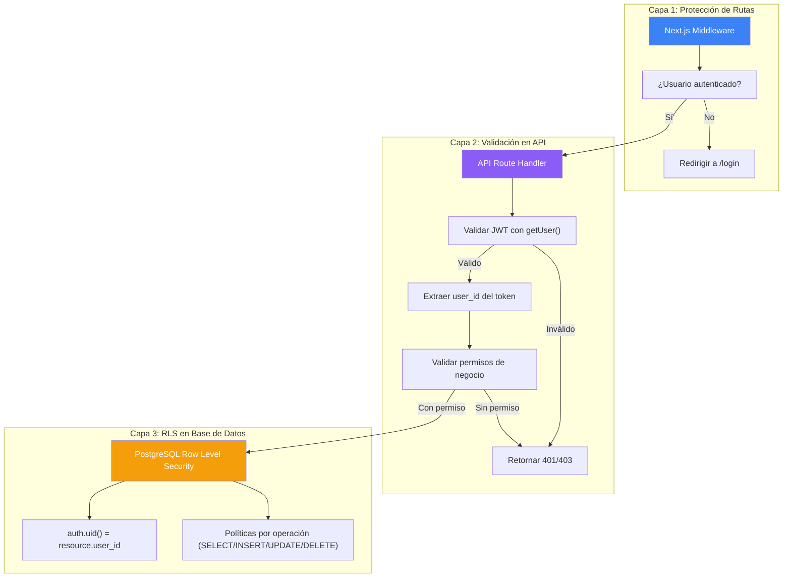
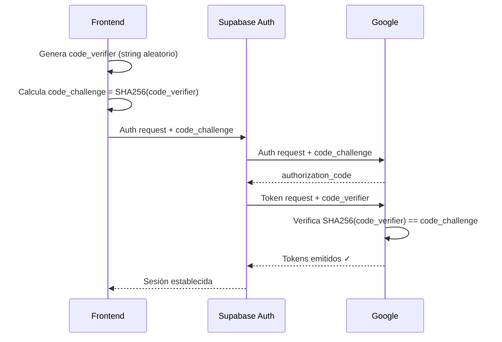
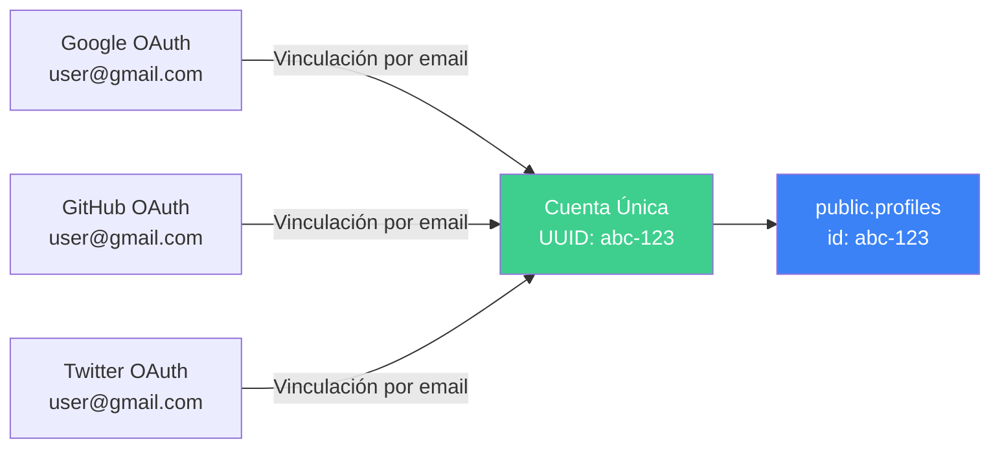

# Autenticación — PromptHub

> Documento de arquitectura de autenticación para la plataforma PromptHub.  
> Última actualización: 2026-06-18

---

## Tabla de Contenidos

1. [Visión General de la Arquitectura](#visión-general-de-la-arquitectura)
2. [Flujo de Google OAuth](#flujo-de-google-oauth)
3. [Sincronización Usuario-Perfil](#sincronización-usuario-perfil)
4. [Gestión de Sesiones](#gestión-de-sesiones)
5. [Estrategia de Autorización](#estrategia-de-autorización)
6. [Roles y Permisos](#roles-y-permisos)
7. [Seguridad del JWT](#seguridad-del-jwt)
8. [Vinculación de Cuentas (Futuro)](#vinculación-de-cuentas-futuro)

---

## Visión General de la Arquitectura

PromptHub utiliza **Supabase Auth** como proveedor de identidad, integrado con **Google OAuth 2.0** como método principal de inicio de sesión. Esta decisión reduce la fricción de registro para los usuarios y elimina la necesidad de gestionar contraseñas, lo que simplifica tanto la experiencia de usuario como la superficie de seguridad.

El sistema de autenticación se compone de tres capas fundamentales:

| Capa | Tecnología | Responsabilidad |
|------|-----------|-----------------|
| **Proveedor de Identidad** | Google OAuth 2.0 | Verificación de identidad del usuario |
| **Gestión de Auth** | Supabase Auth | Tokens, sesiones, almacenamiento de usuarios |
| **Integración Frontend** | `@supabase/ssr` + Next.js Middleware | Protección de rutas, refresco de sesión |
| **Integración Backend** | Supabase Client (server-side) | Validación de JWT en API Routes |
| **Capa de Datos** | PostgreSQL RLS | Autorización a nivel de fila |



---

## Flujo de Google OAuth

### Descripción paso a paso

El flujo de autenticación con Google OAuth sigue el estándar **Authorization Code Flow con PKCE** (Proof Key for Code Exchange), que es el flujo recomendado para aplicaciones web modernas. Supabase implementa PKCE de forma nativa, lo que agrega una capa adicional de seguridad contra ataques de interceptación de código.

| Paso | Actor | Acción | Detalle |
|------|-------|--------|---------|
| 1 | Usuario | Clic en "Iniciar sesión con Google" | Botón en la página de login |
| 2 | Frontend | Llama a `supabase.auth.signInWithOAuth()` | Genera `code_verifier` y `code_challenge` (PKCE) |
| 3 | Navegador | Redirige a Google | Pantalla de consentimiento de Google |
| 4 | Usuario | Autoriza la aplicación | Otorga permisos de perfil y email |
| 5 | Google | Redirige al callback URL | Incluye `authorization_code` en la URL |
| 6 | Supabase Auth | Intercambia código por tokens | Envía `code` + `code_verifier` a Google |
| 7 | Supabase Auth | Crea/actualiza usuario | Almacena en `auth.users` |
| 8 | Supabase Auth | Emite sesión | JWT access token + refresh token |
| 9 | Frontend | Recibe la sesión | Almacenada en cookies httpOnly vía `@supabase/ssr` |

### Diagrama de Secuencia



### Configuración del OAuth en el Frontend

```typescript
// lib/supabase/client.ts
import { createBrowserClient } from '@supabase/ssr'

export function createClient() {
  return createBrowserClient(
    process.env.NEXT_PUBLIC_SUPABASE_URL!,
    process.env.NEXT_PUBLIC_SUPABASE_ANON_KEY!
  )
}
```

```typescript
// Ejemplo: componente de login
'use client'

import { createClient } from '@/lib/supabase/client'

export function LoginButton() {
  const supabase = createClient()

  const handleLogin = async () => {
    await supabase.auth.signInWithOAuth({
      provider: 'google',
      options: {
        redirectTo: `${window.location.origin}/auth/callback`,
        queryParams: {
          access_type: 'offline',      // Para obtener refresh token de Google
          prompt: 'consent',           // Forzar pantalla de consentimiento
        },
      },
    })
  }

  return (
    <button onClick={handleLogin}>
      Iniciar sesión con Google
    </button>
  )
}
```

```typescript
// app/auth/callback/route.ts
import { createServerClient } from '@supabase/ssr'
import { cookies } from 'next/headers'
import { NextResponse } from 'next/server'

export async function GET(request: Request) {
  const { searchParams, origin } = new URL(request.url)
  const code = searchParams.get('code')
  const next = searchParams.get('next') ?? '/dashboard'

  if (code) {
    const cookieStore = cookies()
    const supabase = createServerClient(
      process.env.NEXT_PUBLIC_SUPABASE_URL!,
      process.env.NEXT_PUBLIC_SUPABASE_ANON_KEY!,
      {
        cookies: {
          getAll() { return cookieStore.getAll() },
          setAll(cookiesToSet) {
            cookiesToSet.forEach(({ name, value, options }) =>
              cookieStore.set(name, value, options)
            )
          },
        },
      }
    )

    const { error } = await supabase.auth.exchangeCodeForSession(code)
    if (!error) {
      return NextResponse.redirect(`${origin}${next}`)
    }
  }

  // Si hay error, redirigir a página de error
  return NextResponse.redirect(`${origin}/auth/error`)
}
```

### Configuración en Supabase Dashboard

Para habilitar Google OAuth en Supabase:

1. **Google Cloud Console:**
   - Crear un proyecto en Google Cloud Console
   - Habilitar la API de Google+ / People API
   - Crear credenciales OAuth 2.0 (Web application)
   - Agregar `https://<PROJECT_REF>.supabase.co/auth/v1/callback` como Authorized redirect URI
   - Anotar el `Client ID` y `Client Secret`

2. **Supabase Dashboard:**
   - Ir a Authentication → Providers → Google
   - Habilitar Google provider
   - Ingresar el `Client ID` y `Client Secret`
   - Configurar los scopes necesarios: `email`, `profile`

3. **Variables de Entorno:**
   ```env
   NEXT_PUBLIC_SUPABASE_URL=https://<PROJECT_REF>.supabase.co
   NEXT_PUBLIC_SUPABASE_ANON_KEY=<anon-key>
   SUPABASE_SERVICE_ROLE_KEY=<service-role-key>  # Solo server-side, NUNCA en el cliente
   ```

> [!CAUTION]
> La clave `SUPABASE_SERVICE_ROLE_KEY` bypasea todas las políticas de Row Level Security. **Nunca** debe exponerse en el cliente ni en variables de entorno con prefijo `NEXT_PUBLIC_`.

---

## Sincronización Usuario-Perfil

### Problema

Cuando un usuario se registra mediante Google OAuth, Supabase crea un registro en la tabla interna `auth.users`. Sin embargo, PromptHub necesita una tabla `public.profiles` con datos adicionales del usuario (username, bio, preferencias, etc.) que está bajo nuestro control y protegida por RLS.

### Solución: Database Trigger

Se utiliza un **trigger de PostgreSQL** que se ejecuta automáticamente cada vez que se inserta un nuevo registro en `auth.users`. Este enfoque es preferible a un webhook o Edge Function porque:

- Es **síncrono** y **atómico** (se ejecuta dentro de la misma transacción)
- No depende de servicios externos
- Es más confiable (no puede fallar por problemas de red)
- Tiene acceso directo a los datos del nuevo usuario



### Implementación del Trigger

```sql
-- Función que se ejecuta con el trigger
CREATE OR REPLACE FUNCTION public.handle_new_user()
RETURNS TRIGGER
LANGUAGE plpgsql
SECURITY DEFINER          -- Se ejecuta con permisos del owner (superuser)
SET search_path = ''      -- Prevenir inyección de search_path
AS $$
DECLARE
  _display_name TEXT;
  _avatar_url TEXT;
  _username TEXT;
BEGIN
  -- Extraer datos del perfil de Google
  -- raw_user_meta_data contiene la info del proveedor OAuth
  _display_name := COALESCE(
    NEW.raw_user_meta_data ->> 'full_name',
    NEW.raw_user_meta_data ->> 'name',
    split_part(NEW.email, '@', 1)      -- Fallback: parte local del email
  );

  _avatar_url := COALESCE(
    NEW.raw_user_meta_data ->> 'avatar_url',
    NEW.raw_user_meta_data ->> 'picture',
    NULL
  );

  -- Generar username único basado en el UUID del usuario
  -- Formato: 'user_' + primeros 8 caracteres del UUID
  _username := 'user_' || LEFT(REPLACE(NEW.id::TEXT, '-', ''), 8);

  -- Insertar el perfil
  INSERT INTO public.profiles (
    id,
    username,
    display_name,
    avatar_url,
    role,
    onboarding_completed,
    created_at,
    updated_at
  ) VALUES (
    NEW.id,                    -- Mismo ID que auth.users (FK)
    _username,                 -- Username auto-generado
    _display_name,             -- Nombre del perfil de Google
    _avatar_url,               -- Avatar de Google
    'user',                    -- Rol por defecto
    FALSE,                     -- Necesita completar onboarding
    NOW(),
    NOW()
  );

  RETURN NEW;
END;
$$;

-- Crear el trigger
CREATE TRIGGER on_auth_user_created
  AFTER INSERT ON auth.users
  FOR EACH ROW
  EXECUTE FUNCTION public.handle_new_user();
```

### Flujo de Onboarding (Primera Vez)

Cuando un usuario inicia sesión por primera vez, el campo `onboarding_completed` estará en `FALSE`. El frontend detecta esta condición y redirige al usuario a un flujo de onboarding donde puede:

1. **Elegir un username único** — Validación en tiempo real contra la base de datos
2. **Confirmar o editar su display name** — Pre-llenado con el nombre de Google
3. **Opcionalmente agregar una bio** — Breve descripción del usuario
4. **Aceptar los términos de servicio** — Requerido para continuar

```typescript
// middleware.ts — Detección de onboarding pendiente
// (simplificado, ver sección de middleware completa más adelante)

if (session && !profile.onboarding_completed) {
  // Redirigir al onboarding si no está en la ruta de onboarding
  if (!request.nextUrl.pathname.startsWith('/onboarding')) {
    return NextResponse.redirect(new URL('/onboarding', request.url))
  }
}
```

### Validación de Username

```sql
-- Restricciones en la tabla profiles
ALTER TABLE public.profiles
  ADD CONSTRAINT profiles_username_unique UNIQUE (username),
  ADD CONSTRAINT profiles_username_format CHECK (
    username ~ '^[a-z0-9_]{3,30}$'      -- Solo minúsculas, números, guiones bajos
  );

-- Palabras reservadas (evitar usernames como 'admin', 'api', 'auth', etc.)
-- Se validan tanto en el frontend como en una función del backend
```

---

## Gestión de Sesiones

### Estructura de Tokens

Supabase Auth utiliza un sistema de **dos tokens** para gestionar las sesiones:

| Token | Tipo | Duración | Almacenamiento | Propósito |
|-------|------|----------|----------------|-----------|
| **Access Token** | JWT | ~1 hora (3600s) | Cookie httpOnly | Autenticación en cada request |
| **Refresh Token** | Opaco | ~1 semana | Cookie httpOnly | Renovar el access token |

### Contenido del JWT (Access Token)

El JWT emitido por Supabase contiene los siguientes claims relevantes:

```json
{
  "aud": "authenticated",
  "exp": 1718700000,
  "iat": 1718696400,
  "iss": "https://<PROJECT_REF>.supabase.co/auth/v1",
  "sub": "uuid-del-usuario",          // auth.users.id
  "email": "usuario@gmail.com",
  "phone": "",
  "app_metadata": {
    "provider": "google",
    "providers": ["google"]
  },
  "user_metadata": {
    "full_name": "Nombre del Usuario",
    "avatar_url": "https://lh3.googleusercontent.com/...",
    "email_verified": true
  },
  "role": "authenticated",
  "aal": "aal1",                       // Authentication Assurance Level
  "session_id": "uuid-de-la-sesion"
}
```

> [!NOTE]
> El claim `sub` contiene el UUID del usuario y es lo que PostgreSQL usa en las políticas RLS a través de `auth.uid()`. Este es el vínculo entre la autenticación y la autorización a nivel de base de datos.

### Mecanismo de Auto-Refresco

El cliente de Supabase (`@supabase/ssr`) maneja automáticamente el refresco de tokens:



### Implementación del Middleware de Sesión

```typescript
// middleware.ts
import { createServerClient } from '@supabase/ssr'
import { NextResponse, type NextRequest } from 'next/server'

export async function middleware(request: NextRequest) {
  let supabaseResponse = NextResponse.next({
    request,
  })

  const supabase = createServerClient(
    process.env.NEXT_PUBLIC_SUPABASE_URL!,
    process.env.NEXT_PUBLIC_SUPABASE_ANON_KEY!,
    {
      cookies: {
        getAll() {
          return request.cookies.getAll()
        },
        setAll(cookiesToSet) {
          // Actualizar cookies en el request (para Server Components)
          cookiesToSet.forEach(({ name, value }) =>
            request.cookies.set(name, value)
          )
          // Actualizar cookies en el response (para el navegador)
          supabaseResponse = NextResponse.next({ request })
          cookiesToSet.forEach(({ name, value, options }) =>
            supabaseResponse.cookies.set(name, value, options)
          )
        },
      },
    }
  )

  // IMPORTANTE: No usar getSession() — puede ser falsificada.
  // getUser() valida el JWT contra el servidor de Supabase.
  const { data: { user } } = await supabase.auth.getUser()

  // Rutas protegidas
  const protectedPaths = ['/dashboard', '/settings', '/publish', '/collections']
  const isProtectedRoute = protectedPaths.some(path =>
    request.nextUrl.pathname.startsWith(path)
  )

  if (isProtectedRoute && !user) {
    const url = request.nextUrl.clone()
    url.pathname = '/login'
    url.searchParams.set('redirectTo', request.nextUrl.pathname)
    return NextResponse.redirect(url)
  }

  // Si el usuario está autenticado y va a /login, redirigir al dashboard
  if (user && request.nextUrl.pathname === '/login') {
    return NextResponse.redirect(new URL('/dashboard', request.url))
  }

  return supabaseResponse
}

export const config = {
  matcher: [
    // Excluir archivos estáticos y assets
    '/((?!_next/static|_next/image|favicon.ico|.*\\.(?:svg|png|jpg|jpeg|gif|webp)$).*)',
  ],
}
```

> [!WARNING]
> **Nunca** uses `supabase.auth.getSession()` para validar la autenticación en el servidor. Esta función lee los datos de la cookie sin validar el JWT contra el servidor. Un atacante podría falsificar la cookie. Siempre usa `supabase.auth.getUser()` que realiza una validación completa.

### Logout

```typescript
// app/auth/logout/route.ts
import { createServerClient } from '@supabase/ssr'
import { cookies } from 'next/headers'
import { NextResponse } from 'next/server'

export async function POST() {
  const cookieStore = cookies()
  const supabase = createServerClient(/* ... configuración ... */)

  await supabase.auth.signOut()

  return NextResponse.redirect(new URL('/', process.env.NEXT_PUBLIC_SITE_URL!))
}
```

---

## Estrategia de Autorización

PromptHub implementa un modelo de **autorización en tres capas** (defense in depth). Cada capa actúa como una barrera independiente, de modo que si una capa falla o es bypaseada, las siguientes capas siguen protegiendo los datos.

### Las Tres Capas



### Capa 1 — Protección de Rutas (Frontend)

| Ruta | Acceso | Comportamiento |
|------|--------|----------------|
| `/` | Público | Landing page |
| `/explore` | Público | Explorar recursos públicos |
| `/resource/:slug` | Público (si recurso público) | Ver detalle del recurso |
| `/user/:username` | Público | Perfil público del usuario |
| `/login` | Solo no autenticados | Redirige a `/dashboard` si ya autenticado |
| `/dashboard` | Autenticado | Redirige a `/login` si no autenticado |
| `/settings` | Autenticado | Configuración del perfil |
| `/publish` | Autenticado | Crear/editar recursos |
| `/collections` | Autenticado | Gestión de colecciones |
| `/admin/*` | Admin (futuro) | Panel de administración |

### Capa 2 — Validación en API Routes (Backend)

```typescript
// lib/auth/validate-request.ts
import { createServerClient } from '@supabase/ssr'
import { cookies } from 'next/headers'

export async function validateRequest() {
  const cookieStore = cookies()
  const supabase = createServerClient(/* ... */)

  const { data: { user }, error } = await supabase.auth.getUser()

  if (error || !user) {
    return { user: null, error: 'No autenticado' }
  }

  return { user, error: null }
}

// Uso en un API Route
// app/api/resources/route.ts
import { validateRequest } from '@/lib/auth/validate-request'
import { NextResponse } from 'next/server'

export async function POST(request: Request) {
  const { user, error } = await validateRequest()

  if (!user) {
    return NextResponse.json(
      { error: 'No autenticado' },
      { status: 401 }
    )
  }

  // El user.id se usa para asociar el recurso al usuario
  const body = await request.json()

  // ... lógica de creación del recurso con user.id como author_id
}
```

### Capa 3 — Row Level Security (Base de Datos)

```sql
-- Ejemplo: Políticas RLS para la tabla resources
ALTER TABLE public.resources ENABLE ROW LEVEL SECURITY;

-- SELECT: Cualquiera puede ver recursos publicados;
-- solo el autor puede ver sus borradores
CREATE POLICY "Recursos publicados son públicos"
  ON public.resources FOR SELECT
  USING (
    status = 'published'
    OR auth.uid() = user_id
  );

-- INSERT: Solo usuarios autenticados pueden crear recursos
CREATE POLICY "Usuarios autenticados crean recursos"
  ON public.resources FOR INSERT
  WITH CHECK (
    auth.uid() = user_id
  );

-- UPDATE: Solo el autor puede editar sus recursos
CREATE POLICY "Solo el autor edita sus recursos"
  ON public.resources FOR UPDATE
  USING (auth.uid() = user_id)
  WITH CHECK (auth.uid() = user_id);

-- DELETE: Solo el autor puede eliminar sus recursos
CREATE POLICY "Solo el autor elimina sus recursos"
  ON public.resources FOR DELETE
  USING (auth.uid() = user_id);
```

> [!IMPORTANT]
> RLS es la **última línea de defensa**. Incluso si un atacante logra bypasear el middleware y las API routes, las políticas RLS en PostgreSQL impiden el acceso no autorizado a nivel de base de datos. Esto es especialmente importante porque el `anon key` de Supabase es público y podría ser usado directamente contra la API de Supabase.

---

## Roles y Permisos

### Modelo de Roles para el MVP

Para el MVP, PromptHub implementa un modelo de roles simple con dos niveles. La extensión a más roles será posible sin cambios arquitecturales significativos gracias al diseño basado en una columna `role` en la tabla `profiles`.

| Rol | Valor en DB | Permisos | Implementación |
|-----|-------------|----------|----------------|
| **Usuario Regular** | `'user'` | CRUD completo sobre sus propios recursos, interacción social (likes, comentarios, follows), gestión de colecciones | MVP — activo |
| **Administrador** | `'admin'` | Todo lo del usuario + moderación de contenido, gestión de usuarios, feature flags | Futuro — post-MVP |

### Esquema de la Columna de Rol

```sql
-- En la tabla profiles
ALTER TABLE public.profiles
  ADD COLUMN role TEXT NOT NULL DEFAULT 'user'
  CHECK (role IN ('user', 'admin'));

-- Índice para consultas por rol (útil para panel de admin)
CREATE INDEX idx_profiles_role ON public.profiles (role);
```

### Permisos Detallados por Rol

#### Usuario Regular (`'user'`)

| Recurso | Crear | Leer | Editar | Eliminar |
|---------|-------|------|--------|----------|
| Recursos propios | ✅ | ✅ | ✅ | ✅ |
| Recursos ajenos (publicados) | ❌ | ✅ | ❌ | ❌ |
| Colecciones propias | ✅ | ✅ | ✅ | ✅ |
| Colecciones ajenas (públicas) | ❌ | ✅ | ❌ | ❌ |
| Comentarios propios | ✅ | ✅ | ✅ | ✅ |
| Likes | ✅ | ✅ | — | ✅ (unlike) |
| Perfil propio | — | ✅ | ✅ | ✅ (eliminar cuenta) |
| Perfiles ajenos (público) | — | ✅ | ❌ | ❌ |
| Reportes | ✅ | ❌ | ❌ | ❌ |

#### Administrador (`'admin'`) — Futuro

| Capacidad | Descripción |
|-----------|-------------|
| Moderación de contenido | Ocultar/eliminar recursos y comentarios inapropiados |
| Gestión de usuarios | Banear, suspender o restaurar cuentas |
| Feature flags | Activar/desactivar funcionalidades en producción |
| Métricas y analytics | Acceso al panel de métricas internas |
| Gestión de reportes | Revisar y resolver reportes de usuarios |

### Gestión de Admin en el MVP

Para el MVP no se construirá un panel de administración dedicado. Las tareas administrativas se realizarán directamente a través de:

1. **Supabase Dashboard** — Consultas SQL directas y gestión de datos
2. **Supabase Studio** — Editor visual de tablas
3. **Scripts SQL** — Para operaciones masivas o complejas

```sql
-- Ejemplo: Promover un usuario a admin
UPDATE public.profiles
SET role = 'admin', updated_at = NOW()
WHERE id = 'uuid-del-usuario';

-- Ejemplo: Banear un usuario (soft delete)
UPDATE public.profiles
SET banned_at = NOW(), updated_at = NOW()
WHERE id = 'uuid-del-usuario';
```

### Verificación de Rol en API Routes

```typescript
// lib/auth/check-role.ts
import { validateRequest } from './validate-request'
import { createServerClient } from '@supabase/ssr'

export async function requireAdmin() {
  const { user, error } = await validateRequest()

  if (!user) {
    return { authorized: false, status: 401, message: 'No autenticado' }
  }

  const supabase = createServerClient(/* ... */)
  const { data: profile } = await supabase
    .from('profiles')
    .select('role')
    .eq('id', user.id)
    .single()

  if (profile?.role !== 'admin') {
    return { authorized: false, status: 403, message: 'Acceso denegado' }
  }

  return { authorized: true, user, profile }
}
```

---

## Seguridad del JWT

### Principios de Seguridad

La gestión segura de JWT es crítica para la protección de la plataforma. Los siguientes principios se aplican de manera estricta:

| Principio | Implementación | Riesgo que mitiga |
|-----------|---------------|-------------------|
| **Nunca exponer JWT en URL** | Usar cookies httpOnly, no query params | Filtración en logs del servidor, historial del navegador, referers |
| **Cookies httpOnly** | Configurado por `@supabase/ssr` automáticamente | XSS no puede acceder a tokens via JavaScript |
| **Cookies Secure** | Solo enviar cookies sobre HTTPS | Intercepción en redes no seguras (MitM) |
| **Cookies SameSite** | `SameSite=Lax` (default de Supabase) | Ataques CSRF |
| **Validar firma en cada request** | `supabase.auth.getUser()` valida contra el servidor | JWT falsificados o manipulados |
| **Verificar expiración** | Supabase verifica `exp` automáticamente | Uso de tokens expirados |
| **PKCE Flow** | Activado por defecto en Supabase Auth | Interceptación del authorization code |

### Flujo PKCE (Proof Key for Code Exchange)

PKCE agrega una capa de seguridad al flujo de OAuth que protege contra la interceptación del código de autorización:



> [!TIP]
> No es necesario implementar PKCE manualmente. Supabase Auth lo habilita por defecto cuando se usa `signInWithOAuth()`. El `code_verifier` se almacena temporalmente en una cookie durante el flujo de redirección.

### Checklist de Seguridad JWT

- [ ] ✅ Access token tiene duración corta (~1 hora)
- [ ] ✅ Refresh token almacenado en cookie httpOnly
- [ ] ✅ Cookies configuradas como `Secure` (solo HTTPS)
- [ ] ✅ Cookies configuradas como `SameSite=Lax`
- [ ] ✅ JWT nunca se transmite via query parameters
- [ ] ✅ JWT nunca se almacena en `localStorage`
- [ ] ✅ Se usa `getUser()` (no `getSession()`) para validación server-side
- [ ] ✅ PKCE habilitado para el flujo OAuth
- [ ] ✅ `anon key` nunca se usa para operaciones privilegiadas
- [ ] ✅ `service_role key` nunca se expone al cliente

---

## Vinculación de Cuentas (Futuro)

### Proveedores OAuth Adicionales

En fases posteriores al MVP, PromptHub podrá agregar más proveedores de autenticación. Los candidatos más relevantes para la comunidad de AI/desarrollo son:

| Proveedor | Prioridad | Justificación |
|-----------|-----------|---------------|
| **GitHub** | Alta | Muchos usuarios de AI son desarrolladores |
| **Twitter/X** | Media | Comunidad activa de AI en Twitter |
| **Discord** | Media | Comunidades de AI populares en Discord |
| **Email/Password** | Baja | Fallback para usuarios sin cuentas sociales |

### Vinculación Automática por Email

Supabase Auth soporta la **vinculación automática de cuentas** basada en el email. Esto significa que si un usuario se registra con Google (`user@gmail.com`) y luego intenta iniciar sesión con GitHub usando el mismo email, Supabase vinculará ambos proveedores a la misma cuenta automáticamente.



### Configuración Futura

```typescript
// Agregar un nuevo proveedor es tan simple como:
await supabase.auth.signInWithOAuth({
  provider: 'github',   // Cambiar el proveedor
  options: {
    redirectTo: `${window.location.origin}/auth/callback`,
    scopes: 'read:user user:email',  // Scopes específicos del proveedor
  },
})
```

### Consideraciones de Implementación

1. **No se requieren cambios en la tabla `profiles`** — El trigger `handle_new_user` funcionará sin cambios porque vincula por `auth.users.id`
2. **El usuario puede gestionar sus proveedores vinculados** — Futura página en `/settings/accounts`
3. **Conflicto de datos** — Si los datos de perfil difieren entre proveedores (nombre, avatar), se mantienen los del primer registro y el usuario puede editarlos manualmente
4. **Desvinculación** — Supabase permite desvincular proveedores siempre que quede al menos uno activo

---

## Referencias

- [Supabase Auth Documentation](https://supabase.com/docs/guides/auth)
- [Supabase Auth with Next.js (Server-Side)](https://supabase.com/docs/guides/auth/server-side/nextjs)
- [Google OAuth 2.0 Documentation](https://developers.google.com/identity/protocols/oauth2)
- [PKCE RFC 7636](https://tools.ietf.org/html/rfc7636)
- [Next.js Middleware Documentation](https://nextjs.org/docs/app/building-your-application/routing/middleware)
