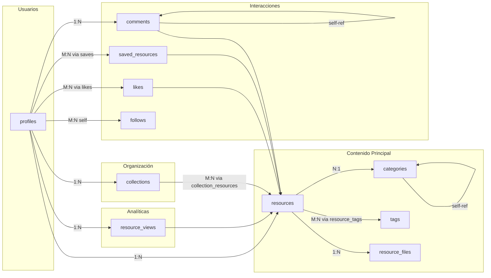
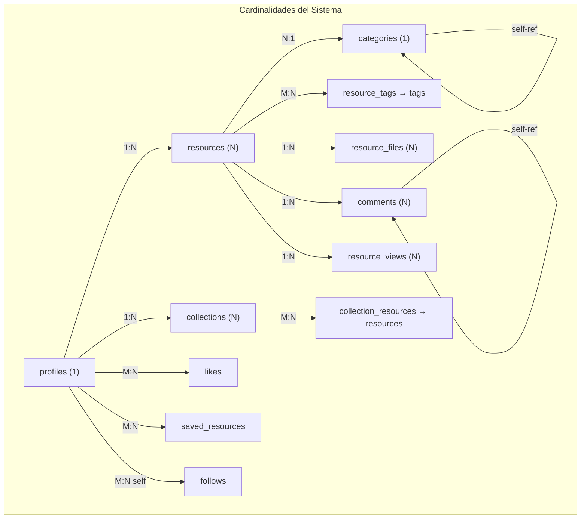
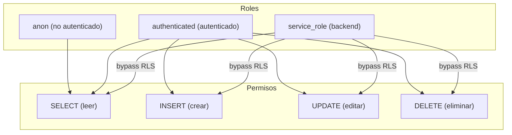
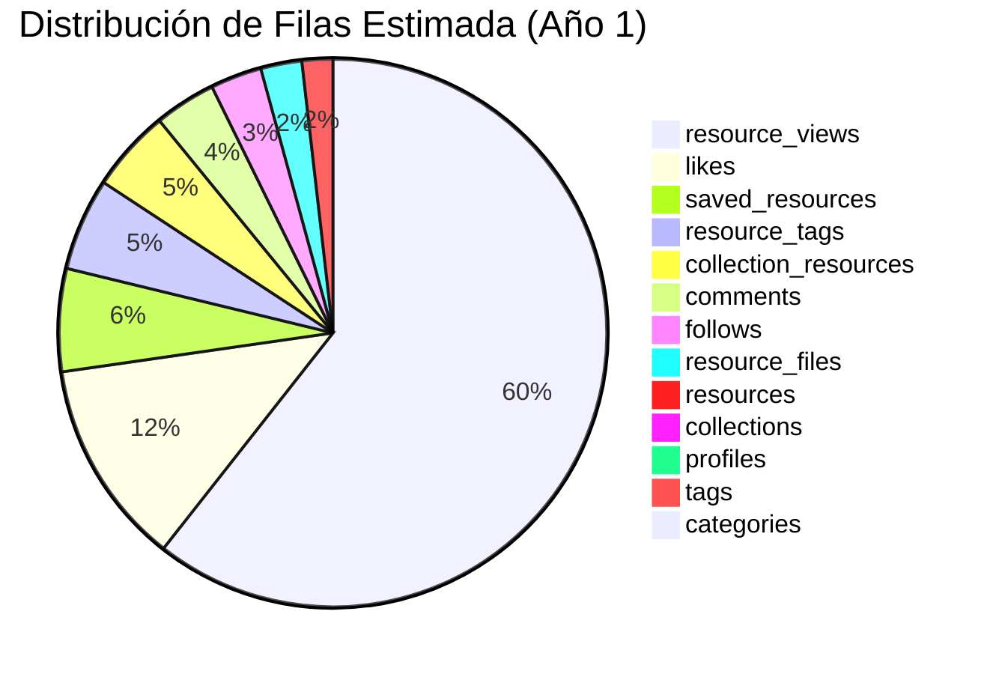
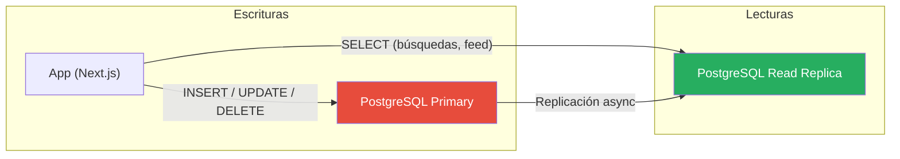
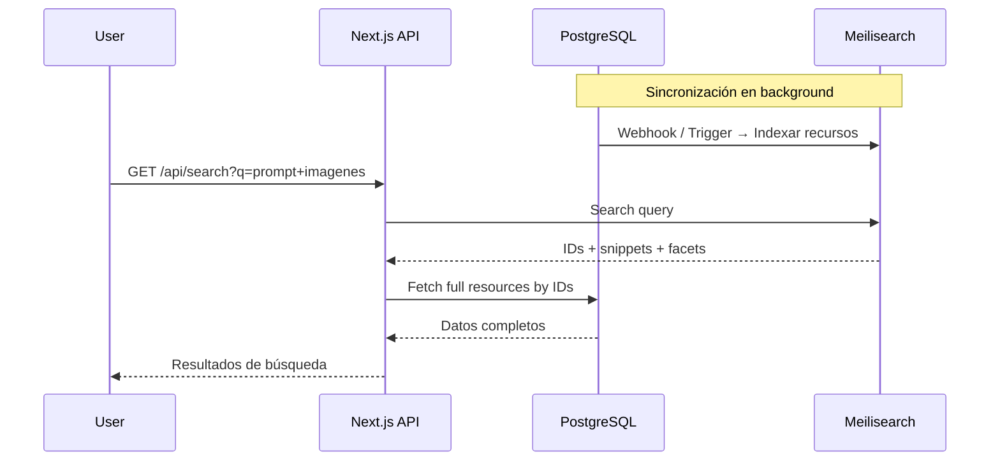

# 🗄️ Diseño de Base de Datos — PromptHub

> **Versión:** 1.0  
> **Última actualización:** 18 de junio de 2026  
> **Motor:** PostgreSQL 15+ (Supabase)  
> **ORM / Query Builder:** Supabase Client SDK + SQL directo para migraciones

---

## Tabla de Contenidos

1. [Visión General](#visión-general)
2. [Diagrama Entidad-Relación](#diagrama-entidad-relación)
3. [Entidades y Atributos](#entidades-y-atributos)
4. [Relaciones y Cardinalidades](#relaciones-y-cardinalidades)
5. [Estrategia de Índices](#estrategia-de-índices)
6. [Estrategia de Desnormalización](#estrategia-de-desnormalización)
7. [Políticas de Row Level Security (RLS)](#políticas-de-row-level-security-rls)
8. [Resumen de Entidades y Planificación de Capacidad](#resumen-de-entidades-y-planificación-de-capacidad)
9. [Optimizaciones Futuras](#optimizaciones-futuras)

---

## Visión General

La base de datos de PromptHub está diseñada sobre **Supabase (PostgreSQL)** y sigue los siguientes principios:

| Principio | Descripción |
|---|---|
| **Seguridad desde el diseño** | Cada tabla tiene políticas RLS que garantizan acceso granular |
| **Desnormalización controlada** | Contadores desnormalizados para evitar `COUNT(*)` costosos, sincronizados con triggers |
| **Escalabilidad progresiva** | Estructura lista para particionamiento, vistas materializadas y búsqueda full-text |
| **Flexibilidad** | Campos `JSONB` y arrays de PostgreSQL para datos semi-estructurados |
| **UUIDs como claves primarias** | Compatibilidad nativa con Supabase Auth y generación distribuida |

El esquema se compone de **13 entidades** que cubren: perfiles de usuario, recursos (contenido principal), organización (categorías, etiquetas, colecciones), interacciones sociales (likes, guardados, comentarios, follows) y analíticas (vistas).

---

## Diagrama Entidad-Relación

### Diagrama Completo

```mermaid
erDiagram
    profiles {
        uuid id PK "FK a auth.users.id"
        varchar username UK "max 30, NOT NULL"
        varchar display_name "max 100"
        text bio "max 500 chars"
        text avatar_url
        text website_url
        jsonb social_links
        boolean is_verified "DEFAULT false"
        timestamptz created_at
        timestamptz updated_at
    }

    resources {
        uuid id PK
        uuid author_id FK "FK a profiles.id"
        varchar title "max 200, NOT NULL"
        varchar slug UK "max 250, NOT NULL"
        text description
        text content "NOT NULL"
        enum type "prompt_llm, prompt_image, etc."
        enum status "draft, published, etc."
        uuid category_id FK "FK a categories.id"
        text_arr compatible_models "TEXT[]"
        text example_input
        text example_output
        jsonb metadata
        integer views_count "DEFAULT 0"
        integer likes_count "DEFAULT 0"
        integer saves_count "DEFAULT 0"
        integer comments_count "DEFAULT 0"
        boolean is_featured "DEFAULT false"
        timestamptz published_at
        timestamptz created_at
        timestamptz updated_at
    }

    categories {
        uuid id PK
        varchar name UK "max 100, NOT NULL"
        varchar slug UK "max 120, NOT NULL"
        text description
        varchar icon "max 50"
        uuid parent_id FK "FK a categories.id (self)"
        integer sort_order "DEFAULT 0"
        timestamptz created_at
    }

    tags {
        uuid id PK
        varchar name UK "max 50, NOT NULL"
        varchar slug UK "max 60, NOT NULL"
        integer usage_count "DEFAULT 0"
        timestamptz created_at
    }

    resource_tags {
        uuid resource_id PK_FK
        uuid tag_id PK_FK
    }

    resource_files {
        uuid id PK
        uuid resource_id FK
        text file_url "NOT NULL"
        varchar file_type "max 50"
        integer file_size
        integer sort_order "DEFAULT 0"
        timestamptz created_at
    }

    collections {
        uuid id PK
        uuid owner_id FK "FK a profiles.id"
        varchar name "max 100, NOT NULL"
        varchar slug "max 120, NOT NULL"
        text description
        text cover_image_url
        boolean is_public "DEFAULT false"
        integer resources_count "DEFAULT 0"
        timestamptz created_at
        timestamptz updated_at
    }

    collection_resources {
        uuid collection_id PK_FK
        uuid resource_id PK_FK
        timestamptz added_at
        integer sort_order "DEFAULT 0"
    }

    likes {
        uuid user_id PK_FK "FK a profiles.id"
        uuid resource_id PK_FK "FK a resources.id"
        timestamptz created_at
    }

    saved_resources {
        uuid user_id PK_FK "FK a profiles.id"
        uuid resource_id PK_FK "FK a resources.id"
        timestamptz created_at
    }

    comments {
        uuid id PK
        uuid resource_id FK
        uuid author_id FK "FK a profiles.id"
        uuid parent_id FK "FK a comments.id (self)"
        text content "NOT NULL, max 2000"
        boolean is_edited "DEFAULT false"
        timestamptz created_at
        timestamptz updated_at
    }

    follows {
        uuid follower_id PK_FK "FK a profiles.id"
        uuid following_id PK_FK "FK a profiles.id"
        timestamptz created_at
    }

    resource_views {
        uuid id PK
        uuid resource_id FK
        uuid viewer_id FK "nullable"
        varchar ip_hash "max 64"
        timestamptz created_at
    }

    %% === RELACIONES ===
    profiles ||--o{ resources : "autor de"
    profiles ||--o{ collections : "posee"
    profiles ||--o{ comments : "escribe"
    profiles ||--o{ likes : "da like"
    profiles ||--o{ saved_resources : "guarda"
    profiles ||--o{ resource_views : "visualiza"
    profiles ||--o{ follows : "sigue (follower)"
    profiles ||--o{ follows : "es seguido (following)"

    resources ||--o{ resource_tags : "tiene"
    resources ||--o{ resource_files : "adjunta"
    resources ||--o{ collection_resources : "incluido en"
    resources ||--o{ likes : "recibe"
    resources ||--o{ saved_resources : "guardado por"
    resources ||--o{ comments : "tiene"
    resources ||--o{ resource_views : "registra"
    resources }o--|| categories : "pertenece a"

    tags ||--o{ resource_tags : "aplicada a"

    categories ||--o{ categories : "subcategoría de"

    collections ||--o{ collection_resources : "contiene"

    comments ||--o{ comments : "respuesta a"
```

### Diagrama Simplificado de Relaciones Clave



---

## Entidades y Atributos

### 1. `profiles` — Perfiles de Usuario

Extiende la tabla `auth.users` nativa de Supabase. Se crea automáticamente al registrarse un usuario mediante un trigger en `auth.users`.

| Columna | Tipo | Restricciones | Descripción |
|---|---|---|---|
| `id` | `UUID` | `PK`, `FK → auth.users.id`, `ON DELETE CASCADE` | Identificador del usuario, vinculado a Supabase Auth |
| `username` | `VARCHAR(30)` | `UNIQUE`, `NOT NULL` | Nombre de usuario único, usado en URLs (`/u/{username}`) |
| `display_name` | `VARCHAR(100)` | — | Nombre visible públicamente |
| `bio` | `TEXT` | `CHECK(char_length(bio) <= 500)` | Biografía corta del usuario |
| `avatar_url` | `TEXT` | — | URL de la imagen de perfil (Supabase Storage) |
| `website_url` | `TEXT` | — | Sitio web personal |
| `social_links` | `JSONB` | `DEFAULT '{}'` | Objeto JSON con enlaces sociales |
| `is_verified` | `BOOLEAN` | `DEFAULT false` | Si el usuario está verificado por el equipo |
| `created_at` | `TIMESTAMPTZ` | `DEFAULT now()` | Fecha de creación |
| `updated_at` | `TIMESTAMPTZ` | `DEFAULT now()` | Última actualización |

**Estructura de `social_links`:**

```json
{
  "twitter": "https://twitter.com/usuario",
  "github": "https://github.com/usuario",
  "linkedin": "https://linkedin.com/in/usuario",
  "youtube": "https://youtube.com/@usuario"
}
```

**SQL de creación:**

```sql
CREATE TABLE public.profiles (
  id          UUID PRIMARY KEY REFERENCES auth.users(id) ON DELETE CASCADE,
  username    VARCHAR(30) UNIQUE NOT NULL,
  display_name VARCHAR(100),
  bio         TEXT CHECK (char_length(bio) <= 500),
  avatar_url  TEXT,
  website_url TEXT,
  social_links JSONB DEFAULT '{}',
  is_verified BOOLEAN DEFAULT false,
  created_at  TIMESTAMPTZ DEFAULT now(),
  updated_at  TIMESTAMPTZ DEFAULT now()
);

-- Trigger para crear perfil automáticamente al registrarse
CREATE OR REPLACE FUNCTION public.handle_new_user()
RETURNS TRIGGER AS $$
BEGIN
  INSERT INTO public.profiles (id, username, display_name, avatar_url)
  VALUES (
    NEW.id,
    -- Generar username provisional desde email
    LOWER(SPLIT_PART(NEW.email, '@', 1)) || '_' || SUBSTR(NEW.id::text, 1, 8),
    COALESCE(NEW.raw_user_meta_data->>'full_name', NEW.raw_user_meta_data->>'name', ''),
    COALESCE(NEW.raw_user_meta_data->>'avatar_url', '')
  );
  RETURN NEW;
END;
$$ LANGUAGE plpgsql SECURITY DEFINER;

CREATE TRIGGER on_auth_user_created
  AFTER INSERT ON auth.users
  FOR EACH ROW EXECUTE FUNCTION public.handle_new_user();
```

---

### 2. `resources` — Recursos (Entidad Principal)

El corazón de PromptHub. Cada recurso representa un prompt, agente, workflow u otro contenido de IA compartido por un usuario.

| Columna | Tipo | Restricciones | Descripción |
|---|---|---|---|
| `id` | `UUID` | `PK`, `DEFAULT gen_random_uuid()` | Identificador único |
| `author_id` | `UUID` | `FK → profiles.id`, `NOT NULL`, `ON DELETE CASCADE` | Autor del recurso |
| `title` | `VARCHAR(200)` | `NOT NULL` | Título del recurso |
| `slug` | `VARCHAR(250)` | `UNIQUE`, `NOT NULL` | URL-friendly slug, generado desde el título |
| `description` | `TEXT` | — | Descripción o resumen del recurso |
| `content` | `TEXT` | `NOT NULL` | El prompt/instrucciones real |
| `type` | `resource_type` | `NOT NULL` | Tipo de recurso (enum personalizado) |
| `status` | `resource_status` | `NOT NULL`, `DEFAULT 'draft'` | Estado de publicación |
| `category_id` | `UUID` | `FK → categories.id`, `ON DELETE SET NULL` | Categoría principal |
| `compatible_models` | `TEXT[]` | `DEFAULT '{}'` | Array de modelos compatibles |
| `example_input` | `TEXT` | — | Ejemplo de entrada/uso |
| `example_output` | `TEXT` | — | Ejemplo de salida esperada |
| `metadata` | `JSONB` | `DEFAULT '{}'` | Datos extra flexibles por tipo |
| `views_count` | `INTEGER` | `DEFAULT 0`, `CHECK(views_count >= 0)` | Contador desnormalizado de vistas |
| `likes_count` | `INTEGER` | `DEFAULT 0`, `CHECK(likes_count >= 0)` | Contador desnormalizado de likes |
| `saves_count` | `INTEGER` | `DEFAULT 0`, `CHECK(saves_count >= 0)` | Contador desnormalizado de guardados |
| `comments_count` | `INTEGER` | `DEFAULT 0`, `CHECK(comments_count >= 0)` | Contador desnormalizado de comentarios |
| `is_featured` | `BOOLEAN` | `DEFAULT false` | Destacado por el equipo |
| `published_at` | `TIMESTAMPTZ` | — | Fecha de publicación (se establece al cambiar status a `published`) |
| `created_at` | `TIMESTAMPTZ` | `DEFAULT now()` | Fecha de creación |
| `updated_at` | `TIMESTAMPTZ` | `DEFAULT now()` | Última actualización |

**Tipos ENUM:**

```sql
CREATE TYPE resource_type AS ENUM (
  'prompt_llm',
  'prompt_image',
  'prompt_video',
  'agent',
  'workflow',
  'other'
);

CREATE TYPE resource_status AS ENUM (
  'draft',
  'published',
  'archived',
  'flagged'
);
```

**Estructura de `metadata` (varía según `type`):**

```json
// Para type = 'prompt_llm'
{
  "temperature": 0.7,
  "max_tokens": 2048,
  "system_prompt": "You are a helpful assistant...",
  "version": "1.2"
}

// Para type = 'agent'
{
  "tools": ["web_search", "code_interpreter"],
  "framework": "langchain",
  "version": "2.0"
}

// Para type = 'workflow'
{
  "steps_count": 5,
  "platform": "n8n",
  "estimated_time": "2min"
}
```

**SQL de creación:**

```sql
CREATE TABLE public.resources (
  id               UUID PRIMARY KEY DEFAULT gen_random_uuid(),
  author_id        UUID NOT NULL REFERENCES public.profiles(id) ON DELETE CASCADE,
  title            VARCHAR(200) NOT NULL,
  slug             VARCHAR(250) UNIQUE NOT NULL,
  description      TEXT,
  content          TEXT NOT NULL,
  type             resource_type NOT NULL,
  status           resource_status NOT NULL DEFAULT 'draft',
  category_id      UUID REFERENCES public.categories(id) ON DELETE SET NULL,
  compatible_models TEXT[] DEFAULT '{}',
  example_input    TEXT,
  example_output   TEXT,
  metadata         JSONB DEFAULT '{}',
  views_count      INTEGER DEFAULT 0 CHECK (views_count >= 0),
  likes_count      INTEGER DEFAULT 0 CHECK (likes_count >= 0),
  saves_count      INTEGER DEFAULT 0 CHECK (saves_count >= 0),
  comments_count   INTEGER DEFAULT 0 CHECK (comments_count >= 0),
  is_featured      BOOLEAN DEFAULT false,
  published_at     TIMESTAMPTZ,
  created_at       TIMESTAMPTZ DEFAULT now(),
  updated_at       TIMESTAMPTZ DEFAULT now()
);

-- Trigger para establecer published_at al publicar
CREATE OR REPLACE FUNCTION public.set_published_at()
RETURNS TRIGGER AS $$
BEGIN
  IF NEW.status = 'published' AND OLD.status != 'published' THEN
    NEW.published_at = now();
  END IF;
  RETURN NEW;
END;
$$ LANGUAGE plpgsql;

CREATE TRIGGER on_resource_publish
  BEFORE UPDATE ON public.resources
  FOR EACH ROW EXECUTE FUNCTION public.set_published_at();
```

---

### 3. `categories` — Categorías

Estructura jerárquica de categorías con soporte para subcategorías mediante relación auto-referencial.

| Columna | Tipo | Restricciones | Descripción |
|---|---|---|---|
| `id` | `UUID` | `PK`, `DEFAULT gen_random_uuid()` | Identificador único |
| `name` | `VARCHAR(100)` | `UNIQUE`, `NOT NULL` | Nombre de la categoría |
| `slug` | `VARCHAR(120)` | `UNIQUE`, `NOT NULL` | Slug para URLs |
| `description` | `TEXT` | — | Descripción de la categoría |
| `icon` | `VARCHAR(50)` | — | Nombre del ícono (ej: `"brain"`, `"image"`) |
| `parent_id` | `UUID` | `FK → categories.id`, `ON DELETE SET NULL` | Categoría padre (NULL = raíz) |
| `sort_order` | `INTEGER` | `DEFAULT 0` | Orden de visualización |
| `created_at` | `TIMESTAMPTZ` | `DEFAULT now()` | Fecha de creación |

```sql
CREATE TABLE public.categories (
  id          UUID PRIMARY KEY DEFAULT gen_random_uuid(),
  name        VARCHAR(100) UNIQUE NOT NULL,
  slug        VARCHAR(120) UNIQUE NOT NULL,
  description TEXT,
  icon        VARCHAR(50),
  parent_id   UUID REFERENCES public.categories(id) ON DELETE SET NULL,
  sort_order  INTEGER DEFAULT 0,
  created_at  TIMESTAMPTZ DEFAULT now()
);
```

**Datos semilla iniciales:**

| Nombre | Slug | Ícono | Padre |
|---|---|---|---|
| Prompts para LLMs | `prompts-llm` | `message-square` | NULL |
| Prompts para Imágenes | `prompts-imagen` | `image` | NULL |
| Prompts para Video | `prompts-video` | `video` | NULL |
| Agentes | `agentes` | `bot` | NULL |
| Workflows | `workflows` | `git-branch` | NULL |
| Otros | `otros` | `package` | NULL |
| Asistentes de Código | `asistentes-codigo` | `code` | Prompts para LLMs |
| Redacción Creativa | `redaccion-creativa` | `pen-tool` | Prompts para LLMs |
| Generación de Logos | `generacion-logos` | `palette` | Prompts para Imágenes |

---

### 4. `tags` — Etiquetas

Sistema de etiquetado libre donde los usuarios pueden añadir etiquetas a sus recursos.

| Columna | Tipo | Restricciones | Descripción |
|---|---|---|---|
| `id` | `UUID` | `PK`, `DEFAULT gen_random_uuid()` | Identificador único |
| `name` | `VARCHAR(50)` | `UNIQUE`, `NOT NULL` | Nombre del tag (case-insensitive en búsquedas) |
| `slug` | `VARCHAR(60)` | `UNIQUE`, `NOT NULL` | Slug normalizado |
| `usage_count` | `INTEGER` | `DEFAULT 0`, `CHECK(usage_count >= 0)` | Número de recursos que usan este tag |
| `created_at` | `TIMESTAMPTZ` | `DEFAULT now()` | Fecha de creación |

```sql
CREATE TABLE public.tags (
  id          UUID PRIMARY KEY DEFAULT gen_random_uuid(),
  name        VARCHAR(50) UNIQUE NOT NULL,
  slug        VARCHAR(60) UNIQUE NOT NULL,
  usage_count INTEGER DEFAULT 0 CHECK (usage_count >= 0),
  created_at  TIMESTAMPTZ DEFAULT now()
);
```

---

### 5. `resource_tags` — Relación Recursos ↔ Etiquetas (M:N)

Tabla pivote que conecta recursos con etiquetas.

| Columna | Tipo | Restricciones | Descripción |
|---|---|---|---|
| `resource_id` | `UUID` | `PK`, `FK → resources.id`, `ON DELETE CASCADE` | Recurso |
| `tag_id` | `UUID` | `PK`, `FK → tags.id`, `ON DELETE CASCADE` | Etiqueta |

```sql
CREATE TABLE public.resource_tags (
  resource_id UUID NOT NULL REFERENCES public.resources(id) ON DELETE CASCADE,
  tag_id      UUID NOT NULL REFERENCES public.tags(id) ON DELETE CASCADE,
  PRIMARY KEY (resource_id, tag_id)
);
```

---

### 6. `resource_files` — Archivos Adjuntos

Imágenes, screenshots, archivos de configuración u otros adjuntos asociados a un recurso.

| Columna | Tipo | Restricciones | Descripción |
|---|---|---|---|
| `id` | `UUID` | `PK`, `DEFAULT gen_random_uuid()` | Identificador único |
| `resource_id` | `UUID` | `FK → resources.id`, `NOT NULL`, `ON DELETE CASCADE` | Recurso asociado |
| `file_url` | `TEXT` | `NOT NULL` | URL del archivo en Supabase Storage |
| `file_type` | `VARCHAR(50)` | — | MIME type (ej: `image/png`, `application/pdf`) |
| `file_size` | `INTEGER` | — | Tamaño en bytes |
| `sort_order` | `INTEGER` | `DEFAULT 0` | Orden de visualización |
| `created_at` | `TIMESTAMPTZ` | `DEFAULT now()` | Fecha de subida |

```sql
CREATE TABLE public.resource_files (
  id          UUID PRIMARY KEY DEFAULT gen_random_uuid(),
  resource_id UUID NOT NULL REFERENCES public.resources(id) ON DELETE CASCADE,
  file_url    TEXT NOT NULL,
  file_type   VARCHAR(50),
  file_size   INTEGER,
  sort_order  INTEGER DEFAULT 0,
  created_at  TIMESTAMPTZ DEFAULT now()
);
```

---

### 7. `collections` — Colecciones

Los usuarios pueden organizar recursos en colecciones temáticas, públicas o privadas.

| Columna | Tipo | Restricciones | Descripción |
|---|---|---|---|
| `id` | `UUID` | `PK`, `DEFAULT gen_random_uuid()` | Identificador único |
| `owner_id` | `UUID` | `FK → profiles.id`, `NOT NULL`, `ON DELETE CASCADE` | Propietario de la colección |
| `name` | `VARCHAR(100)` | `NOT NULL` | Nombre de la colección |
| `slug` | `VARCHAR(120)` | `NOT NULL` | Slug para URLs |
| `description` | `TEXT` | — | Descripción de la colección |
| `cover_image_url` | `TEXT` | — | Imagen de portada |
| `is_public` | `BOOLEAN` | `DEFAULT false` | Visibilidad pública o privada |
| `resources_count` | `INTEGER` | `DEFAULT 0`, `CHECK(resources_count >= 0)` | Contador desnormalizado |
| `created_at` | `TIMESTAMPTZ` | `DEFAULT now()` | Fecha de creación |
| `updated_at` | `TIMESTAMPTZ` | `DEFAULT now()` | Última actualización |

```sql
CREATE TABLE public.collections (
  id              UUID PRIMARY KEY DEFAULT gen_random_uuid(),
  owner_id        UUID NOT NULL REFERENCES public.profiles(id) ON DELETE CASCADE,
  name            VARCHAR(100) NOT NULL,
  slug            VARCHAR(120) NOT NULL,
  description     TEXT,
  cover_image_url TEXT,
  is_public       BOOLEAN DEFAULT false,
  resources_count INTEGER DEFAULT 0 CHECK (resources_count >= 0),
  created_at      TIMESTAMPTZ DEFAULT now(),
  updated_at      TIMESTAMPTZ DEFAULT now(),

  UNIQUE (owner_id, slug) -- Slug único por usuario
);
```

> [!NOTE]
> La restricción `UNIQUE(owner_id, slug)` permite que dos usuarios diferentes tengan colecciones con el mismo slug, pero cada usuario debe tener slugs únicos dentro de sus propias colecciones.

---

### 8. `collection_resources` — Relación Colecciones ↔ Recursos (M:N)

| Columna | Tipo | Restricciones | Descripción |
|---|---|---|---|
| `collection_id` | `UUID` | `PK`, `FK → collections.id`, `ON DELETE CASCADE` | Colección |
| `resource_id` | `UUID` | `PK`, `FK → resources.id`, `ON DELETE CASCADE` | Recurso |
| `added_at` | `TIMESTAMPTZ` | `DEFAULT now()` | Cuándo se añadió |
| `sort_order` | `INTEGER` | `DEFAULT 0` | Orden personalizado |

```sql
CREATE TABLE public.collection_resources (
  collection_id UUID NOT NULL REFERENCES public.collections(id) ON DELETE CASCADE,
  resource_id   UUID NOT NULL REFERENCES public.resources(id) ON DELETE CASCADE,
  added_at      TIMESTAMPTZ DEFAULT now(),
  sort_order    INTEGER DEFAULT 0,
  PRIMARY KEY (collection_id, resource_id)
);
```

---

### 9. `likes` — Likes / Me Gusta

Relación many-to-many entre usuarios y recursos que han marcado como favoritos.

| Columna | Tipo | Restricciones | Descripción |
|---|---|---|---|
| `user_id` | `UUID` | `PK`, `FK → profiles.id`, `ON DELETE CASCADE` | Usuario que dio like |
| `resource_id` | `UUID` | `PK`, `FK → resources.id`, `ON DELETE CASCADE` | Recurso que recibió el like |
| `created_at` | `TIMESTAMPTZ` | `DEFAULT now()` | Fecha del like |

```sql
CREATE TABLE public.likes (
  user_id     UUID NOT NULL REFERENCES public.profiles(id) ON DELETE CASCADE,
  resource_id UUID NOT NULL REFERENCES public.resources(id) ON DELETE CASCADE,
  created_at  TIMESTAMPTZ DEFAULT now(),
  PRIMARY KEY (user_id, resource_id)
);
```

---

### 10. `saved_resources` — Recursos Guardados (Privado)

Guardado rápido y privado de recursos, independiente de las colecciones. Equivalente al "bookmark" de Twitter o el "guardar" de Instagram.

| Columna | Tipo | Restricciones | Descripción |
|---|---|---|---|
| `user_id` | `UUID` | `PK`, `FK → profiles.id`, `ON DELETE CASCADE` | Usuario |
| `resource_id` | `UUID` | `PK`, `FK → resources.id`, `ON DELETE CASCADE` | Recurso guardado |
| `created_at` | `TIMESTAMPTZ` | `DEFAULT now()` | Fecha del guardado |

```sql
CREATE TABLE public.saved_resources (
  user_id     UUID NOT NULL REFERENCES public.profiles(id) ON DELETE CASCADE,
  resource_id UUID NOT NULL REFERENCES public.resources(id) ON DELETE CASCADE,
  created_at  TIMESTAMPTZ DEFAULT now(),
  PRIMARY KEY (user_id, resource_id)
);
```

---

### 11. `comments` — Comentarios

Sistema de comentarios con soporte para respuestas anidadas (un nivel de profundidad recomendado en el MVP).

| Columna | Tipo | Restricciones | Descripción |
|---|---|---|---|
| `id` | `UUID` | `PK`, `DEFAULT gen_random_uuid()` | Identificador único |
| `resource_id` | `UUID` | `FK → resources.id`, `NOT NULL`, `ON DELETE CASCADE` | Recurso comentado |
| `author_id` | `UUID` | `FK → profiles.id`, `NOT NULL`, `ON DELETE CASCADE` | Autor del comentario |
| `parent_id` | `UUID` | `FK → comments.id`, `ON DELETE CASCADE` | Comentario padre (NULL = top-level) |
| `content` | `TEXT` | `NOT NULL`, `CHECK(char_length(content) <= 2000)` | Contenido del comentario |
| `is_edited` | `BOOLEAN` | `DEFAULT false` | Si ha sido editado |
| `created_at` | `TIMESTAMPTZ` | `DEFAULT now()` | Fecha de creación |
| `updated_at` | `TIMESTAMPTZ` | `DEFAULT now()` | Última edición |

```sql
CREATE TABLE public.comments (
  id          UUID PRIMARY KEY DEFAULT gen_random_uuid(),
  resource_id UUID NOT NULL REFERENCES public.resources(id) ON DELETE CASCADE,
  author_id   UUID NOT NULL REFERENCES public.profiles(id) ON DELETE CASCADE,
  parent_id   UUID REFERENCES public.comments(id) ON DELETE CASCADE,
  content     TEXT NOT NULL CHECK (char_length(content) <= 2000),
  is_edited   BOOLEAN DEFAULT false,
  created_at  TIMESTAMPTZ DEFAULT now(),
  updated_at  TIMESTAMPTZ DEFAULT now()
);
```

---

### 12. `follows` — Seguimientos entre Usuarios

Relación many-to-many auto-referencial en `profiles`.

| Columna | Tipo | Restricciones | Descripción |
|---|---|---|---|
| `follower_id` | `UUID` | `PK`, `FK → profiles.id`, `ON DELETE CASCADE` | Usuario que sigue |
| `following_id` | `UUID` | `PK`, `FK → profiles.id`, `ON DELETE CASCADE` | Usuario seguido |
| `created_at` | `TIMESTAMPTZ` | `DEFAULT now()` | Fecha del follow |

```sql
CREATE TABLE public.follows (
  follower_id  UUID NOT NULL REFERENCES public.profiles(id) ON DELETE CASCADE,
  following_id UUID NOT NULL REFERENCES public.profiles(id) ON DELETE CASCADE,
  created_at   TIMESTAMPTZ DEFAULT now(),
  PRIMARY KEY (follower_id, following_id),
  CHECK (follower_id != following_id) -- No puedes seguirte a ti mismo
);
```

---

### 13. `resource_views` — Vistas de Recursos (Analíticas)

Registro granular de vistas para alimentar analíticas, trending y recomendaciones.

| Columna | Tipo | Restricciones | Descripción |
|---|---|---|---|
| `id` | `UUID` | `PK`, `DEFAULT gen_random_uuid()` | Identificador único |
| `resource_id` | `UUID` | `FK → resources.id`, `NOT NULL`, `ON DELETE CASCADE` | Recurso visualizado |
| `viewer_id` | `UUID` | `FK → profiles.id`, `ON DELETE SET NULL` | Usuario (NULL = anónimo) |
| `ip_hash` | `VARCHAR(64)` | — | Hash SHA-256 del IP (para deduplicación sin almacenar IP real) |
| `created_at` | `TIMESTAMPTZ` | `DEFAULT now()` | Fecha/hora de la vista |

```sql
CREATE TABLE public.resource_views (
  id          UUID PRIMARY KEY DEFAULT gen_random_uuid(),
  resource_id UUID NOT NULL REFERENCES public.resources(id) ON DELETE CASCADE,
  viewer_id   UUID REFERENCES public.profiles(id) ON DELETE SET NULL,
  ip_hash     VARCHAR(64),
  created_at  TIMESTAMPTZ DEFAULT now()
);
```

> [!WARNING]
> Esta tabla crecerá rápidamente. Ver la sección [Optimizaciones Futuras](#optimizaciones-futuras) para estrategias de particionamiento y retención de datos.

---

## Relaciones y Cardinalidades

### Tabla de Relaciones Completa

| Entidad Origen | Relación | Entidad Destino | Tabla Pivote | Descripción |
|---|---|---|---|---|
| `profiles` | `1:N` | `resources` | — | Un usuario puede crear muchos recursos |
| `profiles` | `1:N` | `collections` | — | Un usuario puede tener muchas colecciones |
| `profiles` | `1:N` | `comments` | — | Un usuario puede escribir muchos comentarios |
| `profiles` | `M:N` | `resources` | `likes` | Un usuario puede dar like a muchos recursos y viceversa |
| `profiles` | `M:N` | `resources` | `saved_resources` | Un usuario puede guardar muchos recursos y viceversa |
| `profiles` | `M:N` | `profiles` | `follows` | Relación auto-referencial de seguimientos |
| `profiles` | `1:N` | `resource_views` | — | Un usuario genera muchas vistas |
| `resources` | `M:N` | `tags` | `resource_tags` | Un recurso puede tener muchos tags y viceversa |
| `resources` | `1:N` | `resource_files` | — | Un recurso puede tener muchos archivos adjuntos |
| `resources` | `1:N` | `comments` | — | Un recurso puede tener muchos comentarios |
| `resources` | `N:1` | `categories` | — | Muchos recursos pertenecen a una categoría |
| `resources` | `1:N` | `resource_views` | — | Un recurso tiene muchas vistas |
| `collections` | `M:N` | `resources` | `collection_resources` | Una colección puede contener muchos recursos y viceversa |
| `comments` | `self-ref` | `comments` | — | Un comentario puede tener respuestas (parent_id) |
| `categories` | `self-ref` | `categories` | — | Una categoría puede tener subcategorías (parent_id) |

### Diagrama de Cardinalidades



---

## Estrategia de Índices

Los índices están diseñados para optimizar las consultas más frecuentes de la aplicación.

### Índices por Tabla

#### `resources`

| Índice | Columnas | Tipo | Justificación |
|---|---|---|---|
| `idx_resources_author` | `(author_id)` | B-tree | Listar recursos de un usuario (`/u/{username}`) |
| `idx_resources_category` | `(category_id)` | B-tree | Filtrar por categoría |
| `idx_resources_type_status` | `(type, status)` | B-tree | Filtrar por tipo + estado |
| `idx_resources_feed` | `(status, published_at DESC)` | B-tree | Feed principal ordenado por fecha |
| `idx_resources_slug` | `(slug)` | B-tree (unique) | Búsqueda por slug (ya cubierto por UNIQUE) |
| `idx_resources_featured` | `(is_featured) WHERE is_featured = true` | B-tree parcial | Recursos destacados |
| `idx_resources_models` | `(compatible_models)` | GIN | Búsqueda por modelo compatible |
| `idx_resources_fts` | `(to_tsvector('spanish', title \|\| ' ' \|\| description \|\| ' ' \|\| content))` | GIN | Búsqueda full-text |

```sql
-- Índices básicos
CREATE INDEX idx_resources_author ON resources(author_id);
CREATE INDEX idx_resources_category ON resources(category_id);
CREATE INDEX idx_resources_type_status ON resources(type, status);
CREATE INDEX idx_resources_feed ON resources(status, published_at DESC);
CREATE INDEX idx_resources_featured ON resources(is_featured) WHERE is_featured = true;

-- GIN para arrays
CREATE INDEX idx_resources_models ON resources USING GIN(compatible_models);

-- Full-text search (ver sección de optimizaciones futuras para tsvector dedicado)
CREATE INDEX idx_resources_fts ON resources 
  USING GIN(to_tsvector('spanish', coalesce(title, '') || ' ' || coalesce(description, '') || ' ' || coalesce(content, '')));
```

#### `profiles`

| Índice | Columnas | Tipo | Justificación |
|---|---|---|---|
| `idx_profiles_username` | `(username)` | B-tree (unique) | Ya cubierto por UNIQUE constraint |

#### `tags`

| Índice | Columnas | Tipo | Justificación |
|---|---|---|---|
| `idx_tags_slug` | `(slug)` | B-tree (unique) | Ya cubierto por UNIQUE constraint |
| `idx_tags_name` | `(name)` | B-tree (unique) | Ya cubierto por UNIQUE constraint |
| `idx_tags_popular` | `(usage_count DESC)` | B-tree | Tags más populares |

```sql
CREATE INDEX idx_tags_popular ON tags(usage_count DESC);
```

#### `likes`

| Índice | Columnas | Tipo | Justificación |
|---|---|---|---|
| `idx_likes_resource` | `(resource_id)` | B-tree | Contar likes de un recurso, verificar si usuario dio like |

```sql
CREATE INDEX idx_likes_resource ON likes(resource_id);
```

#### `comments`

| Índice | Columnas | Tipo | Justificación |
|---|---|---|---|
| `idx_comments_resource_date` | `(resource_id, created_at)` | B-tree | Comentarios de un recurso ordenados cronológicamente |
| `idx_comments_parent` | `(parent_id)` | B-tree | Cargar respuestas de un comentario |

```sql
CREATE INDEX idx_comments_resource_date ON comments(resource_id, created_at);
CREATE INDEX idx_comments_parent ON comments(parent_id) WHERE parent_id IS NOT NULL;
```

#### `follows`

| Índice | Columnas | Tipo | Justificación |
|---|---|---|---|
| `idx_follows_following` | `(following_id)` | B-tree | Contar/listar seguidores de un usuario |
| `idx_follows_follower` | `(follower_id)` | B-tree | Contar/listar a quién sigue un usuario |

```sql
CREATE INDEX idx_follows_following ON follows(following_id);
CREATE INDEX idx_follows_follower ON follows(follower_id);
```

#### `collection_resources`

| Índice | Columnas | Tipo | Justificación |
|---|---|---|---|
| `idx_colres_resource` | `(resource_id)` | B-tree | Encontrar en qué colecciones está un recurso |

```sql
CREATE INDEX idx_colres_resource ON collection_resources(resource_id);
```

#### `resource_views`

| Índice | Columnas | Tipo | Justificación |
|---|---|---|---|
| `idx_views_resource_date` | `(resource_id, created_at)` | B-tree | Analíticas por recurso en rango de fechas |
| `idx_views_date` | `(created_at)` | B-tree | Consultas globales de trending |

```sql
CREATE INDEX idx_views_resource_date ON resource_views(resource_id, created_at);
CREATE INDEX idx_views_date ON resource_views(created_at);
```

#### `resource_tags`

| Índice | Columnas | Tipo | Justificación |
|---|---|---|---|
| `idx_restags_tag` | `(tag_id)` | B-tree | Encontrar todos los recursos con un tag específico |

```sql
CREATE INDEX idx_restags_tag ON resource_tags(tag_id);
```

---

## Estrategia de Desnormalización

### ¿Por qué desnormalizar contadores?

En una aplicación social, las consultas de conteo son extremadamente frecuentes:

| Operación | Sin desnormalizar | Con desnormalizar |
|---|---|---|
| Mostrar likes de un recurso | `SELECT COUNT(*) FROM likes WHERE resource_id = ?` → **O(n)** | `SELECT likes_count FROM resources WHERE id = ?` → **O(1)** |
| Feed con 20 recursos + contadores | **20 subconsultas COUNT** o JOINs complejos | **Una sola query** con todos los datos |
| Escala con 1M likes | Cada COUNT escanea miles de filas | Lectura directa de un INTEGER |

### Contadores Desnormalizados

| Tabla | Campo Desnormalizado | Fuente Real | Trigger de Sincronización |
|---|---|---|---|
| `resources` | `likes_count` | `COUNT(*) FROM likes` | INSERT/DELETE en `likes` |
| `resources` | `saves_count` | `COUNT(*) FROM saved_resources` | INSERT/DELETE en `saved_resources` |
| `resources` | `comments_count` | `COUNT(*) FROM comments` | INSERT/DELETE en `comments` |
| `resources` | `views_count` | `COUNT(*) FROM resource_views` | INSERT en `resource_views` |
| `tags` | `usage_count` | `COUNT(*) FROM resource_tags` | INSERT/DELETE en `resource_tags` |
| `collections` | `resources_count` | `COUNT(*) FROM collection_resources` | INSERT/DELETE en `collection_resources` |

### Implementación con PostgreSQL Triggers

```sql
-- ================================================
-- Trigger: Sincronizar likes_count en resources
-- ================================================
CREATE OR REPLACE FUNCTION public.update_resource_likes_count()
RETURNS TRIGGER AS $$
BEGIN
  IF TG_OP = 'INSERT' THEN
    UPDATE resources 
    SET likes_count = likes_count + 1 
    WHERE id = NEW.resource_id;
    RETURN NEW;
  ELSIF TG_OP = 'DELETE' THEN
    UPDATE resources 
    SET likes_count = GREATEST(likes_count - 1, 0)
    WHERE id = OLD.resource_id;
    RETURN OLD;
  END IF;
END;
$$ LANGUAGE plpgsql SECURITY DEFINER;

CREATE TRIGGER on_like_change
  AFTER INSERT OR DELETE ON public.likes
  FOR EACH ROW EXECUTE FUNCTION public.update_resource_likes_count();

-- ================================================
-- Trigger: Sincronizar saves_count en resources
-- ================================================
CREATE OR REPLACE FUNCTION public.update_resource_saves_count()
RETURNS TRIGGER AS $$
BEGIN
  IF TG_OP = 'INSERT' THEN
    UPDATE resources 
    SET saves_count = saves_count + 1 
    WHERE id = NEW.resource_id;
    RETURN NEW;
  ELSIF TG_OP = 'DELETE' THEN
    UPDATE resources 
    SET saves_count = GREATEST(saves_count - 1, 0) 
    WHERE id = OLD.resource_id;
    RETURN OLD;
  END IF;
END;
$$ LANGUAGE plpgsql SECURITY DEFINER;

CREATE TRIGGER on_save_change
  AFTER INSERT OR DELETE ON public.saved_resources
  FOR EACH ROW EXECUTE FUNCTION public.update_resource_saves_count();

-- ================================================
-- Trigger: Sincronizar comments_count en resources
-- ================================================
CREATE OR REPLACE FUNCTION public.update_resource_comments_count()
RETURNS TRIGGER AS $$
BEGIN
  IF TG_OP = 'INSERT' THEN
    UPDATE resources 
    SET comments_count = comments_count + 1 
    WHERE id = NEW.resource_id;
    RETURN NEW;
  ELSIF TG_OP = 'DELETE' THEN
    UPDATE resources 
    SET comments_count = GREATEST(comments_count - 1, 0) 
    WHERE id = OLD.resource_id;
    RETURN OLD;
  END IF;
END;
$$ LANGUAGE plpgsql SECURITY DEFINER;

CREATE TRIGGER on_comment_change
  AFTER INSERT OR DELETE ON public.comments
  FOR EACH ROW EXECUTE FUNCTION public.update_resource_comments_count();

-- ================================================
-- Trigger: Sincronizar views_count en resources
-- ================================================
CREATE OR REPLACE FUNCTION public.update_resource_views_count()
RETURNS TRIGGER AS $$
BEGIN
  UPDATE resources 
  SET views_count = views_count + 1 
  WHERE id = NEW.resource_id;
  RETURN NEW;
END;
$$ LANGUAGE plpgsql SECURITY DEFINER;

CREATE TRIGGER on_view_insert
  AFTER INSERT ON public.resource_views
  FOR EACH ROW EXECUTE FUNCTION public.update_resource_views_count();

-- ================================================
-- Trigger: Sincronizar usage_count en tags
-- ================================================
CREATE OR REPLACE FUNCTION public.update_tag_usage_count()
RETURNS TRIGGER AS $$
BEGIN
  IF TG_OP = 'INSERT' THEN
    UPDATE tags 
    SET usage_count = usage_count + 1 
    WHERE id = NEW.tag_id;
    RETURN NEW;
  ELSIF TG_OP = 'DELETE' THEN
    UPDATE tags 
    SET usage_count = GREATEST(usage_count - 1, 0) 
    WHERE id = OLD.tag_id;
    RETURN OLD;
  END IF;
END;
$$ LANGUAGE plpgsql SECURITY DEFINER;

CREATE TRIGGER on_resource_tag_change
  AFTER INSERT OR DELETE ON public.resource_tags
  FOR EACH ROW EXECUTE FUNCTION public.update_tag_usage_count();

-- ================================================
-- Trigger: Sincronizar resources_count en collections
-- ================================================
CREATE OR REPLACE FUNCTION public.update_collection_resources_count()
RETURNS TRIGGER AS $$
BEGIN
  IF TG_OP = 'INSERT' THEN
    UPDATE collections 
    SET resources_count = resources_count + 1 
    WHERE id = NEW.collection_id;
    RETURN NEW;
  ELSIF TG_OP = 'DELETE' THEN
    UPDATE collections 
    SET resources_count = GREATEST(resources_count - 1, 0) 
    WHERE id = OLD.collection_id;
    RETURN OLD;
  END IF;
END;
$$ LANGUAGE plpgsql SECURITY DEFINER;

CREATE TRIGGER on_collection_resource_change
  AFTER INSERT OR DELETE ON public.collection_resources
  FOR EACH ROW EXECUTE FUNCTION public.update_collection_resources_count();
```

### Trigger genérico `updated_at`

```sql
-- Trigger reutilizable para actualizar updated_at
CREATE OR REPLACE FUNCTION public.update_updated_at_column()
RETURNS TRIGGER AS $$
BEGIN
  NEW.updated_at = now();
  RETURN NEW;
END;
$$ LANGUAGE plpgsql;

-- Aplicar a todas las tablas con updated_at
CREATE TRIGGER set_updated_at BEFORE UPDATE ON profiles
  FOR EACH ROW EXECUTE FUNCTION update_updated_at_column();

CREATE TRIGGER set_updated_at BEFORE UPDATE ON resources
  FOR EACH ROW EXECUTE FUNCTION update_updated_at_column();

CREATE TRIGGER set_updated_at BEFORE UPDATE ON collections
  FOR EACH ROW EXECUTE FUNCTION update_updated_at_column();

CREATE TRIGGER set_updated_at BEFORE UPDATE ON comments
  FOR EACH ROW EXECUTE FUNCTION update_updated_at_column();
```

> [!IMPORTANT]
> **Script de reconciliación:** Es recomendable tener un job periódico (semanal) que recalcule todos los contadores desde las tablas fuente para corregir posibles desfases:
> ```sql
> -- Reconciliar likes_count
> UPDATE resources r
> SET likes_count = (SELECT COUNT(*) FROM likes l WHERE l.resource_id = r.id);
> 
> -- Reconciliar saves_count
> UPDATE resources r
> SET saves_count = (SELECT COUNT(*) FROM saved_resources s WHERE s.resource_id = r.id);
> 
> -- Similar para comments_count, views_count, usage_count, resources_count...
> ```

---

## Políticas de Row Level Security (RLS)

Supabase utiliza PostgreSQL RLS para controlar el acceso a los datos directamente a nivel de base de datos. Esto proporciona seguridad robusta independiente del código de aplicación.

### Diagrama de Políticas por Rol



### Políticas por Tabla

#### `profiles`

```sql
ALTER TABLE profiles ENABLE ROW LEVEL SECURITY;

-- Cualquiera puede ver perfiles públicos
CREATE POLICY "Perfiles visibles para todos"
  ON profiles FOR SELECT
  USING (true);

-- Solo el propietario puede actualizar su perfil
CREATE POLICY "Usuarios pueden actualizar su propio perfil"
  ON profiles FOR UPDATE
  USING (auth.uid() = id)
  WITH CHECK (auth.uid() = id);

-- La inserción se maneja mediante el trigger de auth.users
-- No se permite INSERT directo desde el cliente
```

#### `resources`

```sql
ALTER TABLE resources ENABLE ROW LEVEL SECURITY;

-- Recursos publicados visibles para todos; borradores solo para el autor
CREATE POLICY "Recursos publicados visibles para todos"
  ON resources FOR SELECT
  USING (
    status = 'published' 
    OR author_id = auth.uid()
  );

-- Solo usuarios autenticados pueden crear recursos
CREATE POLICY "Usuarios autenticados pueden crear recursos"
  ON resources FOR INSERT
  WITH CHECK (
    auth.uid() = author_id
  );

-- Solo el autor puede actualizar sus recursos
CREATE POLICY "Autores pueden actualizar sus recursos"
  ON resources FOR UPDATE
  USING (auth.uid() = author_id)
  WITH CHECK (auth.uid() = author_id);

-- Solo el autor puede eliminar sus recursos
CREATE POLICY "Autores pueden eliminar sus recursos"
  ON resources FOR DELETE
  USING (auth.uid() = author_id);
```

#### `collections`

```sql
ALTER TABLE collections ENABLE ROW LEVEL SECURITY;

-- Colecciones públicas visibles para todos; privadas solo para el dueño
CREATE POLICY "Colecciones públicas visibles para todos"
  ON collections FOR SELECT
  USING (
    is_public = true 
    OR owner_id = auth.uid()
  );

-- Solo usuarios autenticados pueden crear colecciones propias
CREATE POLICY "Usuarios pueden crear sus colecciones"
  ON collections FOR INSERT
  WITH CHECK (auth.uid() = owner_id);

-- Solo el dueño puede actualizar
CREATE POLICY "Dueños pueden actualizar sus colecciones"
  ON collections FOR UPDATE
  USING (auth.uid() = owner_id)
  WITH CHECK (auth.uid() = owner_id);

-- Solo el dueño puede eliminar
CREATE POLICY "Dueños pueden eliminar sus colecciones"
  ON collections FOR DELETE
  USING (auth.uid() = owner_id);
```

#### `likes`

```sql
ALTER TABLE likes ENABLE ROW LEVEL SECURITY;

-- Cualquiera puede ver los likes (para mostrar contadores)
CREATE POLICY "Likes visibles para todos"
  ON likes FOR SELECT
  USING (true);

-- Solo usuarios autenticados pueden dar like (propio)
CREATE POLICY "Usuarios pueden dar like"
  ON likes FOR INSERT
  WITH CHECK (auth.uid() = user_id);

-- Solo el usuario puede quitar su like
CREATE POLICY "Usuarios pueden quitar su like"
  ON likes FOR DELETE
  USING (auth.uid() = user_id);
```

#### `saved_resources`

```sql
ALTER TABLE saved_resources ENABLE ROW LEVEL SECURITY;

-- Solo el dueño puede ver sus guardados (privacidad total)
CREATE POLICY "Solo el dueño ve sus guardados"
  ON saved_resources FOR SELECT
  USING (auth.uid() = user_id);

-- Solo el dueño puede guardar
CREATE POLICY "Usuarios pueden guardar recursos"
  ON saved_resources FOR INSERT
  WITH CHECK (auth.uid() = user_id);

-- Solo el dueño puede quitar de guardados
CREATE POLICY "Usuarios pueden quitar de guardados"
  ON saved_resources FOR DELETE
  USING (auth.uid() = user_id);
```

#### `comments`

```sql
ALTER TABLE comments ENABLE ROW LEVEL SECURITY;

-- Comentarios visibles en recursos publicados
CREATE POLICY "Comentarios visibles en recursos publicados"
  ON comments FOR SELECT
  USING (
    EXISTS (
      SELECT 1 FROM resources 
      WHERE resources.id = comments.resource_id 
      AND (resources.status = 'published' OR resources.author_id = auth.uid())
    )
  );

-- Usuarios autenticados pueden comentar
CREATE POLICY "Usuarios autenticados pueden comentar"
  ON comments FOR INSERT
  WITH CHECK (
    auth.uid() = author_id
    AND EXISTS (
      SELECT 1 FROM resources 
      WHERE resources.id = resource_id 
      AND resources.status = 'published'
    )
  );

-- Solo el autor del comentario puede editarlo
CREATE POLICY "Autores pueden editar sus comentarios"
  ON comments FOR UPDATE
  USING (auth.uid() = author_id)
  WITH CHECK (auth.uid() = author_id);

-- Solo el autor del comentario puede eliminarlo
CREATE POLICY "Autores pueden eliminar sus comentarios"
  ON comments FOR DELETE
  USING (auth.uid() = author_id);
```

#### `follows`

```sql
ALTER TABLE follows ENABLE ROW LEVEL SECURITY;

-- Cualquiera puede ver los follows
CREATE POLICY "Follows visibles para todos"
  ON follows FOR SELECT
  USING (true);

-- Solo usuarios autenticados pueden seguir (como follower)
CREATE POLICY "Usuarios pueden seguir a otros"
  ON follows FOR INSERT
  WITH CHECK (auth.uid() = follower_id);

-- Solo el follower puede dejar de seguir
CREATE POLICY "Usuarios pueden dejar de seguir"
  ON follows FOR DELETE
  USING (auth.uid() = follower_id);
```

#### `resource_tags`

```sql
ALTER TABLE resource_tags ENABLE ROW LEVEL SECURITY;

-- Visibles para todos
CREATE POLICY "Tags de recursos visibles para todos"
  ON resource_tags FOR SELECT
  USING (true);

-- Solo el autor del recurso puede gestionar tags
CREATE POLICY "Autores pueden gestionar tags de sus recursos"
  ON resource_tags FOR INSERT
  WITH CHECK (
    EXISTS (
      SELECT 1 FROM resources 
      WHERE resources.id = resource_id 
      AND resources.author_id = auth.uid()
    )
  );

CREATE POLICY "Autores pueden eliminar tags de sus recursos"
  ON resource_tags FOR DELETE
  USING (
    EXISTS (
      SELECT 1 FROM resources 
      WHERE resources.id = resource_id 
      AND resources.author_id = auth.uid()
    )
  );
```

#### `resource_files`

```sql
ALTER TABLE resource_files ENABLE ROW LEVEL SECURITY;

-- Visibles si el recurso es visible
CREATE POLICY "Archivos visibles con el recurso"
  ON resource_files FOR SELECT
  USING (
    EXISTS (
      SELECT 1 FROM resources 
      WHERE resources.id = resource_id 
      AND (resources.status = 'published' OR resources.author_id = auth.uid())
    )
  );

-- Solo el autor puede subir archivos
CREATE POLICY "Autores pueden subir archivos a sus recursos"
  ON resource_files FOR INSERT
  WITH CHECK (
    EXISTS (
      SELECT 1 FROM resources 
      WHERE resources.id = resource_id 
      AND resources.author_id = auth.uid()
    )
  );

-- Solo el autor puede eliminar archivos
CREATE POLICY "Autores pueden eliminar archivos de sus recursos"
  ON resource_files FOR DELETE
  USING (
    EXISTS (
      SELECT 1 FROM resources 
      WHERE resources.id = resource_id 
      AND resources.author_id = auth.uid()
    )
  );
```

#### `collection_resources`

```sql
ALTER TABLE collection_resources ENABLE ROW LEVEL SECURITY;

-- Visibles si la colección es pública o el usuario es dueño
CREATE POLICY "Recursos de colecciones accesibles"
  ON collection_resources FOR SELECT
  USING (
    EXISTS (
      SELECT 1 FROM collections 
      WHERE collections.id = collection_id 
      AND (collections.is_public = true OR collections.owner_id = auth.uid())
    )
  );

-- Solo el dueño de la colección puede añadir recursos
CREATE POLICY "Dueños pueden añadir recursos a sus colecciones"
  ON collection_resources FOR INSERT
  WITH CHECK (
    EXISTS (
      SELECT 1 FROM collections 
      WHERE collections.id = collection_id 
      AND collections.owner_id = auth.uid()
    )
  );

-- Solo el dueño puede quitar recursos
CREATE POLICY "Dueños pueden quitar recursos de sus colecciones"
  ON collection_resources FOR DELETE
  USING (
    EXISTS (
      SELECT 1 FROM collections 
      WHERE collections.id = collection_id 
      AND collections.owner_id = auth.uid()
    )
  );
```

#### `categories` y `tags`

```sql
-- Categories: solo lectura pública, gestión por admin (service_role)
ALTER TABLE categories ENABLE ROW LEVEL SECURITY;

CREATE POLICY "Categorías visibles para todos"
  ON categories FOR SELECT
  USING (true);
-- INSERT/UPDATE/DELETE solo via service_role (panel admin)

-- Tags: lectura pública, creación por usuarios autenticados
ALTER TABLE tags ENABLE ROW LEVEL SECURITY;

CREATE POLICY "Tags visibles para todos"
  ON tags FOR SELECT
  USING (true);

CREATE POLICY "Usuarios autenticados pueden crear tags"
  ON tags FOR INSERT
  WITH CHECK (auth.uid() IS NOT NULL);
```

#### `resource_views`

```sql
ALTER TABLE resource_views ENABLE ROW LEVEL SECURITY;

-- Inserción pública (incluso anónimos pueden generar vistas)
CREATE POLICY "Cualquiera puede registrar una vista"
  ON resource_views FOR INSERT
  WITH CHECK (true);

-- Lectura solo para el autor del recurso o via service_role
CREATE POLICY "Autores pueden ver analíticas de sus recursos"
  ON resource_views FOR SELECT
  USING (
    EXISTS (
      SELECT 1 FROM resources 
      WHERE resources.id = resource_id 
      AND resources.author_id = auth.uid()
    )
  );
```

---

## Resumen de Entidades y Planificación de Capacidad

### Tabla de Resumen

| # | Entidad | Tipo | Filas Estimadas (Año 1) | Filas Estimadas (Año 3) | Crecimiento | Notas |
|---|---|---|---|---|---|---|
| 1 | `profiles` | Entidad principal | 5,000 | 50,000 | Lineal | 1 por usuario registrado |
| 2 | `resources` | Entidad principal | 15,000 | 200,000 | Lineal-exponencial | ~3 recursos/usuario promedio |
| 3 | `categories` | Catálogo | 30 | 80 | Bajo | Gestionado por admins |
| 4 | `tags` | Catálogo | 2,000 | 15,000 | Moderado | Crece con diversidad de contenido |
| 5 | `resource_tags` | Pivote M:N | 45,000 | 600,000 | Alto (3 tags/recurso) | Crece proporcional a resources × tags |
| 6 | `resource_files` | Adjuntos | 20,000 | 300,000 | Alto | ~1.3 archivos/recurso promedio |
| 7 | `collections` | Organización | 8,000 | 80,000 | Moderado | ~1.6 colecciones/usuario activo |
| 8 | `collection_resources` | Pivote M:N | 40,000 | 500,000 | Alto | ~5 recursos/colección promedio |
| 9 | `likes` | Interacción | 100,000 | 2,000,000 | Alto | 20 likes/usuario promedio |
| 10 | `saved_resources` | Interacción | 50,000 | 800,000 | Alto | 10 saves/usuario promedio |
| 11 | `comments` | Interacción | 30,000 | 500,000 | Moderado-alto | 6 comentarios/usuario promedio |
| 12 | `follows` | Social | 25,000 | 400,000 | Moderado | 5 follows/usuario promedio |
| 13 | `resource_views` | Analíticas | 500,000 | 20,000,000 | **Muy alto** | ⚠️ Requiere particionamiento |

### Distribución de Almacenamiento Estimada



> [!CAUTION]
> La tabla `resource_views` es la de mayor crecimiento. Sin estrategias de particionamiento o retención, puede degradar el rendimiento general de la base de datos en 6-12 meses de operación con tráfico moderado.

---

## Optimizaciones Futuras

### 1. Vistas Materializadas para Trending

Calcular trending en tiempo real es costoso. Una vista materializada permite precalcular el ranking periódicamente.

```sql
-- Vista materializada: Recursos trending (últimos 7 días)
CREATE MATERIALIZED VIEW mv_trending_resources AS
SELECT 
  r.id,
  r.title,
  r.slug,
  r.type,
  r.author_id,
  r.likes_count,
  r.views_count,
  r.comments_count,
  -- Algoritmo de trending: combina recencia + popularidad
  (
    COALESCE(recent_views.cnt, 0) * 1.0 +
    COALESCE(recent_likes.cnt, 0) * 3.0 +
    COALESCE(recent_comments.cnt, 0) * 2.0
  ) / POWER(EXTRACT(EPOCH FROM (now() - r.published_at)) / 3600 + 2, 1.5) AS trending_score
FROM resources r
LEFT JOIN (
  SELECT resource_id, COUNT(*) as cnt 
  FROM resource_views 
  WHERE created_at > now() - INTERVAL '7 days' 
  GROUP BY resource_id
) recent_views ON recent_views.resource_id = r.id
LEFT JOIN (
  SELECT resource_id, COUNT(*) as cnt 
  FROM likes 
  WHERE created_at > now() - INTERVAL '7 days' 
  GROUP BY resource_id
) recent_likes ON recent_likes.resource_id = r.id
LEFT JOIN (
  SELECT resource_id, COUNT(*) as cnt 
  FROM comments 
  WHERE created_at > now() - INTERVAL '7 days' 
  GROUP BY resource_id
) recent_comments ON recent_comments.resource_id = r.id
WHERE r.status = 'published'
ORDER BY trending_score DESC
LIMIT 200;

CREATE UNIQUE INDEX idx_mv_trending_id ON mv_trending_resources(id);

-- Refrescar cada hora (via pg_cron o Supabase Edge Function programada)
-- SELECT cron.schedule('refresh-trending', '0 * * * *', 'REFRESH MATERIALIZED VIEW CONCURRENTLY mv_trending_resources');
```

---

### 2. Particionamiento de `resource_views` por Mes

```sql
-- Convertir resource_views a tabla particionada
CREATE TABLE public.resource_views_partitioned (
  id          UUID DEFAULT gen_random_uuid(),
  resource_id UUID NOT NULL,
  viewer_id   UUID,
  ip_hash     VARCHAR(64),
  created_at  TIMESTAMPTZ DEFAULT now()
) PARTITION BY RANGE (created_at);

-- Crear particiones mensuales
CREATE TABLE resource_views_2026_01 PARTITION OF resource_views_partitioned
  FOR VALUES FROM ('2026-01-01') TO ('2026-02-01');

CREATE TABLE resource_views_2026_02 PARTITION OF resource_views_partitioned
  FOR VALUES FROM ('2026-02-01') TO ('2026-03-01');

-- Automatizar con pg_partman o un cron job que cree particiones futuras
```

---

### 3. Columna `tsvector` Dedicada para Full-Text Search

En lugar de calcular el `tsvector` en cada consulta, almacenarlo como columna calculada:

```sql
-- Añadir columna tsvector a resources
ALTER TABLE resources ADD COLUMN search_vector tsvector;

-- Trigger para mantenerla actualizada
CREATE OR REPLACE FUNCTION update_resource_search_vector()
RETURNS TRIGGER AS $$
BEGIN
  NEW.search_vector = 
    setweight(to_tsvector('spanish', coalesce(NEW.title, '')), 'A') ||
    setweight(to_tsvector('spanish', coalesce(NEW.description, '')), 'B') ||
    setweight(to_tsvector('spanish', coalesce(NEW.content, '')), 'C');
  RETURN NEW;
END;
$$ LANGUAGE plpgsql;

CREATE TRIGGER update_search_vector
  BEFORE INSERT OR UPDATE OF title, description, content
  ON resources
  FOR EACH ROW EXECUTE FUNCTION update_resource_search_vector();

-- Índice GIN sobre la columna tsvector
CREATE INDEX idx_resources_search_vector ON resources USING GIN(search_vector);

-- Ejemplo de consulta full-text con ranking
SELECT 
  id, title, slug,
  ts_rank(search_vector, query) AS rank
FROM resources, plainto_tsquery('spanish', 'generar imágenes realistas') AS query
WHERE search_vector @@ query
  AND status = 'published'
ORDER BY rank DESC
LIMIT 20;
```

---

### 4. Read Replicas para Consultas de Búsqueda

Cuando el volumen de búsquedas crezca, separar las consultas de lectura:



> [!TIP]
> Supabase ofrece Read Replicas en el plan Pro. Configurar el Supabase Client para dirigir queries de lectura a la réplica:
> ```typescript
> const supabaseRead = createClient(
>   process.env.SUPABASE_READ_REPLICA_URL!,
>   process.env.SUPABASE_ANON_KEY!
> );
> ```

---

### 5. TimescaleDB para Analíticas de Series Temporales

Si las analíticas crecen en complejidad (métricas por hora, tendencias, etc.):

```sql
-- Habilitar extensión TimescaleDB (disponible en Supabase)
CREATE EXTENSION IF NOT EXISTS timescaledb;

-- Convertir resource_views en hypertable
SELECT create_hypertable('resource_views', 'created_at');

-- Consultas optimizadas de series temporales
SELECT 
  time_bucket('1 hour', created_at) AS hour,
  COUNT(*) AS views
FROM resource_views
WHERE resource_id = '<uuid>'
  AND created_at > now() - INTERVAL '7 days'
GROUP BY hour
ORDER BY hour;
```

---

### 6. Migración a Meilisearch para Búsqueda Avanzada

Para búsqueda con typo-tolerance, facetado y relevancia avanzada:



---

### Resumen del Roadmap de Optimizaciones

| Fase | Optimización | Trigger de Implementación | Complejidad |
|---|---|---|---|
| **MVP** | Índices básicos + full-text con `to_tsvector` | Día 1 | ⭐ |
| **Post-MVP** | Columna `tsvector` dedicada con pesos | 1,000+ recursos | ⭐⭐ |
| **Crecimiento** | Vista materializada para trending | 5,000+ vistas/día | ⭐⭐ |
| **Escala** | Particionamiento de `resource_views` | 1M+ filas en views | ⭐⭐⭐ |
| **Escala** | Read Replicas | Latencia de lectura > 200ms | ⭐⭐ |
| **Escala** | Meilisearch para búsqueda | Necesidad de typo-tolerance o facetado | ⭐⭐⭐ |
| **Avanzado** | TimescaleDB para analíticas | Dashboard de analíticas avanzado | ⭐⭐⭐⭐ |

---

> [!NOTE]
> Este documento debe evolucionar junto con el producto. Cada cambio en el esquema debe reflejarse aquí y en las migraciones de Supabase (`supabase/migrations/`). Usar `supabase db diff` para generar migraciones automáticas a partir de cambios en el dashboard.
