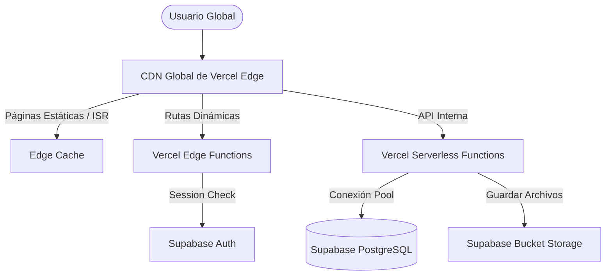
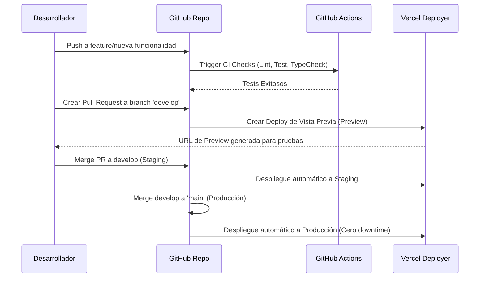

# 🚀 Estrategia de Despliegue — PromptHub

Este documento describe la arquitectura de despliegue, el pipeline de Integración y Entrega Continua (CI/CD), la gestión de entornos, políticas de respaldo y la estrategia de escalamiento técnico y financiero para PromptHub.

---

## 1. Arquitectura de Despliegue Global

PromptHub utiliza una arquitectura Serverless distribuida en el Edge para lograr una latencia mínima global y una infraestructura libre de mantenimiento de servidores físicos.



---

## 2. Gestión de Entornos

Para garantizar que los cambios no afecten a los usuarios en producción, se establecen cuatro entornos separados con sus respectivas ramas de Git y configuraciones de servicios aisladas:

| Entorno | URL | Rama Git | Base de Datos | Bucket Storage |
|---|---|---|---|---|
| **Local / Dev** | `localhost:3000` | `feature/*` | Supabase Local (Docker) | Local Storage emulator |
| **Preview** | `*-preview.vercel.app` | Pull Requests | DB Temp (Mock / Shared Staging) | Bucket Staging |
| **Staging** | `staging.prompthub.app` | `develop` | Supabase Staging | Bucket Staging |
| **Production** | `prompthub.app` | `main` | Supabase Production | Bucket Production |

---

## 3. Variables de Entorno

Las variables de entorno se gestionan a través de la consola web de Vercel y nunca se suben al repositorio de Git. Están agrupadas por la capa o servicio al que pertenecen:

### 3.1 Entorno del Cliente (Expuestas al navegador)
* `NEXT_PUBLIC_SUPABASE_URL`: Endpoint de la API de Supabase.
* `NEXT_PUBLIC_SUPABASE_ANON_KEY`: API Key pública para llamadas seguras y autenticación directa.
* `NEXT_PUBLIC_APP_URL`: URL base de la aplicación para redirecciones de OAuth y correos.
* `NEXT_PUBLIC_APP_ENV`: Define el entorno actual (`development`, `staging`, `production`).

### 3.2 Entorno del Servidor (Ocultas, solo backend Next.js)
* `SUPABASE_SERVICE_ROLE_KEY`: Clave de administración de Supabase. Permite hacer bypass a las políticas RLS. **Nunca debe exponerse al frontend.**
* `UPSTASH_REDIS_REST_URL`: Dirección de la base de datos Redis para rate limiting.
* `UPSTASH_REDIS_REST_TOKEN`: Token de autenticación de Redis.
* `SENTRY_DSN`: Identificador para reporte de bugs del servidor.

---

## 4. Pipeline de CI/CD (Integración y Despliegue Continuo)

El flujo de despliegue automatizado se controla mediante la integración de **GitHub Actions** y **Vercel GitHub Integration**:



### 4.1 Pasos Obligatorios de Verificación (GitHub Actions)
Antes de permitir el merge de cualquier PR a `develop` o `main`, se ejecutan las siguientes comprobaciones en contenedores aislados:
1. **Instalación de Dependencias**: `pnpm install --frozen-lockfile`.
2. **Análisis Estático (Linting)**: `pnpm lint` (ESLint).
3. **Verificación de Tipos**: `pnpm typecheck` (`tsc --noEmit`).
4. **Pruebas Unitarias**: `pnpm test:unit` (Vitest).
5. **Simulación de Build de Producción**: `pnpm build` (Previene fallos de empaquetado en Next.js).

---

## 5. Gestión de Migraciones de Base de Datos

Las migraciones del esquema de PostgreSQL se manejan como código mediante el **Supabase CLI**.

- **Desarrollo**: Las migraciones se crean localmente con `supabase migration new nombre_migracion` y se prueban en la base de datos local de Docker con `supabase db reset`.
- **Despliegue a Staging / Producción**: El pipeline de CI/CD ejecuta el comando de despliegue mediante el CLI autenticado:
  ```bash
  supabase db push --linked
  ```
- **Estrategia de Rollback**: En caso de fallo crítico en una migración, se debe desplegar una migración inversa compensatoria (ej. si la migración agrega una columna, la migración de rollback debe eliminarla mediante `DROP COLUMN`). Nunca se debe modificar una migración ya aplicada e historiada en Git.

---

## 6. Monitoreo y Observabilidad

Para asegurar un diagnóstico rápido ante caídas o lentitud del servicio:

* **Uptime y Disponibilidad**: Configuración de BetterStack para realizar pings HTTP cada 60 segundos a `/api/v1/health`. Si la llamada retorna un código distinto de 200, envía notificaciones push al teléfono móvil y correo electrónico del desarrollador.
* **Seguimiento de Errores (Error Tracking)**: Sentry recopila excepciones no controladas tanto en el cliente de React como en las funciones serverless de Next.js, agrupando bugs por impacto y número de usuarios afectados.
* **Métricas de Base de Datos**: Gráficas de CPU, memoria, índice de acierto de caché de disco y pool de conexiones directamente en el panel administrativo de Supabase.

---

## 7. Estrategia de Respaldo (Backups)

1. **Esquema e Historial de Base de Datos**: Respaldado en Git como código de migraciones.
2. **Datos de PostgreSQL**:
   - En planes de producción (Supabase Pro), Supabase realiza copias de seguridad físicas automáticas diariamente con un período de retención de 7 días.
   - En plan gratuito (MVP), se programa un script semanal en GitHub Actions que ejecuta `pg_dump` y almacena el backup cifrado en un repositorio privado alterno de manera segura.
3. **Archivos de Medios**: Supabase Storage se aloja en infraestructura de AWS S3 de manera subyacente, la cual tiene replicación geográfica redundante por defecto, minimizando el riesgo de pérdida física de archivos.

---

## 8. Plan de Escalado y Presupuesto Estimado

El proyecto está diseñado para crecer de manera orgánica minimizando los costos fijos al inicio:

| Fase / Escala | Infraestructura Recomendada | Coste Fijo Estimado | Capacidad Soportada |
|---|---|---|---|
| **Fase 1: MVP** | • Vercel Free Plan<br>• Supabase Free Plan<br>• Upstash Redis (Free)<br>• Sentry (Free) | **0 USD / mes** | Hasta 10,000 usuarios.<br>Tráfico moderado (<1,000 visitas/día). |
| **Fase 2: Comunidad** | • Vercel Pro Plan (20 USD)<br>• Supabase Pro Plan (25 USD)<br>• Upstash Redis Pay-as-you-go (5 USD) | **~50 USD / mes** | Hasta 100,000 usuarios.<br>Permite backups automáticos e incremento de límites de almacenamiento de imágenes. |
| **Fase 3: Escalado** | • Vercel Pro / Enterprise<br>• Supabase Pro + Add-ons de Base de Datos (ej. mayor CPU)<br>• Meilisearch Cloud (19 USD) | **~150+ USD / mes** | >500,000 usuarios.<br>Búsqueda ultra rápida en milisegundos y réplicas de lectura de BD. |

---

## 9. Recuperación ante Desastres (Disaster Recovery)

- **Objetivo de Punto de Recuperación (RPO)**: Máximo 24 horas (pérdida de datos máxima permitida en el peor escenario mediante restauración del último backup diario).
- **Objetivo de Tiempo de Recuperación (RTO)**: Menor a 2 horas para restablecer el servicio a los usuarios en caso de caída total de la base de datos o borrado accidental.
- **Plan de Acción rápido**: El desarrollador dispone de un checklist de comandos para redirigir el tráfico de Vercel a un nuevo proyecto clon de Supabase y aplicar las migraciones y backups de datos de forma inmediata.
