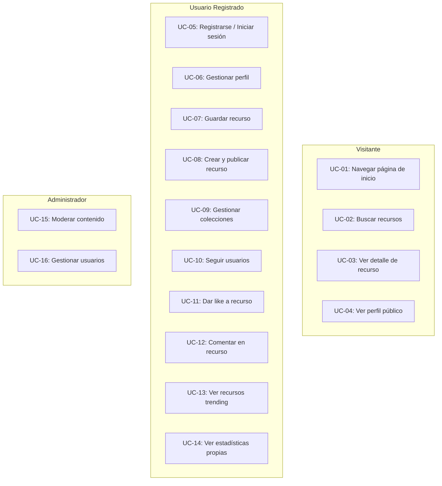
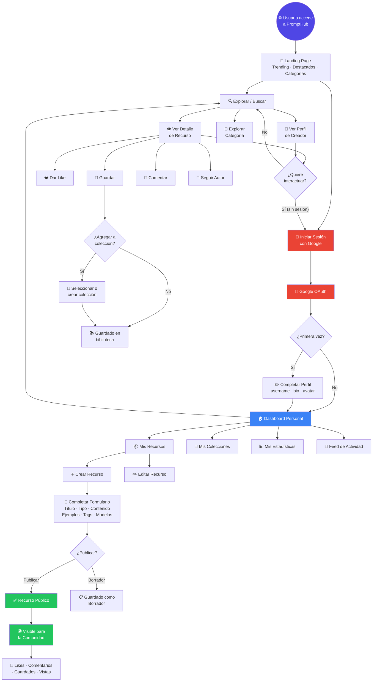
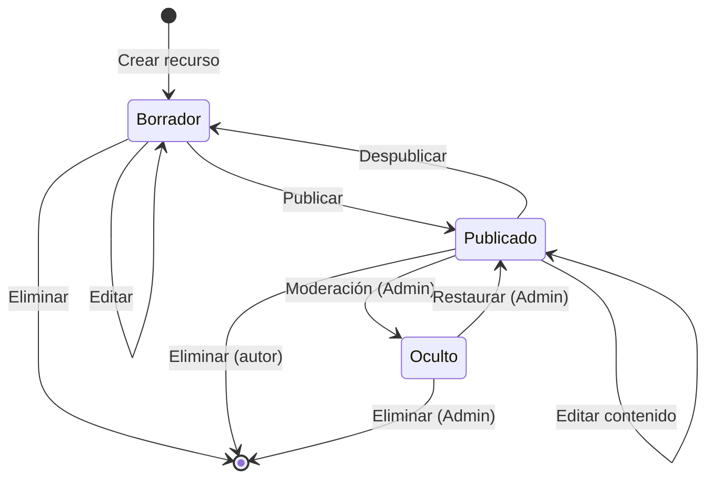
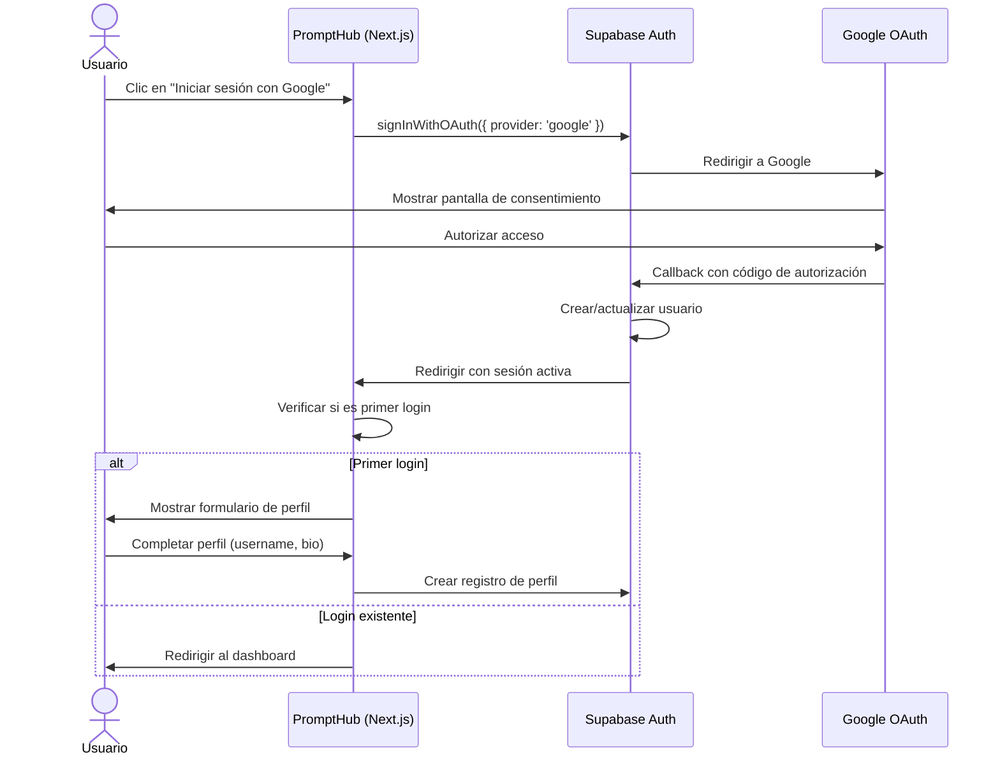

# 📋 PromptHub — Visión General del Producto

> Documento que describe la visión del producto, los tipos de usuario, casos de uso principales, flujos de la aplicación y los tipos de recursos soportados.

---

## 1. Resumen Ejecutivo

**PromptHub** es una plataforma comunitaria diseñada para practicantes de Inteligencia Artificial que necesitan un lugar centralizado para **descubrir, guardar, organizar, compartir y publicar recursos de IA**. 

La plataforma combina tres conceptos fundamentales:

| Concepto | Analogía | Funcionalidad |
|----------|----------|---------------|
| **Biblioteca de Recursos** | Como un GitHub para prompts | Almacenamiento estructurado, versionado y categorización de recursos de IA |
| **Red Social Especializada** | Como un Twitter para la comunidad IA | Follows, likes, comentarios y feed de actividad entre creadores y consumidores |
| **Motor de Descubrimiento** | Como un Product Hunt para herramientas IA | Trending, destacados, búsqueda avanzada y recomendaciones por categoría |

### Propuesta de Valor

```
Para:        Practicantes de IA (desarrolladores, diseñadores, creadores de contenido, investigadores)
Que necesitan: Un lugar centralizado para encontrar y compartir recursos de IA de calidad
PromptHub es: Una plataforma comunitaria de recursos de IA
Que ofrece:  Descubrimiento, organización y colaboración en torno a prompts, agentes y workflows
A diferencia de: Buscar en foros dispersos, documentos personales o hilos de redes sociales
Nuestro producto: Ofrece una experiencia curada, organizada y social específica para recursos de IA
```

---

## 2. Tipos de Usuario

### 2.1 Visitante (No Registrado)

| Aspecto | Detalle |
|---------|---------|
| **Descripción** | Cualquier persona que accede a la plataforma sin iniciar sesión |
| **Motivación** | Explorar el contenido disponible antes de decidir registrarse |
| **Acceso** | Solo lectura de contenido público |

**Capacidades:**
- ✅ Navegar por la página de inicio y descubrir recursos trending
- ✅ Buscar recursos públicos por texto, categoría o tipo
- ✅ Ver el detalle completo de recursos públicos (incluyendo ejemplos)
- ✅ Ver perfiles públicos de creadores
- ✅ Ver colecciones públicas de otros usuarios
- ❌ No puede guardar, crear, dar like ni comentar
- ❌ No puede seguir a otros usuarios
- ❌ No puede acceder a funcionalidades sociales

### 2.2 Usuario Registrado

| Aspecto | Detalle |
|---------|---------|
| **Descripción** | Usuario que ha iniciado sesión mediante Google OAuth |
| **Motivación** | Participar activamente: guardar, crear, compartir y socializar |
| **Acceso** | Lectura y escritura completa según permisos |

**Capacidades (además de las del Visitante):**
- ✅ Iniciar sesión con cuenta de Google
- ✅ Crear y editar su perfil (nombre, bio, avatar, enlaces)
- ✅ Crear, editar y eliminar recursos de IA propios
- ✅ Publicar recursos como públicos o mantenerlos privados (borradores)
- ✅ Guardar recursos de otros usuarios en su biblioteca personal
- ✅ Crear y gestionar colecciones (públicas o privadas)
- ✅ Dar like y comentar en recursos públicos
- ✅ Seguir a otros usuarios y ver su actividad
- ✅ Ver estadísticas básicas de sus propias publicaciones
- ✅ Recibir notificaciones de actividad relevante (futuro)

### 2.3 Creador Destacado *(Fase Futura)*

| Aspecto | Detalle |
|---------|---------|
| **Descripción** | Usuario verificado que ha demostrado calidad y consistencia en sus publicaciones |
| **Motivación** | Reconocimiento, visibilidad y posibles beneficios exclusivos |
| **Acceso** | Todo lo del usuario registrado + beneficios especiales |

**Capacidades adicionales (planificadas):**
- ✅ Badge de verificación visible en su perfil y recursos
- ✅ Prioridad en resultados de búsqueda y descubrimiento
- ✅ Acceso a analíticas avanzadas de sus publicaciones
- ✅ Posibilidad de crear recursos premium (monetización futura)
- ✅ Acceso temprano a nuevas funcionalidades

**Criterios de elegibilidad (preliminares):**
- Mínimo 20 recursos publicados con calificación positiva
- Al menos 50 seguidores
- Cuenta activa por más de 3 meses
- Sin infracciones de las normas de la comunidad

### 2.4 Administrador

| Aspecto | Detalle |
|---------|---------|
| **Descripción** | Operador de la plataforma con acceso a herramientas de gestión |
| **Motivación** | Mantener la calidad, seguridad y buen funcionamiento de la comunidad |
| **Acceso** | Acceso total al sistema incluyendo panel de administración |

**Capacidades:**
- ✅ Todas las funcionalidades del usuario registrado
- ✅ Moderar contenido: revisar, aprobar, ocultar o eliminar recursos reportados
- ✅ Gestionar usuarios: suspender, advertir o banear cuentas
- ✅ Gestionar categorías, tags y configuraciones globales
- ✅ Ver analíticas globales de la plataforma
- ✅ Otorgar o revocar el estado de "Creador Destacado"
- ✅ Gestionar contenido destacado (featured) en la página de inicio

---

## 3. Casos de Uso Principales

### Mapa de Casos de Uso



### Detalle de Casos de Uso

#### UC-01: Navegar la Página de Inicio

| Campo | Detalle |
|-------|---------|
| **Actor** | Visitante / Usuario Registrado |
| **Descripción** | El usuario accede a la página principal y explora los recursos destacados, trending y las categorías disponibles |
| **Precondición** | Ninguna |
| **Flujo principal** | 1. El usuario accede a la URL raíz de PromptHub → 2. El sistema muestra la landing page con secciones de recursos trending, destacados y categorías → 3. El usuario puede hacer scroll y explorar las secciones → 4. El usuario puede hacer clic en cualquier recurso para ver su detalle |
| **Resultado** | El usuario descubre recursos de IA sin necesidad de buscar activamente |

#### UC-02: Buscar Recursos de IA

| Campo | Detalle |
|-------|---------|
| **Actor** | Visitante / Usuario Registrado |
| **Descripción** | El usuario busca recursos específicos utilizando texto libre y/o filtros |
| **Precondición** | Ninguna |
| **Flujo principal** | 1. El usuario escribe un término en la barra de búsqueda → 2. El sistema muestra resultados en tiempo real → 3. El usuario puede aplicar filtros (categoría, tipo, tags, modelo compatible) → 4. El usuario puede ordenar resultados (relevancia, fecha, popularidad) → 5. El usuario selecciona un recurso para ver su detalle |
| **Flujo alternativo** | Si no hay resultados, el sistema sugiere términos alternativos o muestra recursos populares relacionados |
| **Resultado** | El usuario encuentra recursos relevantes para su necesidad |

#### UC-03: Ver Detalle de un Recurso

| Campo | Detalle |
|-------|---------|
| **Actor** | Visitante / Usuario Registrado |
| **Descripción** | El usuario visualiza toda la información de un recurso específico |
| **Precondición** | El recurso debe ser público (o propio si es usuario registrado) |
| **Flujo principal** | 1. El usuario navega al detalle del recurso → 2. El sistema muestra: título, descripción, contenido completo (Markdown), ejemplos de input/output, modelos compatibles, tags, categoría, autor y estadísticas → 3. El sistema incrementa el contador de vistas → 4. Si es usuario registrado, puede interactuar (like, guardar, comentar) |
| **Resultado** | El usuario obtiene toda la información necesaria para usar el recurso |

#### UC-04: Ver Perfil Público de un Usuario

| Campo | Detalle |
|-------|---------|
| **Actor** | Visitante / Usuario Registrado |
| **Descripción** | El usuario visualiza el perfil público de un creador |
| **Precondición** | El perfil debe existir |
| **Flujo principal** | 1. El usuario accede al perfil de otro usuario → 2. El sistema muestra: nombre, avatar, bio, fecha de registro, número de seguidores/seguidos, recursos públicos y colecciones públicas → 3. Si es usuario registrado, puede seguir/dejar de seguir al creador |
| **Resultado** | El usuario conoce al creador y puede explorar su contenido |

#### UC-05: Registrarse / Iniciar Sesión con Google

| Campo | Detalle |
|-------|---------|
| **Actor** | Visitante |
| **Descripción** | El usuario crea una cuenta o inicia sesión usando su cuenta de Google |
| **Precondición** | El usuario tiene una cuenta de Google válida |
| **Flujo principal** | 1. El usuario hace clic en "Iniciar sesión con Google" → 2. El sistema redirige al flujo OAuth de Google → 3. El usuario autoriza el acceso → 4. El sistema crea la cuenta (si es nueva) o inicia la sesión → 5. Si es primera vez, el sistema crea un perfil básico con los datos de Google (nombre, avatar) → 6. El usuario es redirigido a la página anterior o al inicio |
| **Flujo alternativo** | Si el usuario cancela la autorización, se muestra un mensaje informativo y permanece sin sesión |
| **Resultado** | El usuario tiene una sesión activa y acceso completo a la plataforma |

#### UC-06: Gestionar Perfil Personal

| Campo | Detalle |
|-------|---------|
| **Actor** | Usuario Registrado |
| **Descripción** | El usuario edita su información de perfil |
| **Precondición** | Sesión activa |
| **Flujo principal** | 1. El usuario accede a la configuración de perfil → 2. El usuario puede editar: nombre de usuario (único), nombre para mostrar, bio, avatar (subir imagen), enlaces externos (sitio web, Twitter/X, GitHub) → 3. El usuario guarda los cambios → 4. El sistema valida y actualiza el perfil |
| **Resultado** | El perfil del usuario se actualiza y se refleja en toda la plataforma |

#### UC-07: Guardar Recurso en Biblioteca Personal

| Campo | Detalle |
|-------|---------|
| **Actor** | Usuario Registrado |
| **Descripción** | El usuario guarda un recurso público de otro usuario para acceder a él fácilmente |
| **Precondición** | Sesión activa, el recurso es público |
| **Flujo principal** | 1. El usuario hace clic en el botón "Guardar" de un recurso → 2. El sistema guarda la referencia en la biblioteca personal del usuario → 3. Opcionalmente, el sistema pregunta si quiere agregar el recurso a una colección existente → 4. El contador de guardados del recurso se incrementa |
| **Resultado** | El recurso aparece en la biblioteca personal del usuario |

#### UC-08: Crear y Publicar un Recurso de IA

| Campo | Detalle |
|-------|---------|
| **Actor** | Usuario Registrado |
| **Descripción** | El usuario crea un nuevo recurso y decide si publicarlo o guardarlo como borrador |
| **Precondición** | Sesión activa |
| **Flujo principal** | 1. El usuario accede al formulario de creación → 2. El usuario completa: título, descripción, tipo de recurso, categoría, contenido principal (editor Markdown), ejemplos de input/output, modelos compatibles, tags → 3. Opcionalmente sube archivos adjuntos → 4. El usuario elige "Publicar" (público) o "Guardar borrador" (privado) → 5. El sistema valida y guarda el recurso |
| **Flujo alternativo** | El usuario puede editar o eliminar el recurso después de publicarlo |
| **Resultado** | El recurso se crea y, si es público, queda disponible para toda la comunidad |

#### UC-09: Gestionar Colecciones

| Campo | Detalle |
|-------|---------|
| **Actor** | Usuario Registrado |
| **Descripción** | El usuario organiza sus recursos guardados en colecciones temáticas |
| **Precondición** | Sesión activa |
| **Flujo principal** | 1. El usuario crea una nueva colección con nombre, descripción y visibilidad (pública/privada) → 2. El usuario agrega recursos a la colección → 3. El usuario puede reordenar, quitar recursos o editar los datos de la colección → 4. El usuario puede eliminar la colección sin afectar los recursos |
| **Resultado** | Los recursos quedan organizados en colecciones accesibles desde el perfil |

#### UC-10: Seguir a Otros Usuarios

| Campo | Detalle |
|-------|---------|
| **Actor** | Usuario Registrado |
| **Descripción** | El usuario sigue a un creador para descubrir su nuevo contenido |
| **Precondición** | Sesión activa, no puede seguirse a sí mismo |
| **Flujo principal** | 1. El usuario visita el perfil de otro usuario o ve un recurso suyo → 2. El usuario hace clic en "Seguir" → 3. El sistema registra la relación de follow → 4. Los contadores de seguidores/seguidos se actualizan → 5. El contenido nuevo del usuario seguido puede aparecer en el feed del seguidor |
| **Resultado** | El usuario recibe actualizaciones del creador que sigue |

#### UC-11: Dar Like a un Recurso

| Campo | Detalle |
|-------|---------|
| **Actor** | Usuario Registrado |
| **Descripción** | El usuario indica que un recurso le resulta útil o interesante |
| **Precondición** | Sesión activa, el recurso es público |
| **Flujo principal** | 1. El usuario hace clic en el botón de like (❤️) → 2. El sistema registra el like → 3. El contador de likes del recurso se incrementa → 4. Si vuelve a hacer clic, el like se revoca (toggle) |
| **Resultado** | El recurso refleja el nuevo conteo de likes y el estado para el usuario |

#### UC-12: Comentar en un Recurso

| Campo | Detalle |
|-------|---------|
| **Actor** | Usuario Registrado |
| **Descripción** | El usuario deja un comentario en un recurso público |
| **Precondición** | Sesión activa, el recurso es público |
| **Flujo principal** | 1. El usuario escribe un comentario en la sección de comentarios → 2. El sistema valida el contenido (longitud mínima/máxima, no vacío) → 3. El comentario se publica asociado al recurso y al usuario → 4. El autor del recurso puede recibir una notificación (futuro) |
| **Flujo alternativo** | El usuario puede editar o eliminar sus propios comentarios |
| **Resultado** | El comentario es visible para todos los usuarios que vean el recurso |

#### UC-13: Ver Recursos Trending

| Campo | Detalle |
|-------|---------|
| **Actor** | Visitante / Usuario Registrado |
| **Descripción** | El usuario explora los recursos más populares en un periodo de tiempo |
| **Precondición** | Ninguna |
| **Flujo principal** | 1. El usuario accede a la sección de trending → 2. El sistema calcula y muestra los recursos con mayor engagement reciente (combinación de vistas, likes y guardados en los últimos 7 días) → 3. El usuario puede filtrar trending por categoría o tipo de recurso |
| **Resultado** | El usuario descubre los recursos más relevantes del momento |

#### UC-14: Ver Estadísticas de Publicaciones Propias

| Campo | Detalle |
|-------|---------|
| **Actor** | Usuario Registrado |
| **Descripción** | El usuario revisa el rendimiento de sus recursos publicados |
| **Precondición** | Sesión activa, el usuario tiene al menos un recurso publicado |
| **Flujo principal** | 1. El usuario accede a su dashboard de creador → 2. El sistema muestra métricas agregadas: total de vistas, likes, guardados y comentarios → 3. El usuario ve un listado de sus recursos con métricas individuales → 4. El usuario puede ordenar por diferentes métricas |
| **Resultado** | El usuario comprende el impacto y alcance de sus publicaciones |

---

## 4. Flujo Principal de la Aplicación

### 4.1 Recorrido del Usuario (User Journey)



### 4.2 Flujo de Estados de un Recurso



### 4.3 Flujo de Autenticación



---

## 5. Tipos de Recursos

PromptHub soporta múltiples tipos de recursos de IA. Cada tipo comparte una estructura base y agrega metadatos específicos según su naturaleza.

### 5.1 Estructura Base (Común a Todos los Tipos)

| Campo | Tipo | Requerido | Descripción |
|-------|------|-----------|-------------|
| `title` | `string` | ✅ | Título descriptivo del recurso (máx. 150 caracteres) |
| `slug` | `string` | ✅ (auto) | URL-friendly identifier generado desde el título |
| `description` | `string` | ✅ | Descripción breve del recurso (máx. 500 caracteres) |
| `content` | `markdown` | ✅ | Contenido principal del recurso en formato Markdown |
| `type` | `enum` | ✅ | Tipo de recurso (ver sección 5.2) |
| `category` | `string` | ✅ | Categoría principal (Desarrollo, Marketing, Educación, etc.) |
| `tags` | `string[]` | ❌ | Etiquetas para clasificación y búsqueda (máx. 10) |
| `status` | `enum` | ✅ | Estado: `draft`, `published`, `hidden` |
| `author_id` | `uuid` | ✅ (auto) | Referencia al usuario creador |
| `thumbnail_url` | `string` | ❌ | Imagen de portada del recurso |
| `created_at` | `timestamp` | ✅ (auto) | Fecha de creación |
| `updated_at` | `timestamp` | ✅ (auto) | Fecha de última modificación |
| `published_at` | `timestamp` | ❌ | Fecha de publicación (cuando se hace público) |

**Métricas asociadas (calculadas):**

| Métrica | Descripción |
|---------|-------------|
| `views_count` | Número total de visualizaciones |
| `likes_count` | Número total de likes |
| `saves_count` | Número de veces guardado por otros usuarios |
| `comments_count` | Número total de comentarios |

---

### 5.2 Tipos Específicos de Recursos

#### 🗣️ Prompts para LLMs (Modelos de Lenguaje)

> Prompts diseñados para modelos de texto como ChatGPT, Claude, Gemini, Llama, etc.

| Campo Específico | Tipo | Requerido | Descripción |
|-------------------|------|-----------|-------------|
| `compatible_models` | `string[]` | ✅ | Modelos compatibles (GPT-4, Claude 3.5, Gemini Pro, etc.) |
| `prompt_template` | `string` | ✅ | El prompt completo con placeholders (`{{variable}}`) |
| `variables` | `object[]` | ❌ | Lista de variables del prompt con nombre, descripción y ejemplo |
| `system_prompt` | `string` | ❌ | System prompt asociado (si aplica) |
| `examples` | `object[]` | ❌ | Pares de input/output de ejemplo |
| `use_case` | `string` | ❌ | Caso de uso principal (redacción, código, análisis, etc.) |
| `language` | `string` | ❌ | Idioma principal del prompt |
| `estimated_tokens` | `number` | ❌ | Estimación de tokens que consume el prompt |

**Ejemplo de estructura:**
```json
{
  "type": "llm_prompt",
  "title": "Generador de User Stories",
  "compatible_models": ["GPT-4", "Claude 3.5 Sonnet", "Gemini 1.5 Pro"],
  "prompt_template": "Actúa como un Product Manager experto. Genera user stories para la siguiente funcionalidad: {{feature_description}}. Formato: Como [tipo de usuario], quiero [acción] para [beneficio].",
  "variables": [
    {
      "name": "feature_description",
      "description": "Descripción de la funcionalidad",
      "example": "Sistema de notificaciones push para una app de delivery"
    }
  ],
  "examples": [
    {
      "input": "Sistema de pagos en línea para e-commerce",
      "output": "Como comprador, quiero pagar con tarjeta de crédito para completar mi compra sin salir de la plataforma..."
    }
  ]
}
```

---

#### 🎨 Prompts para Generación de Imágenes

> Prompts diseñados para modelos de generación de imágenes como DALL-E, Midjourney, Stable Diffusion, Flux, etc.

| Campo Específico | Tipo | Requerido | Descripción |
|-------------------|------|-----------|-------------|
| `compatible_models` | `string[]` | ✅ | Modelos compatibles (DALL-E 3, Midjourney v6, Stable Diffusion XL, Flux, etc.) |
| `prompt_template` | `string` | ✅ | El prompt de generación de imagen |
| `negative_prompt` | `string` | ❌ | Prompt negativo (lo que se quiere evitar) |
| `style` | `string` | ❌ | Estilo artístico (fotorrealista, ilustración, anime, etc.) |
| `aspect_ratio` | `string` | ❌ | Relación de aspecto recomendada (16:9, 1:1, 4:3, etc.) |
| `parameters` | `object` | ❌ | Parámetros de generación recomendados (steps, CFG scale, sampler, etc.) |
| `example_outputs` | `string[]` | ❌ | URLs de imágenes de ejemplo generadas con el prompt |
| `variables` | `object[]` | ❌ | Variables personalizables del prompt |

---

#### 🎬 Prompts para Generación de Video

> Prompts diseñados para modelos de generación de video como Sora, Runway Gen-3, Pika, Kling, etc.

| Campo Específico | Tipo | Requerido | Descripción |
|-------------------|------|-----------|-------------|
| `compatible_models` | `string[]` | ✅ | Modelos compatibles (Sora, Runway Gen-3, Pika, Kling, etc.) |
| `prompt_template` | `string` | ✅ | El prompt de generación de video |
| `duration` | `string` | ❌ | Duración sugerida del video |
| `resolution` | `string` | ❌ | Resolución recomendada |
| `style` | `string` | ❌ | Estilo visual |
| `camera_movement` | `string` | ❌ | Movimiento de cámara sugerido (pan, zoom, tracking, etc.) |
| `reference_images` | `string[]` | ❌ | URLs de imágenes de referencia |
| `example_outputs` | `string[]` | ❌ | URLs de videos de ejemplo generados |
| `variables` | `object[]` | ❌ | Variables personalizables del prompt |

---

#### 🤖 Agentes de IA

> Configuraciones y definiciones de agentes de IA, incluyendo sus instrucciones, herramientas y comportamientos.

| Campo Específico | Tipo | Requerido | Descripción |
|-------------------|------|-----------|-------------|
| `compatible_platforms` | `string[]` | ✅ | Plataformas compatibles (OpenAI Assistants, LangChain, CrewAI, AutoGen, etc.) |
| `system_instructions` | `string` | ✅ | Instrucciones del sistema / personalidad del agente |
| `tools` | `object[]` | ❌ | Herramientas/funciones que el agente puede usar |
| `knowledge_sources` | `string[]` | ❌ | Fuentes de conocimiento recomendadas |
| `conversation_starters` | `string[]` | ❌ | Preguntas/frases iniciales sugeridas |
| `behavior_rules` | `string[]` | ❌ | Reglas de comportamiento del agente |
| `integration_guide` | `string` | ❌ | Guía de integración en formato Markdown |
| `config_file` | `string` | ❌ | Archivo de configuración exportable (JSON/YAML) |
| `examples` | `object[]` | ❌ | Conversaciones de ejemplo con el agente |

---

#### ⚙️ Workflows y Automatizaciones

> Flujos de trabajo y automatizaciones que combinan múltiples herramientas y pasos de IA.

| Campo Específico | Tipo | Requerido | Descripción |
|-------------------|------|-----------|-------------|
| `compatible_platforms` | `string[]` | ✅ | Plataformas compatibles (n8n, Make, Zapier, LangFlow, Flowise, etc.) |
| `steps` | `object[]` | ❌ | Lista de pasos del workflow con descripción |
| `flow_diagram` | `string` | ❌ | Diagrama del flujo en formato Mermaid o imagen |
| `required_integrations` | `string[]` | ❌ | Integraciones/APIs necesarias |
| `estimated_cost` | `string` | ❌ | Costo estimado por ejecución |
| `trigger_type` | `string` | ❌ | Tipo de trigger (manual, webhook, schedule, event) |
| `config_file` | `string` | ❌ | Archivo de configuración exportable (JSON) |
| `setup_guide` | `string` | ❌ | Guía de configuración paso a paso en Markdown |
| `examples` | `object[]` | ❌ | Ejemplos de ejecución con inputs y outputs |

---

#### 🧩 Otros Recursos de IA

> Recursos que no encajan en las categorías anteriores: datasets, fine-tuning configs, evaluation frameworks, system architectures, etc.

| Campo Específico | Tipo | Requerido | Descripción |
|-------------------|------|-----------|-------------|
| `resource_subtype` | `string` | ✅ | Subtipo libre definido por el creador |
| `compatible_tools` | `string[]` | ❌ | Herramientas o plataformas compatibles |
| `format` | `string` | ❌ | Formato del recurso (JSON, YAML, CSV, texto, etc.) |
| `setup_guide` | `string` | ❌ | Guía de uso/configuración en Markdown |
| `attachments` | `file[]` | ❌ | Archivos adjuntos descargables |
| `examples` | `object[]` | ❌ | Ejemplos de uso |

---

### 5.3 Categorías de Recursos

Las categorías permiten organizar los recursos por dominio de aplicación:

| Categoría | Descripción | Ejemplos |
|-----------|-------------|----------|
| 💻 **Desarrollo** | Recursos orientados a programación y desarrollo de software | Generador de código, debug assistant, code review |
| 📝 **Redacción** | Recursos para creación y edición de contenido textual | Blog writer, email composer, copy generator |
| 🎨 **Diseño** | Recursos para generación y manipulación visual | Image prompts, UI generator, brand assets |
| 📊 **Marketing** | Recursos para estrategias y contenido de marketing | Social media posts, ad copy, SEO content |
| 📚 **Educación** | Recursos para enseñanza, aprendizaje y formación | Tutor prompts, quiz generator, lesson planner |
| 🔬 **Investigación** | Recursos para análisis, investigación y datos | Paper summarizer, data analyzer, literature review |
| 💼 **Negocios** | Recursos para gestión empresarial y productividad | Business plan, SWOT analysis, meeting summarizer |
| 🎮 **Entretenimiento** | Recursos para ocio, juegos y creatividad | Story generator, game master, character creator |
| 🌐 **Traducción** | Recursos para traducción y localización | Multi-language translator, cultural adapter |
| 🔧 **Utilidades** | Recursos de propósito general y herramientas | Text formatter, JSON converter, prompt optimizer |

---

## 6. Métricas de Éxito del MVP

| Métrica | Objetivo (3 meses post-lanzamiento) | Medición |
|---------|--------------------------------------|----------|
| Usuarios registrados | 500+ | Supabase Auth |
| Recursos publicados | 1,000+ | Base de datos |
| DAU (Daily Active Users) | 100+ | Analytics |
| Tasa de retención (D7) | > 30% | Analytics |
| Recursos guardados por usuario | > 5 promedio | Base de datos |
| Tiempo promedio en sitio | > 3 minutos | Analytics |

---

*Última actualización: Junio 2026*
