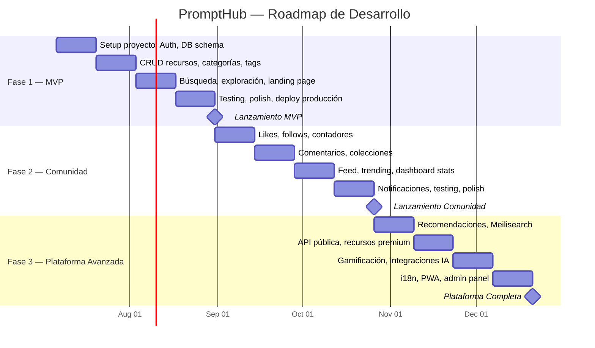
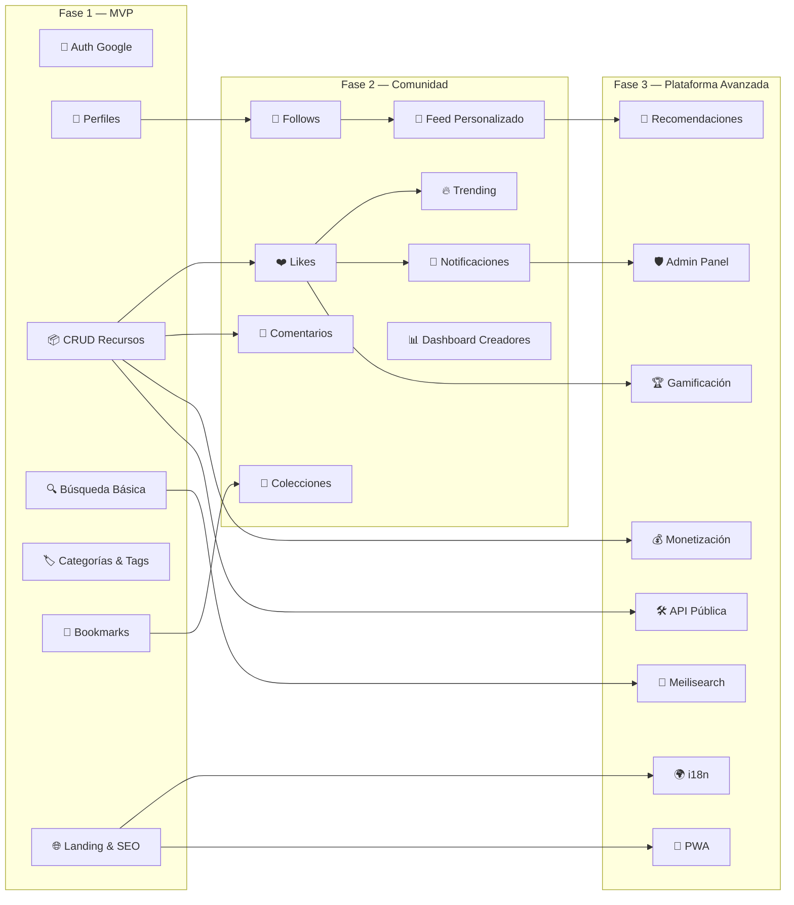
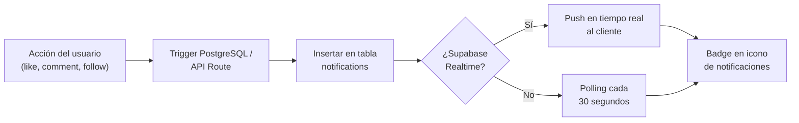
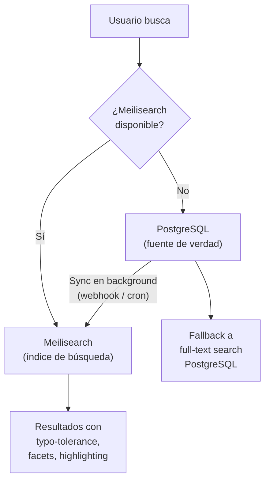
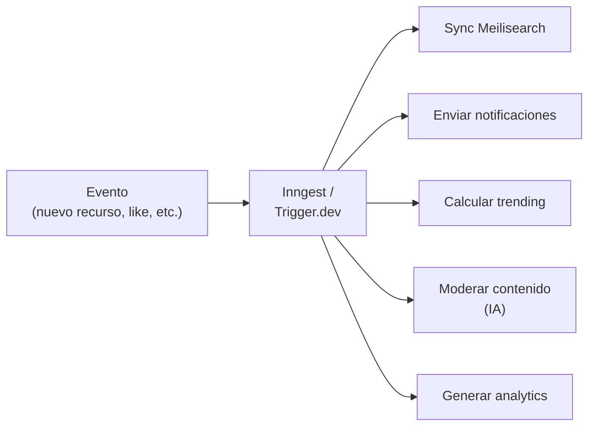

# 📅 PromptHub — Fases del Proyecto

> Documento de planificación por fases para el desarrollo de PromptHub.
> Cada fase tiene objetivos claros, funcionalidades definidas, riesgos identificados y entregables medibles.

---

## Visión General del Roadmap



---

## Diagrama de Roadmap por Capacidades



---

## Fase 1 — MVP (Semanas 1-8)

### 🎯 Objetivos

- **Lanzar una versión funcional mínima** que permita a los usuarios registrarse, publicar y descubrir recursos de IA.
- **Validar la propuesta de valor** con usuarios reales antes de invertir en funcionalidades sociales.
- **Establecer la base técnica** sólida sobre la que se construirán las fases siguientes.

> [!IMPORTANT]
> El foco de esta fase es demostrar que existe demanda para un hub de recursos de IA. No es necesario que sea perfecto; es necesario que sea funcional y usable.

### 📋 Funcionalidades

#### Autenticación y Usuarios
| Funcionalidad | Descripción | Prioridad |
|---|---|---|
| Auth con Google | Inicio de sesión / registro con Google OAuth vía Supabase Auth | P0 |
| Perfil de usuario | Crear, editar perfil (nombre, bio, avatar, links) | P0 |
| Perfil público | Página pública `/u/{username}` con recursos publicados | P0 |
| Sesión persistente | Mantener sesión activa entre visitas | P0 |

#### Recursos de IA (Core)
| Funcionalidad | Descripción | Prioridad |
|---|---|---|
| Crear recurso | Formulario completo con título, descripción, contenido, tipo, categoría, tags | P0 |
| Editar recurso | Actualizar cualquier campo del recurso propio | P0 |
| Eliminar recurso | Soft delete con confirmación | P0 |
| Ver recurso | Página de detalle con toda la información y metadatos | P0 |
| Tipos de recurso | Prompts LLM, prompts de imagen, prompts de video, agentes, workflows | P0 |
| Categorías predefinidas | Seed de categorías: Productividad, Desarrollo, Marketing, Diseño, Educación, etc. | P0 |
| Etiquetas (tags) | Tags de texto libre, autocompletado con tags existentes, máximo 5 por recurso | P0 |
| Bookmarks | Guardar/quitar recursos de forma privada | P1 |

#### Descubrimiento
| Funcionalidad | Descripción | Prioridad |
|---|---|---|
| Búsqueda básica | PostgreSQL full-text search sobre título, descripción y contenido | P0 |
| Explorar por categoría | Página `/explore` con filtros por categoría | P0 |
| Explorar por tipo | Filtro por tipo de recurso | P0 |
| Ordenar resultados | Por fecha, por relevancia de búsqueda | P1 |
| Paginación | Offset-based pagination para listados | P1 |

#### Plataforma
| Funcionalidad | Descripción | Prioridad |
|---|---|---|
| Landing page | Página principal con propuesta de valor, recursos destacados y CTA | P0 |
| Diseño responsivo | Mobile-first, breakpoints para tablet y desktop | P0 |
| SEO básico | SSR/SSG para páginas públicas, meta tags, Open Graph | P1 |
| Página 404 | Página de error personalizada | P2 |
| Loading states | Skeletons y spinners para estados de carga | P2 |

### ⚠️ Riesgos

| Riesgo | Probabilidad | Impacto | Mitigación |
|---|---|---|---|
| **Scope creep:** tentación de agregar features sociales antes de validar el core | Alta | Alto | Definir criterios de aceptación estrictos. No avanzar a Fase 2 sin validar uso real del MVP. |
| **Perfeccionismo en UI** antes de tener usuarios | Alta | Medio | Usar componentes de shadcn/ui. Iterar sobre feedback real, no supuestos. |
| **Modelo de datos incorrecto** que requiera migración costosa | Media | Alto | Revisar schema con casos de uso de Fase 2 en mente. Usar migraciones versionadas desde el día 1. |
| **Subestimar complejidad** del editor de contenido para recursos | Media | Medio | Empezar con textarea + markdown. Evaluar editor WYSIWYG en Fase 2. |
| **Autenticación edge cases** (tokens expirados, sesiones concurrentes) | Media | Medio | Usar middleware de Supabase Auth. Implementar refresh token flow correctamente. |

### 🔧 Consideraciones Técnicas

#### Setup Inicial
```bash
# Stack tecnológico Fase 1
Next.js 14+          # App Router, TypeScript
Tailwind CSS         # Estilos utility-first
Supabase             # Auth, Database (PostgreSQL), Storage
Vercel               # Hosting, CI/CD
Vitest               # Unit testing
Playwright           # E2E testing (mínimo)
```

#### Arquitectura de Carpetas
```
src/
├── app/                      # App Router (Next.js)
│   ├── (auth)/               # Rutas de autenticación
│   │   ├── login/
│   │   └── callback/
│   ├── (main)/               # Layout principal
│   │   ├── explore/
│   │   ├── resource/[slug]/
│   │   └── u/[username]/
│   ├── api/                  # API Routes
│   └── layout.tsx
├── components/               # Componentes reutilizables
│   ├── ui/                   # Primitivos (shadcn/ui)
│   ├── resources/            # Componentes de recursos
│   └── layout/               # Header, Footer, Nav
├── lib/                      # Utilidades y configuraciones
│   ├── supabase/             # Clientes Supabase (server/client)
│   ├── validations/          # Schemas Zod
│   └── utils/
├── hooks/                    # Custom hooks
├── types/                    # Tipos TypeScript globales
└── styles/                   # Estilos globales
```

#### Decisiones Clave
- **Row Level Security (RLS):** Implementar desde el día 1 en todas las tablas. Nunca confiar solo en la validación del frontend.
- **Server Components por defecto:** Usar Client Components solo cuando se necesite interactividad.
- **Supabase SSR:** Usar `@supabase/ssr` para manejo correcto de cookies y sesiones.
- **Validación dual:** Zod en frontend (formularios) y backend (API Routes). Mismos schemas compartidos.
- **Seed data:** Script para poblar categorías predefinidas y 20-30 recursos de ejemplo.
- **CI/CD básico:** Push a `main` → deploy automático a Vercel. GitHub Actions para lint y tests.

#### Testing Mínimo Estratégico
| Área | Tipo | Herramienta | Prioridad |
|---|---|---|---|
| Auth flow completo | E2E | Playwright | P0 |
| CRUD de recursos | Integration | Vitest | P0 |
| Validaciones Zod | Unit | Vitest | P1 |
| RLS policies | Integration | Supabase CLI test | P1 |
| Componentes UI críticos | Unit | Vitest + Testing Library | P2 |

### 📦 Entregables Clave

| Semana | Entregable | Detalle |
|---|---|---|
| **1-2** | Setup proyecto, Auth, DB schema, perfil básico | Proyecto Next.js configurado, Supabase conectado, login con Google funcional, schema de base de datos aplicado, CRUD de perfil de usuario. |
| **3-4** | CRUD recursos, categorías, tags | Crear/editar/eliminar recursos, selección de categoría y tipo, sistema de tags con autocompletado, página de detalle de recurso. |
| **5-6** | Búsqueda, exploración, landing page | Full-text search funcional, página de exploración con filtros, landing page con recursos destacados, bookmarks. |
| **7-8** | Testing, polish, deploy a producción | Tests E2E del auth flow, tests de integración del CRUD, corrección de bugs, responsive check, SEO meta tags, deploy final a producción. |

> [!TIP]
> **Criterio de éxito del MVP:** Al menos 10 usuarios reales han publicado recursos y 50 usuarios han visitado la plataforma en las primeras 2 semanas post-lanzamiento.

---

## Fase 2 — Comunidad (Semanas 9-16)

### 🎯 Objetivos

- **Agregar funcionalidades sociales** para fomentar la interacción entre usuarios y la formación de comunidad.
- **Aumentar engagement y retención** convirtiendo visitantes pasivos en participantes activos.
- **Generar efecto de red:** que el valor de la plataforma crezca con cada usuario nuevo.

> [!IMPORTANT]
> Esta fase solo debe iniciarse si el MVP ha validado que los usuarios encuentran valor en publicar y descubrir recursos. Si no hay tracción, pivotar antes de invertir en features sociales.

### 📋 Funcionalidades

#### Interacción Social
| Funcionalidad | Descripción | Prioridad |
|---|---|---|
| Likes | Like/unlike en recursos, contador visible | P0 |
| Comentarios | Comentar en recursos, soporte para markdown básico | P0 |
| Respuestas anidadas | Responder a comentarios (1 nivel de anidamiento) | P1 |
| Seguimiento | Follow/unfollow usuarios, lista de seguidores/seguidos | P0 |
| Compartir | Botón para copiar link, compartir en redes sociales | P2 |

#### Organización y Curación
| Funcionalidad | Descripción | Prioridad |
|---|---|---|
| Colecciones | Crear colecciones con nombre, descripción e imagen | P0 |
| Organizar colecciones | Agregar/quitar recursos, reordenar | P0 |
| Colecciones públicas | Opción de hacer colecciones visibles en perfil público | P1 |
| Compartir colecciones | URL única para cada colección pública | P1 |

#### Descubrimiento Mejorado
| Funcionalidad | Descripción | Prioridad |
|---|---|---|
| Feed personalizado | Timeline basado en usuarios seguidos | P0 |
| Recursos en tendencia | Algoritmo basado en likes recientes, vistas y comentarios | P0 |
| Recursos populares | Ordenar por likes totales, periodo configurable | P1 |

#### Creadores
| Funcionalidad | Descripción | Prioridad |
|---|---|---|
| Dashboard de estadísticas | Vistas, likes, comentarios y bookmarks de tus recursos | P0 |
| Perfil público mejorado | Mostrar seguidores, seguidos, colecciones públicas | P0 |
| Notificaciones in-app | Likes, comentarios, follows, menciones | P1 |

### ⚠️ Riesgos

| Riesgo | Probabilidad | Impacto | Mitigación |
|---|---|---|---|
| **Queries sociales lentas** afectando rendimiento | Alta | Alto | Contadores denormalizados, índices en columnas de filtrado, cursor-based pagination. |
| **Spam en comentarios** sin moderación | Alta | Alto | Rate limiting, reportar contenido, moderación manual. Evaluar moderación con IA en Fase 3. |
| **Conflictos de concurrencia** en contadores (likes_count) | Media | Medio | Usar triggers de PostgreSQL para incrementar/decrementar atómicamente. |
| **Notificaciones excesivas** que generen fatiga | Media | Medio | Agrupación de notificaciones, configuración de preferencias por usuario. |
| **Feeds vacíos** para usuarios nuevos que no siguen a nadie | Alta | Medio | Feed de "Descubrimiento" como fallback con recursos populares y nuevos. |

### 🔧 Consideraciones Técnicas

#### Contadores Denormalizados

Los contadores (likes, comments, followers) se almacenan directamente en las tablas principales para evitar `COUNT(*)` en cada request:

```sql
-- Trigger para mantener likes_count sincronizado
CREATE OR REPLACE FUNCTION update_resource_likes_count()
RETURNS TRIGGER AS $$
BEGIN
  IF TG_OP = 'INSERT' THEN
    UPDATE resources
    SET likes_count = likes_count + 1
    WHERE id = NEW.resource_id;
    RETURN NEW;
  ELSIF TG_OP = 'DELETE' THEN
    UPDATE resources
    SET likes_count = likes_count - 1
    WHERE id = OLD.resource_id;
    RETURN OLD;
  END IF;
END;
$$ LANGUAGE plpgsql;

CREATE TRIGGER trigger_update_likes_count
AFTER INSERT OR DELETE ON likes
FOR EACH ROW EXECUTE FUNCTION update_resource_likes_count();
```

#### Cursor-based Pagination para Feeds

```typescript
// Ejemplo de cursor-based pagination
interface FeedParams {
  cursor?: string;  // ID del último item visto
  limit: number;    // Items por página (default: 20)
}

// Query con cursor
const { data } = await supabase
  .from('resources')
  .select('*')
  .in('user_id', followedUserIds)
  .lt('created_at', cursor)       // Cursor basado en timestamp
  .order('created_at', { ascending: false })
  .limit(limit + 1);              // +1 para saber si hay más páginas
```

#### Algoritmo de Trending

```
trending_score = (likes_recientes * 3 + comentarios_recientes * 2 + vistas_recientes * 1)
                 / (horas_desde_publicación + 2) ^ 1.5
```

- **likes_recientes:** Likes en las últimas 48 horas.
- **comentarios_recientes:** Comentarios en las últimas 48 horas.
- **vistas_recientes:** Vistas únicas en las últimas 48 horas.
- **Decay temporal:** Penalización exponencial para que el contenido viejo no domine.

#### Notificaciones In-App



#### Rate Limiting

| Acción | Límite | Ventana |
|---|---|---|
| Likes | 60 por usuario | 1 hora |
| Comentarios | 20 por usuario | 1 hora |
| Follows | 30 por usuario | 1 hora |
| Reportes | 10 por usuario | 24 horas |

### 📦 Entregables Clave

| Semana | Entregable | Detalle |
|---|---|---|
| **9-10** | Likes, follows, contadores | Sistema de likes con contadores denormalizados, follow/unfollow con listas de seguidores, triggers de PostgreSQL para contadores. |
| **11-12** | Comentarios, colecciones | Sistema de comentarios con respuestas anidadas (1 nivel), CRUD de colecciones, agregar/quitar recursos de colecciones. |
| **13-14** | Feed, trending, dashboard stats | Feed personalizado basado en follows, algoritmo de trending, dashboard básico con métricas para creadores. |
| **15-16** | Notificaciones, testing, polish | Notificaciones in-app para likes/comments/follows, testing de queries sociales, optimización de performance, polish de UX. |

> [!TIP]
> **Criterio de éxito de la Fase 2:** DAU/MAU ratio > 20%, al menos 30% de usuarios activos han dado likes o comentado, y el feed personalizado tiene contenido suficiente para no sentirse vacío.

---

## Fase 3 — Plataforma Avanzada (Semanas 17-24+)

### 🎯 Objetivos

- **Escalar la plataforma** técnica y funcionalmente para soportar crecimiento.
- **Agregar inteligencia y personalización** para mejorar la experiencia de usuario.
- **Explorar monetización** para hacer la plataforma sostenible a largo plazo.
- **Profesionalizar operaciones** con herramientas de administración y monitoreo.

> [!WARNING]
> Esta fase representa un salto significativo en complejidad. Es probable que se necesite ayuda adicional (colaboradores, freelancers) o priorizar agresivamente las funcionalidades.

### 📋 Funcionalidades

#### Inteligencia y Personalización
| Funcionalidad | Descripción | Prioridad |
|---|---|---|
| Sistema de recomendaciones | Sugerencias basadas en likes, follows, categorías favoritas y comportamiento | P0 |
| Búsqueda avanzada | Migrar a Meilisearch: typo-tolerance, faceted search, filtros avanzados | P0 |
| Recursos relacionados | Sección "También te puede interesar" en la página de detalle | P1 |

#### Monetización
| Funcionalidad | Descripción | Prioridad |
|---|---|---|
| Recursos premium | Creadores pueden marcar recursos como premium (de pago) | P0 |
| Sistema de pagos | Integración con Stripe para compras y suscripciones | P0 |
| Dashboard de ingresos | Panel para que creadores vean sus ganancias | P1 |
| Plan Pro para creadores | Beneficios adicionales para creadores que pagan suscripción | P2 |

#### Plataforma para Desarrolladores
| Funcionalidad | Descripción | Prioridad |
|---|---|---|
| API pública REST | Endpoints para buscar, listar y obtener recursos | P1 |
| API keys | Generación y gestión de API keys por usuario | P1 |
| Documentación API | Documentación interactiva estilo Swagger/OpenAPI | P1 |
| Rate limiting API | Límites diferenciados por tier (free, pro) | P1 |

#### Gamificación y Reputación
| Funcionalidad | Descripción | Prioridad |
|---|---|---|
| Sistema de badges | Insignias por logros (primeros 10 recursos, 100 likes, etc.) | P2 |
| Puntos de reputación | Puntos acumulados por actividad (publicar, recibir likes, etc.) | P2 |
| Leaderboards | Rankings de creadores por categoría y global | P2 |
| Verificación de creadores | Badge de verificación para creadores destacados | P2 |

#### Integraciones
| Funcionalidad | Descripción | Prioridad |
|---|---|---|
| Test de prompts | Probar prompts directamente en la plataforma (via API de OpenAI, etc.) | P2 |
| Importación masiva | Importar prompts desde archivos CSV/JSON | P1 |
| Exportar colecciones | Exportar colecciones completas en varios formatos | P2 |

#### Plataforma
| Funcionalidad | Descripción | Prioridad |
|---|---|---|
| Internacionalización (i18n) | Soporte para inglés como segundo idioma | P1 |
| PWA | Progressive Web App con offline básico y push notifications | P2 |
| Admin panel | Panel completo de administración: usuarios, recursos, reportes, moderación | P0 |
| Analytics avanzado | Métricas detalladas de uso de la plataforma | P1 |
| IA para moderación | Moderación automática de contenido inapropiado con LLMs | P1 |

### ⚠️ Riesgos

| Riesgo | Probabilidad | Impacto | Mitigación |
|---|---|---|---|
| **Costos de infraestructura crecientes** | Alta | Alto | Monitorear costos semanalmente. Establecer alertas de gasto. Optimizar queries antes de escalar hardware. |
| **Necesidad de equipo** (ya no solo developer) | Alta | Alto | Priorizar funcionalidades por ROI. Considerar freelancers para tareas específicas. Documentar todo para onboarding. |
| **Complejidad de recomendaciones** | Alta | Medio | Empezar con recomendaciones simples (content-based). Iterar con collaborative filtering solo si hay datos suficientes. |
| **Regulaciones de contenido** generado por IA | Media | Alto | Términos de servicio claros. Sistema de reportes robusto. Moderación con IA + revisión manual. |
| **Integración con APIs externas** (OpenAI, etc.) | Media | Medio | Abstraer integraciones detrás de interfaces. Manejar rate limits y costos de APIs externas. |
| **Complejidad de pagos** y regulaciones financieras | Media | Alto | Usar Stripe para delegar complejidad regulatoria. Consultar asesor legal para términos de servicio. |

### 🔧 Consideraciones Técnicas

#### Migración a Meilisearch



#### Stack Técnico Ampliado (Fase 3)

```
# Nuevas adiciones al stack
Meilisearch Cloud       # Búsqueda avanzada
Upstash Redis            # Caching, rate limiting, sessions
Inngest / Trigger.dev    # Background jobs, cron jobs
Stripe                   # Pagos y suscripciones
Sentry                   # Error tracking avanzado
Axiom                    # Log aggregation
next-intl                # Internacionalización
Workbox                  # PWA / Service Worker
```

#### Sistema de Recomendaciones (Enfoque Progresivo)

| Etapa | Enfoque | Complejidad | Datos necesarios |
|---|---|---|---|
| **v1** | Content-based | Baja | Tags, categorías compartidas entre recursos | 
| **v2** | Collaborative filtering simple | Media | Patrones de likes entre usuarios similares |
| **v3** | Híbrido con ML | Alta | Embeddings de contenido + comportamiento de usuario |

#### Background Jobs



#### API Pública — Diseño de Endpoints

```
GET    /api/v1/resources          # Listar recursos (filtros, paginación)
GET    /api/v1/resources/:id      # Detalle de recurso
GET    /api/v1/resources/search   # Búsqueda avanzada
GET    /api/v1/categories         # Listar categorías
GET    /api/v1/users/:username    # Perfil público de usuario
GET    /api/v1/collections/:id    # Detalle de colección pública

# Autenticados (requiere API key)
POST   /api/v1/resources          # Crear recurso
PUT    /api/v1/resources/:id      # Actualizar recurso
DELETE /api/v1/resources/:id      # Eliminar recurso
```

### 📦 Entregables Clave

| Semana | Entregable | Detalle |
|---|---|---|
| **17-18** | Recomendaciones, Meilisearch | Sistema de recomendaciones v1 (content-based), migración de búsqueda a Meilisearch, sincronización de índice. |
| **19-20** | API pública, recursos premium | API REST pública con documentación, sistema de API keys, integración con Stripe para recursos premium. |
| **21-22** | Gamificación, integraciones IA | Sistema de badges y puntos, prueba de prompts in-app (MVP), importación masiva de prompts. |
| **23-24** | i18n, PWA, admin panel | Soporte para inglés, Progressive Web App, panel de administración completo, moderación con IA. |

> [!TIP]
> **Criterio de éxito de la Fase 3:** Ingresos recurrentes de recursos premium, al menos 100 API keys creadas, y la plataforma soporta >1000 usuarios concurrentes sin degradación de rendimiento.

---

## Resumen Comparativo de Fases

| Dimensión | Fase 1 — MVP | Fase 2 — Comunidad | Fase 3 — Avanzada |
|---|---|---|---|
| **Duración** | 8 semanas | 8 semanas | 8+ semanas |
| **Foco** | Publicar y descubrir | Interactuar y conectar | Escalar y monetizar |
| **Usuarios objetivo** | Early adopters | Creadores activos | Comunidad establecida |
| **Complejidad técnica** | Baja-Media | Media | Alta |
| **Infraestructura** | Vercel Free + Supabase Free | Misma + optimizaciones | Servicios adicionales (Meilisearch, Redis, Stripe) |
| **Testing** | Mínimo estratégico | Integración + E2E | Completo + Load testing |
| **Equipo** | 1 developer | 1 developer | 1-2 developers + especialistas |

---

## Principios Transversales

> [!NOTE]
> Estos principios aplican a todas las fases del proyecto.

1. **Seguridad desde el día 1:** RLS en toda tabla, validación server-side, nunca confiar en el cliente.
2. **Progressive enhancement:** Cada fase construye sobre la anterior sin reescrituras masivas.
3. **Datos primero:** Diseñar schemas pensando en las 3 fases. Mejor agregar columnas que migrar tablas.
4. **Feedback real > intuición:** No avanzar de fase sin validar con usuarios reales.
5. **Documentar decisiones:** Cada decisión técnica significativa debe documentarse con su contexto y alternativas descartadas.
6. **Ship > Perfect:** Un feature funcional y feo es mejor que un feature perfecto que nunca sale.
