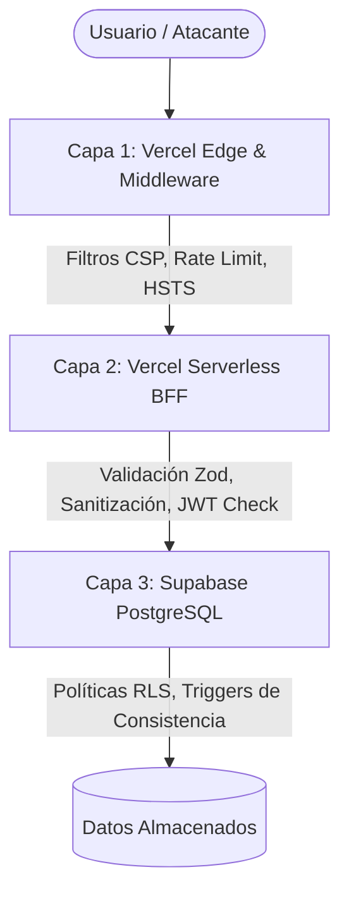

# 🛡️ Seguridad del Sistema — PromptHub

Este documento detalla la arquitectura de seguridad y las medidas de protección implementadas en PromptHub para proteger la integridad del sistema, la privacidad de los datos de los usuarios y evitar el abuso de los recursos de la plataforma.

---

## 1. Arquitectura de Seguridad en Capas

PromptHub implementa un modelo de seguridad en profundidad estructurado en tres capas independientes:



| Capa | Componente | Responsabilidad | Enfoque |
|---|---|---|---|
| **Capa 1: Edge** | Vercel Middleware | Cabeceras de seguridad, enrutamiento seguro y Rate Limiting primario. | Prevención de denegación de servicio (DDoS) y secuestro de clickjacking. |
| **Capa 2: BFF** | Next.js API Routes | Validación sintáctica y semántica de peticiones, sanitización XSS de entradas y verificación de tokens de acceso JWT. | Prevención de inyección de código y validación de reglas de negocio complejas. |
| **Capa 3: Datos** | Supabase RLS | Políticas de seguridad a nivel de fila de base de datos PostgreSQL. | Última línea de defensa. Garantiza que, incluso con un bypass en el backend, los usuarios solo accedan a datos permitidos. |

---

## 2. Control de Acceso y Autorización

### 2.1 Modelo de Autorización de Tres Capas

1. **Frontend (Next.js Middleware)**:
   - Rutas como `/dashboard/*` o `/settings/*` se protegen mediante middleware. Si no hay sesión válida activa, se redirige inmediatamente al login de Google.
2. **Backend (API Routes)**:
   - Las peticiones que modifiquen el estado de los datos (POST/PATCH/DELETE) extraen y validan el token JWT del encabezado `Authorization`.
   - Se valida el ID del usuario contra el ID del propietario del recurso antes de proceder con cualquier modificación.
3. **Base de Datos (Row Level Security - RLS)**:
   - Todas las tablas del esquema tienen RLS activo (`ALTER TABLE ... ENABLE ROW LEVEL SECURITY`).
   - Las consultas directas desde el cliente o a través de PostgREST se evalúan bajo políticas de SQL que garantizan el acceso estrictamente al propietario.

### 2.2 Protección de Recursos Privados

- **Borradores de Recursos (`resources.status = 'draft'`)**:
  - Filtro RLS: `auth.uid() = author_id`. Solo el creador puede consultar o modificar recursos en estado de borrador.
- **Colecciones Privadas (`collections.is_public = false`)**:
  - Filtro RLS: `auth.uid() = owner_id`. Cualquier intento de lectura por parte de terceros fallará retornando 404 o un set de datos vacío.
- **Recursos Guardados (`saved_resources`)**:
  - Filtro RLS: `auth.uid() = user_id`. La biblioteca personal de marcadores es estrictamente privada y oculta para otros usuarios.

---

## 3. Limitación de Tasa (Rate Limiting)

Para prevenir ataques de fuerza bruta, spam, scrapers agresivos y sobrecostos en las funciones Serverless, se establecen límites de consumo de APIs:

| Categoría de Endpoint | Límite Máximo | Ventana Temporal | Acción al Superar |
|---|---|---|---|
| **Autenticación y Sesión** | 5 peticiones | 1 minuto | Código HTTP 429 con cabecera `Retry-After` |
| **Creación/Edición (Escritura)** | 30 peticiones | 1 hora | Código HTTP 429 con cabecera `Retry-After` |
| **Búsqueda global** | 30 peticiones | 1 minuto | Código HTTP 429 |
| **Lectura general (API de recursos)** | 100 peticiones | 1 minuto | Código HTTP 429 |

* **Implementación para MVP**: Middleware en Next.js utilizando una base de datos Redis serverless en Upstash (mediante `@upstash/ratelimit`) para identificar por IP o por ID de usuario autenticado.

---

## 4. Validación de Entradas y Prevención de Inyecciones

### 4.1 Validación con Zod
Toda API Route define un esquema de validación estricto para `req.body` y `req.query`.
```typescript
const createResourceSchema = zod.object({
  title: zod.string().min(5).max(200),
  content: zod.string().min(10),
  type: zod.enum(['prompt_llm', 'prompt_image', 'prompt_video', 'agent', 'workflow', 'other']),
  category_id: zod.string().uuid(),
  compatible_models: zod.array(zod.string()).min(1),
});
```

### 4.2 Prevención de Cross-Site Scripting (XSS)
Debido a que la plataforma permite publicar prompts y ejemplos que contienen código de programación y texto libre estructurado, existe riesgo de XSS persistente.
* **Medida**: Todo el contenido en formato Markdown o HTML es sanitizado en el servidor utilizando la librería `isomorphic-dompurify` antes de ser guardado en la base de datos o renderizado en el cliente.

### 4.3 Prevención de Inyección SQL (SQLi)
* **Medida**: No se utilizará concatenación manual de strings para construir consultas SQL. Todas las interacciones con la base de datos se realizarán mediante el SDK de Supabase, el cual utiliza internamente consultas parametrizadas a través de PostgREST, o mediante el ORM Prisma utilizando placeholders nativos de PostgreSQL.

---

## 5. Seguridad en la Carga de Archivos

Los archivos adjuntos (imágenes asociadas a prompts o archivos de workflows) suponen un vector de ataque importante.

- **Filtros de Tipo MIME**: Se restringen los uploads en Supabase Storage exclusivamente a archivos de imagen (`image/jpeg`, `image/png`, `image/webp`, `image/gif`) y archivos de configuración estructurados (`application/json`, `text/markdown`).
- **Límite de Tamaño**:
  - Imágenes: Máximo **5 MB**.
  - Documentos/Workflows: Máximo **10 MB**.
- **Generación de Nombres Únicos**: Supabase Storage guardará los archivos utilizando una estructura basada en UUIDs (`/resources/{resource_id}/{uuid}.webp`) para evitar ataques de enumeración de directorios y colisiones de nombres.
- **Eliminación de Metadatos (EXIF)**: En el backend (o Edge Function), las imágenes subidas pasan por un proceso de procesamiento con `sharp` para redimensionarlas y limpiar los metadatos de geolocalización y autor para proteger la privacidad de los creadores.

---

## 6. Privacidad de los Datos de los Usuarios

Para alinearse con regulaciones internacionales de privacidad como GDPR y CCPA:

* **Privacidad del Email**: La dirección de correo electrónico del usuario registrada mediante Google Auth se mantiene estrictamente privada en la base de datos de Supabase y **nunca** se expone a través de la API pública o en las pantallas de perfiles de usuario.
* **Derecho al Olvido**: Los usuarios deben poder solicitar la eliminación completa de su cuenta a través de la configuración de su perfil. Un trigger en la base de datos aplicará una eliminación en cascada (`ON DELETE CASCADE`) para borrar permanentemente sus perfiles, recursos, colecciones, likes y comentarios asociados de todas las tablas.
* **Anonimización de IPs**: Los logs de auditoría e IP hashes guardados en la tabla `resource_views` para la prevención de fraude de vistas se enmascaran utilizando funciones de hashing irreversible (`SHA-256` con sal dinámica de sistema) para que no puedan ser mapeados de vuelta a una persona real.

---

## 7. Cabeceras de Seguridad y Configuración de Red

La configuración del archivo `next.config.js` y el middleware inyectarán cabeceras de seguridad HTTP robustas en todas las respuestas:

```nginx
# Evitar que el sitio sea embebido en frames de otros dominios (Clickjacking)
X-Frame-Options: DENY

# Forzar el uso de HTTPS estricto durante 1 año
Strict-Transport-Security: max-age=31536000; includeSubDomains; preload

# Prevenir que el navegador intente adivinar el tipo MIME
X-Content-Type-Options: nosniff

# Controlar qué información de referencia se envía al hacer clic en enlaces
Referrer-Policy: strict-origin-when-cross-origin

# Política de Seguridad del Contenido (CSP) restrictiva
Content-Security-Policy: default-src 'self'; script-src 'self' 'unsafe-eval' 'unsafe-inline' https://apis.google.com; style-src 'self' 'unsafe-inline' https://fonts.googleapis.com; img-src 'self' data: https://*.supabase.co https://lh3.googleusercontent.com; connect-src 'self' https://*.supabase.co; font-src 'self' https://fonts.gstatic.com; frame-src 'self' https://accounts.google.com;
```
