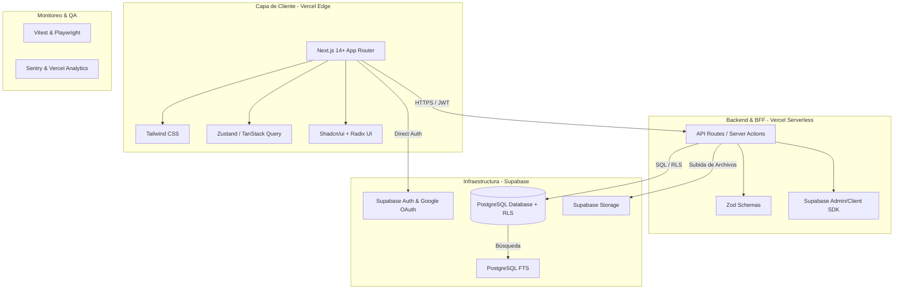

# 🛠️ Stack Tecnológico — PromptHub

Este documento evalúa las tecnologías propuestas para el desarrollo de PromptHub, comparando alternativas viables y justificando cada decisión de arquitectura basada en los trade-offs de rendimiento, coste, tiempo de desarrollo (Time-to-Market) y mantenibilidad para un desarrollador independiente.

---

## 1. Mapa de Tecnologías del Sistema

El siguiente diagrama de arquitectura técnica ilustra cómo interactúan las tecnologías elegidas en las distintas capas del sistema:

---

## 2. Capa de Frontend

### 2.1 Framework Principal

| Tecnología | Alternativas | Ventajas | Desventajas | Decisión |
|---|---|---|---|---|
| **Next.js 14+** (App Router) | Nuxt.js, Remix, Astro, SPA (React + Vite) | • Server Components (RSC) nativos para SEO y velocidad de carga. • API Routes integradas en el mismo repositorio (monorepo fácil). • Despliegue optimizado y automático en Vercel. • Ecosistema gigante y maduro. | • Curva de aprendizaje del App Router y caching server-side. • Acoplamiento inicial con Vercel para explotar todo su potencial. | **Elegido**: Next.js es el estándar de la industria para aplicaciones híbridas de React. El soporte RSC es fundamental para las páginas públicas de recursos. |

### 2.2 Herramientas de Desarrollo y UI de Frontend

* **TypeScript**: Obligatorio. Proporciona seguridad de tipos estáticos de extremo a extremo, lo cual es vital al sincronizar esquemas de base de datos de Supabase con el código del frontend.
* **Tailwind CSS**: Framework de CSS utilitario. Elegido por su velocidad de desarrollo y rendimiento (genera CSS compilado y optimizado). Evita escribir hojas de estilo CSS personalizadas que puedan desorganizarse.
* **Shadcn/ui (Radix UI)**: Biblioteca de componentes desestructurados y accesibles. Permite copiar directamente el código de componentes premium y estilizarlos libremente con Tailwind CSS, evitando la rigidez de librerías como Material UI.
* **Zustand**: Para el estado global del cliente que sea mínimo (ej. estado de barras laterales, modales). Es extremadamente ligero y libre de boilerplate.
* **TanStack Query (React Query)**: Para el manejo de datos asíncronos y caché del cliente. Automatiza los reintentos, refetching, paginación y mutaciones.
* **React Hook Form + Zod**: Para validación y construcción de formularios. Zod permite compartir esquemas de validación de datos entre el frontend y el backend (API Routes).

---

## 3. Capa de Backend y Base de Datos

### 3.1 Servidor de Aplicación (API)

| Tecnología | Alternativas | Ventajas | Desventajas | Decisión |
|---|---|---|---|---|
| **Next.js API Routes** | Express.js, Fastify, NestJS, Go (Fiber) | • Cero setup de infraestructura de servidores adicionales. • Despliegue Serverless autogestionado. • Compartición directa de Tipos TypeScript con el frontend. | • Tiempos de arranque en frío (Cold Start) inherentes a Serverless. • No es apto para procesos de larga duración (ej. WebSockets persistentes o procesamiento pesado). | **Elegido**: Evita la complejidad de gestionar un servidor backend independiente en fases de MVP. |

* **Inyección de Dependencias**: Para la Arquitectura Onion se implementará inyección manual basada en constructores. Se evita el uso de contenedores IoC pesados (como `inversify` o `tsyringe`) para mantener el tamaño del bundle serverless al mínimo y optimizar los arranques en frío (cold starts) en Vercel.

### 3.2 Motor de Base de Datos

| Tecnología | Alternativas | Ventajas | Desventajas | Decisión |
|---|---|---|---|---|
| **Supabase PostgreSQL** | PlanetScale, MongoDB Atlas, Neon PostgreSQL | • Base de datos relacional PostgreSQL completa. • Row Level Security (RLS) para autorizaciones robustas. • Auto-generación de APIs REST inmediatas mediante PostgREST. • Características de tiempo real listas para usar. | • Cierto acoplamiento a las APIs y herramientas propias de Supabase. • El plan gratuito se pausa tras una semana de inactividad del desarrollador. | **Elegido**: Ahorra cientos de horas de desarrollo backend gracias a RLS, generación automática de tipos y la consola administrativa. |

---

## 4. Servicios Esenciales y Proveedores SaaS

### 4.1 Autenticación y Autorización

| Tecnología | Alternativas | Ventajas | Desventajas | Decisión |
|---|---|---|---|---|
| **Supabase Auth** | NextAuth.js / Auth.js, Clerk, Auth0 | • Integrado nativamente con las políticas RLS de la base de datos. • Soporte out-of-the-box para Google OAuth. • Gestión de sesiones segura con tokens JWT y PKCE. | • Dependencia directa de la disponibilidad de Supabase Auth. • Menor personalización extrema en comparación con NextAuth local. | **Elegido**: Se integra automáticamente con el sistema de base de datos y permite implementar el control de acceso en la propia BD. |

### 4.2 Almacenamiento de Archivos (Storage)

| Tecnología | Alternativas | Ventajas | Desventajas | Decisión |
|---|---|---|---|---|
| **Supabase Storage** | AWS S3, Cloudinary, Uploadthing | • Mismo ecosistema de Supabase (una única consola). • RLS para controlar quién puede subir o leer archivos. • Optimización automática de imágenes básica. | • Limitación de CDN avanzado respecto a Cloudinary. • Menor granularidad en políticas complejas que AWS S3. | **Elegido**: RLS simplifica enormemente la seguridad de subida de imágenes de los prompts de usuarios. |

### 4.3 Búsqueda de Recursos

| Tecnología | Alternativas | Ventajas | Desventajas | Decisión |
|---|---|---|---|---|
| **PostgreSQL Full-Text Search** | Meilisearch, Algolia, Elasticsearch | • Cero coste adicional o infraestructura nueva. • Búsqueda difusa nativa con diccionarios de español e índices GIN. • Consultas directas sin sincronización de datos externa. | • Menor relevancia out-of-the-box en búsquedas complejas. • Mayor consumo de CPU en la BD bajo alto volumen de datos. | **Elegido para MVP**: Evita mantener un clúster de búsqueda externo. Se migrará a Meilisearch en la Fase 2/3. |

### 4.4 Caché y Colas

* **Caché de Aplicación**: Vercel Edge Cache + Next.js Incremental Static Regeneration (ISR). Esto permite que las páginas de recursos públicos se generen una vez, se guarden en el CDN global de Vercel y se revaliden en segundo plano cuando cambien, logrando tiempos de respuesta instantáneos.
* **Procesamiento en Segundo Plano (Background Jobs)**: Vercel Cron para tareas programadas sencillas (ej. calcular trending cada hora). En la Fase 2/3 se prevé migrar a **Inngest** o **Trigger.dev** debido a su naturaleza serverless-friendly, evitando desplegar servidores dedicados con Redis y BullMQ.

---

## 5. Calidad, Testing y Observabilidad

### 5.1 Estrategia de Testing

- **Vitest**: Suite de tests rápidos y nativos para ESM. Se utiliza para pruebas unitarias de funciones de lógica de negocio, validación de schemas de Zod y utilidades.
- **Playwright**: Framework de pruebas End-to-End (E2E). Elegido sobre Cypress por su velocidad, capacidad de ejecutar múltiples navegadores en paralelo, y mejor soporte para flujos de autenticación OAuth de Google simulados.
- **Supabase CLI Local**: Permite levantar una base de datos idéntica de manera local en contenedores Docker para correr tests de integración de triggers y políticas RLS antes de subirlos a producción.

### 5.2 Observabilidad

- **Sentry**: Monitoreo y reporte de errores en tiempo real en frontend y funciones serverless. Permite corregir bugs antes de que los usuarios los reporten de forma activa.
- **Vercel Analytics**: Monitoreo nativo de Core Web Vitals y velocidad real del usuario.
- **Plausible Analytics**: Para estadísticas web enfocadas en la privacidad (cumple GDPR sin cookies molestas), aportando métricas de adquisición de tráfico.
